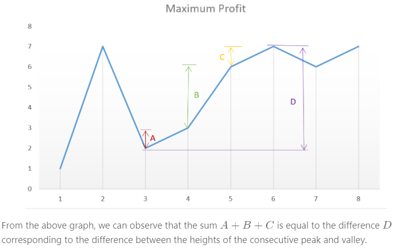
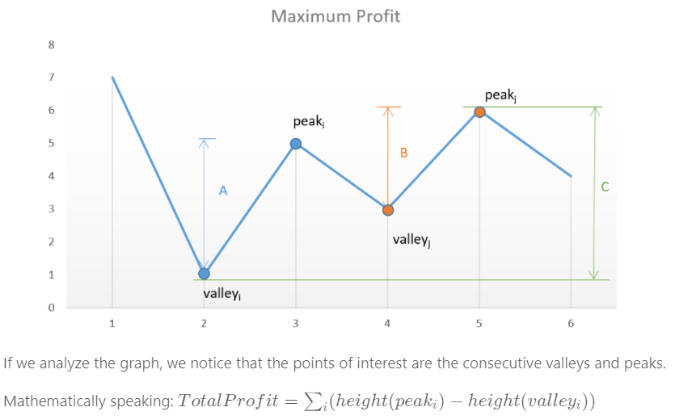
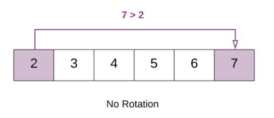
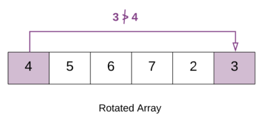
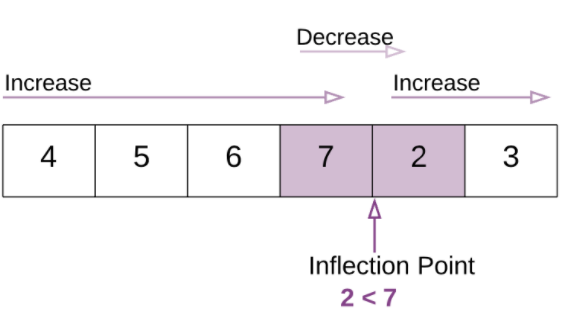

# 双指针

## 167 有序数组的 Two Sum

[Leetcode](https://leetcode.com/problems/two-sum-ii-input-array-is-sorted/description/) / [力扣](https://leetcode-cn.com/problems/two-sum-ii-input-array-is-sorted/description/)

使用双指针，一个指针指向值较小的元素，一个指针指向值较大的元素。指向较小元素的指针从头向尾遍历，指向较大元素的指针从尾向头遍历。

- 如果两个指针指向元素的和 sum == target，那么得到要求的结果；
- 如果 sum > target，移动较大的元素，使 sum 变小一些；
- 如果 sum < target，移动较小的元素，使 sum 变大一些。

数组中的元素最多遍历一次，时间复杂度为 O(N)。只使用了两个额外变量，空间复杂度为 O(1)。

## 633 两数平方和

[Leetcode](https://leetcode.com/problems/sum-of-square-numbers/description/) / [力扣](https://leetcode-cn.com/problems/sum-of-square-numbers/description/)

### Solution 1：brute force

遍历条件a*a <= c

- Time complexity : O(c) Two loops upto $\sqrt{c}$. Here, c*c* refers to the given integer(sum of squares).
- Space complexity : O(1). Constant extra space is used.

### Solution 2：better brute force

因为$a^2+b^2=c$，所以有$b^2=c-a^2$。这种时候我们只需要遍历(0, $\sqrt c$)找到一个a, 然后判断$c-a^2$是否是一个数的平方。

**数学**

第n个正整数的平方=前n个正奇整数之和
$$
n^{2}=1+3+5+\ldots+(2 \cdot n-1)=\sum_{i=1}^{n}(2 \cdot i-1)
$$
Time complexity: $O(c)$. The total number of times the $s u m$ is updated is: $1+2+3+\cdots+\sqrt{c}=\frac{\sqrt{c}(\sqrt{c}+1)}{2}=O(c)$
Space complexity : $O(1)$. Constant extra space is used.

### Solution 3：利用sqrt函数

很巧妙的是不用b\*b == c-a\*a，而是直接

```java
double b = Math.sqrt(c - a * a);
if (b == (int) b)
    return true;
```

- Time complexity: $O(\sqrt{c} \log c)$. We iterate over $\sqrt{c}$ values for choosing $a$. For every $a$ chosen, finding square root of $c-a^{2}$ takes $O(\log c)$ time in the worst case.
- Space complexity : $O(1)$. Constant extra space is used.

### Solution 4：二分查找

要判断$c-a^2$是否是一个整数的平方，利用二分查找。在[0, $c-a^2$]这个区间找到mid*mid = $c-a^2$。

- Time complexity: $O(\sqrt{c} \log c)$. Binary search taking $O(\log c)$ in the worst case is done for $\sqrt{c}$ values of $a$.
- Space complexity : $O(\log c)$. Binary Search will take $O(\log c)$ space.

### Solution 5：Fermat Theorem

费马定理：一个正整数可以分解成两个数的平方的和，当且仅当 n 的素数因式分解时，(4k+3) 形式的每个素数出现偶数次。

如果c本身是一个质数，他不能被[2, $\sqrt c$]中的任何质数分解，因此我们要去检查c是否可以表示成4k+3.如果是，要返回F，如果不是，返回T。

我们要找到c在[2, $\sqrt c$]中的所有质因数

- Time complexity: $O(\sqrt{c} \log c)$. We find the factors of $c$ and their count using repeated division. We check for the factors in the range $[0, \sqrt{c}]$. The maximum number of times a factor can occur(repeated division can be done) is $\log n$ (considering 2 as the only factor, $c=2^{x}$. Thus, $x=\log c$ ).

- Space complexity : $O(1)$. Constant space is used.

## 345 反转字符串中的元音字符

[Leetcode](https://leetcode.com/problems/reverse-vowels-of-a-string/description/) / [力扣](https://leetcode-cn.com/problems/reverse-vowels-of-a-string/description/)

### Solution 1：双指针遍历

一个l指针，一个r指针，从两头开始，分不同情况讨论怎么移动指针。判断元音的时候要小心 a e i o u A E I O U都是元音，要交换的。

### Solution 2：双指针+HashSet

使用双指针，一个指针从头向尾遍历，一个指针从尾到头遍历，当两个指针都遍历到元音字符时，交换这两个元音字符。

为了快速判断一个字符是不是元音字符，我们将全部元音字符添加到集合 HashSet 中，从而以 O(1) 的时间复杂度进行该操作。

- 时间复杂度为 O(N)：只需要遍历所有元素一次
- 空间复杂度 O(1)：只需要使用两个额外变量

## 680 回文字符串

[Leetcode](https://leetcode.com/problems/valid-palindrome-ii/description/) / [力扣](https://leetcode-cn.com/problems/valid-palindrome-ii/description/)

这不是简单的判断是否是回文，而是说至多删除一个字符，判断是否是回文。

本题的关键是处理删除一个字符。在使用双指针遍历字符串时，如果出现两个指针指向的字符不相等的情况，我们就试着删除一个字符，再判断删除完之后的字符串是否是回文字符串。

在判断是否为回文字符串时，我们不需要判断整个字符串，因为左指针左边和右指针右边的字符之前已经判断过具有对称性质，所以只需要判断中间的子字符串即可。

在试着删除字符时，我们既可以删除左指针指向的字符，也可以删除右指针指向的字符。

## 88 归并两个有序数组

[Leetcode](https://leetcode.com/problems/merge-sorted-array/description/) / [力扣](https://leetcode-cn.com/problems/merge-sorted-array/description/)

### Solution 1：从尾进行遍历

需要从尾开始遍历，否则在 nums1 上归并得到的值会覆盖还未进行归并比较的值。

## 141 判断链表是否存在环

[Leetcode](https://leetcode.com/problems/linked-list-cycle/description/) / [力扣](https://leetcode-cn.com/problems/linked-list-cycle/description/)

### Solution 1：快慢指针

循环条件

```java
while(fast != null && fast.next != null && slow != null)
```

空间复杂度O(1)

### Solution 2：HashSet

用set存放结点，判断结点是否在set里面，如果在说明true，否则是false

空间复杂度O(n)

## 524 最长子序列

[Leetcode](https://leetcode.com/problems/longest-word-in-dictionary-through-deleting/description/) / [力扣](https://leetcode-cn.com/problems/longest-word-in-dictionary-through-deleting/description/)

### Solution 1：brute force

我自己写出的，就是强制遍历判断，还引入了HashSet来存s的字母，方便判断。

github的思路跟我一样，不过代码比我简洁很多。

### Solution 2：Sorting  and checking subsequence

为了省去搜索的过程，先对字典里面的字符串进行排序。然后判断字典里的字符串是否是s的子串。

就是在我的基础上先对字典里的数组进行排序

Complexity Analysis
- Time complexity: $O(n \cdot x \log n+n \cdot x)$. Here $n$ refers to the number of strings in list $d$ and $x$ refers to average string length. Sorting takes $O(n \log n)$ and isSubsequence takes $O(x)$ to check whether a string is a subsequence of another string or not.
- Space complexity: $O(\log n)$. Sorting takes $O(\log n)$ space in average case.

### Solution 3：Without Sorting

额，就是直接遍历，然后判断是否是子串

Complexity Analysis

- Time complexity: $O(n \cdot x)$. One iteration over all strings is required. Here $n$ refers to the number of strings in list $d$ and $x$ refers to average string length.
- Space complexity : $O(x)$. max_str variable is used.

# 排序

## 快速选择

用于求解 **Kth Element** 问题，也就是第 K 个元素的问题。

可以使用快速排序的 partition() 进行实现。需要先打乱数组，否则最坏情况下时间复杂度为 O($N^2$)。

## 堆

用于求解 **TopK Elements** 问题，也就是 K 个最小元素的问题。使用最小堆来实现 TopK 问题，最小堆使用大顶堆来实现，大顶堆的堆顶元素为当前堆的最大元素。实现过程：不断地往大顶堆中插入新元素，当堆中元素的数量大于 k 时，移除堆顶元素，也就是当前堆中最大的元素，剩下的元素都为当前添加过的元素中最小的 K 个元素。插入和移除堆顶元素的时间复杂度都为$ log_2N$。

堆也可以用于求解 Kth Element 问题，得到了大小为 K 的最小堆之后，因为使用了大顶堆来实现，因此堆顶元素就是第 K 大的元素。

快速选择也可以求解 TopK Elements 问题，因为找到 Kth Element 之后，再遍历一次数组，所有小于等于 Kth Element 的元素都是 TopK Elements。

可以看到，快速选择和堆排序都可以求解 Kth Element 和 TopK Elements 问题。

### 215  Kth Largest Element in an Array

[Leetcode](https://leetcode.com/problems/kth-largest-element-in-an-array/description/) / [力扣](https://leetcode-cn.com/problems/kth-largest-element-in-an-array/description/)

#### Solution 1：小顶堆

时间复杂度 O(NlogK)，空间复杂度 O(K)

#### Solution 2：排序

时间复杂度 O(NlogN)，空间复杂度 O(1)

```java
Arrays.sort(nums);
```

#### Solution 3：快速选择

时间复杂度 O(N)，空间复杂度 O(1)

link 剑指offer 29 最小的K个数

## 桶排序

### 347 出现频率最多的 k 个元素

[Leetcode](https://leetcode.com/problems/top-k-frequent-elements/description/) / [力扣](https://leetcode-cn.com/problems/top-k-frequent-elements/description/)

#### Solution 1：HashMap + Comparator

看我写的代码！

```java
//利用Comparator接口进行排序
//这里将map.entrySet()转换成list
List<Map.Entry<Integer,Integer>> list = new ArrayList<Map.Entry<Integer,Integer>>(map.entrySet());
//然后通过比较器来实现排序
Collections.sort(list,new Comparator<Map.Entry<Integer,Integer>>() {
    //降序排序
    public int compare(Map.Entry<Integer, Integer> o1,
                       Map.Entry<Integer, Integer> o2) {
        return o2.getValue().compareTo(o1.getValue());
    }

});
int i = 0;
for(Map.Entry<Integer,Integer> mapping:list){
    if(i >= k){
        break;
    }
    ret[i++] = mapping.getKey();
}
```

#### Solution 2：Heap + HashMap

1. 建立HashMap 【元素，次数】，这一步耗费O(N)时间
2. 建立一个大小为k的heap，加入前k个元素需要O(k)时间，O(log1+log2+xxx+logK) = O(logk!) = O(klogk)。加入前k个元素后需要开始加入和弹出，一共进行N-k个操作。push/pop的时间复杂度O(logk)，要push/pop N-k次，所以时间复杂度为O((N-k)logk)。两部分加起来，这一步的时间复杂度O(Nlogk)
3. 最后，将heap转成数组，O(klogk)

Complexity Analysis
- Time complexity: $\mathcal{O}(N \log k)$ if $k<N$ and $\mathcal{O}(N)$ in the particular case of $N=k$. That ensures time complexity to be better than $\mathcal{O}(N \log N)$.
- Space complexity: $\mathcal{O}(N+k)$ to store the hash map with not more $N$ elements and a heap with $k$ elements.

#### Solution 3：Quickselect（Hoare's selection algorithm)

Quickselect经常被用于解决找到第k件事情、第k最小、第k最大、第k最频繁，第k最不频繁，平均时间复杂度O(N)，最差的情况下时间复杂度O(N2)，但出现最差情况的概率可以忽略。

Quickselect其实跟quicksort一样。

1. 建立一个hashmap（元素，频率），key是unique的，但是频率不是unique的。
2. 将频率小的元素放在左边，频率大的或相等的放在右边
3. 比较pivot_ind和N-k，如果相等，说明pivot_ind右边的是topK frequent元素，否则选择一边进行递归。

【感觉跟quicksort一样啊】

空间复杂度：up to O(N)

#### Solution 4：bucket sort

设置若干个桶，每个桶存储出现频率相同的数。桶的下标表示数出现的频率，即第 i 个桶中存储的数出现的频率为 i。

把数都放到桶之后，从后向前遍历桶，最先得到的 k 个数就是出现频率最多的的 k 个数。

### 451 按照字符出现次数对字符串排序

451. Sort Characters By Frequency (Medium)

[Leetcode](https://leetcode.com/problems/sort-characters-by-frequency/description/) / [力扣](https://leetcode-cn.com/problems/sort-characters-by-frequency/description/)

跟前面的347很像啊，不过是出现了多少次都要打印出来，而不是打印key，而是要打印value个key

看代码！

## 荷兰国旗问题

荷兰国旗包含三种颜色：红、白、蓝。

有三种颜色的球，算法的目标是将这三种球按颜色顺序正确地排列。它其实是三向切分快速排序的一种变种，在三向切分快速排序中，每次切分都将数组分成三个区间：小于切分元素、等于切分元素、大于切分元素，而该算法是将数组分成三个区间：等于红色、等于白色、等于蓝色。

### 75 按颜色进行排序

75. Sort Colors (Medium)

[Leetcode](https://leetcode.com/problems/sort-colors/description/) / [力扣](https://leetcode-cn.com/problems/sort-colors/description/)

#### Solution 1：快速排序

看我的代码

#### Solution 2：统计频率再赋值

因为只有0,1,2 第一次遍历统计0,1,2的次数，然后再赋值回原数组中。

数组里只包含 0、1、2，因此可以对数组排序，排序以后，所有的 0 就被摆放在了一起，所有的 1 就被摆放在了一起，所有的 2 就被摆放在了一起。

如果排序方法使用的是快速排序、归并排序，时间复杂度为 O(N log N)。

又由于数组里只包含 0、1、2，还可以使用计数排序，时间复杂度为 O(N)。

#### Solution 3：借助快速排序

[leetcode-cn讲解](https://leetcode-cn.com/problems/sort-colors/solution/kuai-su-pai-xu-partition-guo-cheng-she-ji-xun-huan/)

[youtube视频解析](https://youtu.be/7zuGmKfUt7s)

因为只有0,1,2 其实就已经分成3part了，而且不要求稳定排序，所以不需要递归调用，直接一次遍历就好。

题目最后给出的「进阶」要求，其实考察的是「快速排序」的子过程partition，即:通过一次遍历，把数组分成三个部分。
写代码的时候需要注意到设置的变量以及区间的定义，也就是循环不变量。循环不变量简单说就是在循环的过程中保持不变的性质，这个性质是人为根据需要解决的任务定义的。
对循环不变量的简单认识:

- 变量的值是变化的，但是保持不变的性质，就是循环不变量;
- 这里的「量」是一些人为定义的、可以判断真假的语句，在循环开始前、循环的过程中、循环结束以后，都为真;
- 这里的「循环」是广义上的，并不一定指「循环」，也有可能是在「递归」的过程中。

总结
「循环不变量」主要用于证明算法的正确性，在《算法导论》里大量使用了「循环不变量」这个工具。
·第2.1节插入排序
·第2.3.1节分治法·第6.3节建堆
·第7.1节快速排序的描述
其实「循环不变量」并不是一个很高深的概念，其实我们很多时候，在编写代码的过程中都在不自觉地维护了变量的定义。「循环不变量」只是一个学术化的名字而已，设计清楚「循环不变量」，可以帮助我们写出正确的代码。
关于「循环不变量」，我做了一个专题的视频教程，讲了4个「力扣」上的问题，感兴趣的朋友可以在B站搜索「 liweiwei1419」，专题三就是循环不变量，很好找。

# 贪心思想

保证每次操作都是局部最优的，并且最后得到的结果是全局最优的。

## 455 分配饼干

455. Assign Cookies (Easy)

[Leetcode](https://leetcode.com/problems/assign-cookies/description/) / [力扣](https://leetcode-cn.com/problems/assign-cookies/description/)

1. 给一个孩子的饼干应当尽量小并且又能满足该孩子，这样大饼干才能拿来给满足度比较大的孩子。
2. 因为满足度最小的孩子最容易得到满足，所以先满足满足度最小的孩子。

在以上的解法中，我们只在每次分配时饼干时选择一种看起来是当前最优的分配方法，但无法保证这种局部最优的分配方法最后能得到全局最优解。我们假设能得到全局最优解，并使用反证法进行证明，即假设存在一种比我们使用的贪心策略更优的最优策略。如果不存在这种最优策略，表示贪心策略就是最优策略，得到的解也就是全局最优解。

证明：假设在某次选择中，贪心策略选择给当前满足度最小的孩子分配第 m 个饼干，第 m 个饼干为可以满足该孩子的最小饼干。假设存在一种最优策略，可以给该孩子分配第 n 个饼干，并且 m < n。我们可以发现，经过这一轮分配，贪心策略分配后剩下的饼干一定有一个比最优策略来得大。因此在后续的分配中，贪心策略一定能满足更多的孩子。也就是说不存在比贪心策略更优的策略，即贪心策略就是最优策略。


复杂度分析

时间复杂度：O(mlogm+nlogn)，其中 m 和 n 分别是数组 g和 s 的长度。对两个数组排序的时间复杂度是O(mlogm+nlogn)，遍历数组的时间复杂度是 O(m+n)，因此总时间复杂度是 O(mlogm+nlogn)。

空间复杂度：O(logm+logn)，其中 m 和 n 分别是数组 g和 s 的长度。空间复杂度主要是排序的额外空间开销。

## 435 不重叠的区间个数

435. Non-overlapping Intervals (Medium)

[Leetcode](https://leetcode.com/problems/non-overlapping-intervals/description/) / [力扣](https://leetcode-cn.com/problems/non-overlapping-intervals/description/)

### Solution 1：贪心思想

先计算最多能组成的不重叠区间个数，然后用区间总个数减去不重叠区间的个数。

在每次选择中，区间的结尾最为重要，选择的区间结尾越小，留给后面的区间的空间越大，那么后面能够选择的区间个数也就越大。

按区间的结尾进行排序，每次选择结尾最小，并且和前一个区间不重叠的区间。

```java
Arrays.sort(intervals, Comparator.comparingInt(o -> o[1]));
```

```java
//使用 lambda 表示式创建 Comparator 会导致算法运行时间过长
// 如果注重运行时间，可以修改为普通创建 Comparator 语句：
//实现 compare() 函数时避免使用 return o1[1] - o2[1]; 这种减法操作，防止溢出。
Arrays.sort(intervals, new Comparator<int[]>(){
    public int compare(int[] o1, int[] o2){
        return (o1[1] < o2[1]) ? -1 : ((o1[1] == o2[1])? 0 : 1);
    }
});
```

复杂度分析

时间复杂度：O(nlogn)，其中 n 是区间的数量。我们需要 O(nlogn) 的时间对所有的区间按照右端点进行升序排序，并且需要 O(n)的时间进行遍历。由于前者在渐进意义下大于后者，因此总时间复杂度为 O(nlogn)。

空间复杂度：O(logn)，即为排序需要使用的栈空间。

### Solution 2：动态规划

[leetcode-cn](https://leetcode-cn.com/problems/non-overlapping-intervals/solution/wu-zhong-die-qu-jian-by-leetcode-solutio-cpsb/)

题目的要求等价于「选出最多数量的区间，使得它们互不重叠」。由于选出的区间互不重叠，因此我们可以将它们按照端点从小到大的顺序进行排序，并且无论我们按照左端点还是右端点进行排序，得到的结果都是唯一的。
这样一来，我们可以先将所有的n个区间按照左端点（或者右端点)从小到大进行排序，随后使用动态规划的方法求出区间数量的最大值。设排完序后这n个区间的左右端点分别为$l_0,\dots,l_{n—1}$以及$r_o, \dots, r_{n-1}$，那么我们令$f_i$表示「以区间i为最后一个区间，可以选出的区间数量的最大值」，状态转移方程即为:
$$
f_{i}=\max _{j<i \bigwedge r_j \leq l_i} \leq l_{i}\left\{f_{j}\right\}+1
$$
即我们枚举倒数第二个区间的编号j，满足j<i，并且第j个区间必须要与第i个区间不重叠。由于我们已经按照左端点进行升序排序了，因此只要第j个区间的右端点r没有越过第i个区间的左端点l，即$r_j$≤$l_i$，那么第j个区间就与第i个区间不重叠。我们在所有满足要求的j中，选择$f_j$最大的那一个进行状态转移，如果找不到满足要求的区间，那么状态转移方程中min这一项就为0，$f_i$就为1。
最终的答案即为所有$f_i$中的最大值。

时间复杂度：O(n^2)，其中 n 是区间的数量。我们需要 O(nlogn) 的时间对所有的区间按照左端点进行升序排序，并且需要 O(n^2)的时间进行动态规划。由于前者在渐进意义下小于后者，因此总时间复杂度为 O(n^2)。

注意到方法一本质上是一个「最长上升子序列」问题，因此我们可以将时间复杂度优化至 O(nlogn)

空间复杂度：O(n)，存储所有状态f_i所需要的空间

```java
public static IntStream stream(int[] array)
int maxVal = Arrays.stream(f).max().getAsInt();
//返回顺序IntStream与指定的数组作为源。 
//求出最大值，并通过流的getAsInt（）方法把返回。
```

## 452 投飞镖刺破气球

Minimum Number of Arrows to Burst Balloons (Medium)

[Leetcode](https://leetcode.com/problems/minimum-number-of-arrows-to-burst-balloons/description/) / [力扣](https://leetcode-cn.com/problems/minimum-number-of-arrows-to-burst-balloons/description/)

### Solution 1：范围大的放前面

看我的代码，自己写的

### Solution 2：即求不重叠区间个数

我没转过来为什么可以相当于求不重叠区间。后面想懂了。

1 先根据右端点从小到大排序

2 只要左端点<=end，因为按顺序遍历，右端点一定大于end，这样区间2一定和用于比较的区间有重叠。

## 406 根据身高和序号重组队列

406. Queue Reconstruction by Height(Medium)

[Leetcode](https://leetcode.com/problems/queue-reconstruction-by-height/description/) / [力扣](https://leetcode-cn.com/problems/queue-reconstruction-by-height/description/)

### Solution 1：我自己想的

1 先按人数从小到大排，如果人数相同就按照身高从小到大排

2 然后开始遍历记录下当前人前面有几个身高比他高或相等的记作cnt，并且记录下cnt == k时遍历到第几个人ind

3 如果cnt 比 k要大，就要将当前人放在记录的ind+1的位置，然后其他人顺次往后移动。

### Solution 2：github

[leetcode-cn解析](https://leetcode-cn.com/problems/queue-reconstruction-by-height/solution/xian-pai-xu-zai-cha-dui-dong-hua-yan-shi-suan-fa-g/)

为了使插入操作不影响后续的操作，身高较高的学生应该先做插入操作，否则身高较小的学生原先正确插入的第 k 个位置可能会变成第 k+1 个位置。

身高 h 降序、个数 k 值升序，然后将某个学生插入队列的第 k 个位置中。

渔（套路)︰一般这种数对，还涉及排序的，根据第一个元素正向排序，根据第二个元素反向排序，或者根据第一个元素反向排序，根据第二个元素正向排序，往往能够简化解题过程。
在本题目中，我首先对数对进行排序，按照数对的元素1降序排序，按照数对的元素⒉升序排序。原因是，按照元素1进行降序排序，对于每个元素，在其之前的元素的个数，就是大于等于他的元素的数量，而按照第二个元素正向排序，我们希望k大的尽量在后面，减少插入操作的次数。

## 121 买卖股票最大的收益

121. Best Time to Buy and Sell Stock (Easy)

[Leetcode](https://leetcode.com/problems/best-time-to-buy-and-sell-stock/description/) / [力扣](https://leetcode-cn.com/problems/best-time-to-buy-and-sell-stock/description/)

### Solution 1：brute force

就双重遍历，找到最大profit，但这种算法会超时

### Solution 2：One pass

只要记录前面的最小价格，将这个最小价格作为买入价格，然后将当前的价格作为售出价格，查看当前收益是不是最大收益。

complexity Analysis
- Time complexity: $O\left(n^{2}\right)$. Loop runs $\frac{n(n-1)}{2}$ times.
- Space complexity: $O(1)$. only two variables - maxprofit and profit are used

Complexity Analysis
- Time complexity: $O(n)$. Only a single pass is needed.
- Space complexity: $O(1)$. Only two variables are used.

## 122 买卖股票的最大收益 II

\122. Best Time to Buy and Sell Stock II (Easy)

[Leetcode](https://leetcode.com/problems/best-time-to-buy-and-sell-stock-ii/description/) / [力扣](https://leetcode-cn.com/problems/best-time-to-buy-and-sell-stock-ii/description/)

### Solution 1：Simple one pass

其实是solution 3的升级版

只要有收益就卖

github

对于 [a, b, c, d]，如果有 a <= b <= c <= d ，那么最大收益为 d - a。而 d - a = (d - c) + (c - b) + (b - a) ，因此当访问到一个 prices[i] 且 prices[i] - prices[i-1] > 0，那么就把 prices[i] - prices[i-1] 添加到收益中。



**Complexity Analysis**

- Time complexity : O(n). Single pass.
- Space complexity: O(1). Constant space needed.

### Solution 2：brute force

计算所有可能的组合，然后找到最大利润

时间复杂度O($n^n$)，因为递归要调用$n^n$次

空间复杂度O(n)， 递归深度为n

### Solution 3：peak valley approach



不断的寻找山谷和相邻的山峰

**Complexity Analysis**

- Time complexity : O(n). Single pass.
- Space complexity : O(1). Constant space required.

## 605 种植花朵

605. Can Place Flowers (Easy)

[Leetcode](https://leetcode.com/problems/can-place-flowers/description/) / [力扣](https://leetcode-cn.com/problems/can-place-flowers/description/)

### Solution 1：Single scan

遍历数组，找到为0的元素，判断相邻是否为0，如果是则可以放入1。

如果是第0个元素，只用检查第1个元素是否为0.

如果是最后一个元素，只用检查前面一个元素是否为0.

**Complexity Analysis**

- Time complexity : O(n). A single scan of the flowerbed array of size n is done.
- Space complexity : O(1). Constant extra space is used.

### Solution 2：Optimized

其实只是在Solution 1基础上优化，不用遍历完整个数组，而是一旦发现cnt >= n就可以直接return true.

## 392 判断是否为子序列

392. Is Subsequence (Medium)

[Leetcode](https://leetcode.com/problems/is-subsequence/description/) / [力扣](https://leetcode-cn.com/problems/is-subsequence/description/)

### Solution 1：双指针

### Solution 2：库函数

```java
s.toCharArray();
t.indexOf(c, index+1);
```

## 665  修改一个数成为非递减数组

665. Non-decreasing Array (Easy)

[Leetcode](https://leetcode.com/problems/non-decreasing-array/description/) / [力扣](https://leetcode-cn.com/problems/non-decreasing-array/description/)

### Solution 1：我自己想的

遇到num[i] > num[i+1]，有2种删除情况

1 删除num[i] 判断删除后的num是否符合f1

2 删除num[i+1] 判断删除后是否符合f2

还要用一个del数组判断哪个数被删除，如果f1是true，则在del中标记i，如果f2是true，在del中标记i+1。

用cnt标记删除的次数，因为最多删除一次，如果cnt已经为0，但是又遇到num[i] > num[i+1]，直接返回false。

### Solution 2：github

在出现 nums[i] < nums[i - 1] 时，需要考虑的是应该修改数组的哪个数，使得本次修改能使 i 之前的数组成为非递减数组，并且 **不影响后续的操作** 。优先考虑令 nums[i - 1] = nums[i]，因为如果修改 nums[i] = nums[i - 1] 的话，那么 nums[i] 这个数会变大，就有可能比 nums[i + 1] 大，从而影响了后续操作。还有一个比较特别的情况就是 nums[i] < nums[i - 2]，修改 nums[i - 1] = nums[i] 不能使数组成为非递减数组，只能修改 nums[i] = nums[i - 1]。

### Solution 3：贪心算法

本题是要维持一个非递减的数列，所以遇到递减的情况时(nums[i] > nums[i + 1])，要么将前面的元素缩小，要么将后面的元素放大。
但是本题唯一的易错点就在这，
如果将nums[i]缩小，可能会导致其无法融入前面已经遍历过的非递减子数列;
·如果将nums[i +1]放大，可能会导致其后续的继续出现递减;
所以要采取贪心的策略，在遍历时，每次需要看连续的三个元素，也就是瞻前顾后，遵循以下两个原则:

- 需要尽可能不放大nums[i +1]，这样会让后续非递减更困难;
- 如果缩小nums[i]，但不破坏前面的子序列的非递减性;

算法步骤:

- 遍历数组，如果遇到递减:
- 还能修改:
  - 修改方案1:将nums[i]缩小至nums[i + 1];
  - 修改方案2:将nums[i + 1]放大至nums[i];。
- 不能修改了:直接返回false;

复杂度分析
时间复杂度:O(n)

空间复杂度:O (1)

## 53. 子数组最大的和

53. Maximum Subarray (Easy)

[Leetcode](https://leetcode.com/problems/maximum-subarray/description/) / [力扣](https://leetcode-cn.com/problems/maximum-subarray/description/)

### Solution 1：动态规划

我想到的跟前面一题类似，都是

f(n - 1) > 0, 则f(n) = array[n] + f[n-1];

f(n - 1) <= 0, 则f(n) = array[n];

### Solution 2：暴力法

看我的代码

## 763  分隔字符串使同种字符出现在一起

763. Partition Labels (Medium)

[Leetcode](https://leetcode.com/problems/partition-labels/description/) / [力扣](https://leetcode-cn.com/problems/partition-labels/description/)

```java
//相当于变成[s.length()];
return new ArrayList(Arrays.asList(s.length()))
```

### Solution 1：双指针

看我的代码&ipad上草稿。

1 如果字母在0和len-1位，直接return len

2 开始遍历字符串，字母第一次出现的位置为k，最后出现的位置为j,在[k, j]之间遍历字母c，如果发现c最后出现的位置t>j， 则扩展到在[k, t]查找，如果遍历完，则进入t+1继续遍历。

LeetCode上面给的solution叫做greedy，其实就是我的算法。不过代码有优化。

Complexity Analysis
. Time Complexity: O(N ), where N is the length of S.
. Space Complexity: O(1) to keep data structure last of not more than 26 characters.

# 二分查找

代码

```java
public int binarySearch(int[] nums, int key) {
    int l = 0, h = nums.length - 1;
    while (l <= h) {
        int m = l + (h - l) / 2;
        if (nums[m] == key) {
            return m;
        } else if (nums[m] > key) {
            h = m - 1;
        } else {
            l = m + 1;
        }
    }
    return -1;
}
```

**时间复杂度**

二分查找也称为折半查找，每次都能将查找区间减半，这种折半特性的算法时间复杂度为 O(logN)。

**m 计算**

有两种计算中值 m 的方式：

- m = (l + h) / 2
- m = l + (h - l) / 2

l + h 可能出现加法溢出，也就是说加法的结果大于整型能够表示的范围。但是 l 和 h 都为正数，因此 h - l 不会出现加法溢出问题。所以，最好使用第二种计算法方法。

**未成功查找的返回值**

循环退出时如果仍然没有查找到 key，那么表示查找失败。可以有两种返回值：

- -1：以一个错误码表示没有查找到 key
- l：将 key 插入到 nums 中的正确位置

**变种**

二分查找可以有很多变种，实现变种要注意边界值的判断。例如在一个有重复元素的数组中查找 key 的最左位置的实现如下：

```java
public int binarySearch(int[] nums, int key) {
    //从nums.length-1变成nums.length
    int l = 0, h = nums.length;
    while (l < h) {
        int m = l + (h - l) / 2;
        if (nums[m] >= key) {
            h = m;
        } else {
            l = m + 1;
        }
    }
    return l;
}
```

该实现和正常实现有以下不同：

- h 的赋值表达式为 h = m
- 循环条件为 l < h
- 最后返回 l 而不是 -1

在 nums[m] >= key 的情况下，可以推导出最左 key 位于 [l, m] 区间中，这是一个闭区间。h 的赋值表达式为 h = m，因为 m 位置也可能是解。

在 h 的赋值表达式为 h = m 的情况下，如果循环条件为 l <= h，那么会出现循环无法退出的情况，因此循环条件只能是 l < h。以下演示了循环条件为 l <= h 时循环无法退出的情况：

```
nums = {0, 1, 2}, key = 1
l   m   h
0   1   2  nums[m] >= key
0   0   1  nums[m] < key
1   1   1  nums[m] >= key
1   1   1  nums[m] >= key
...
```

当循环体退出时，不表示没有查找到 key，因此最后返回的结果不应该为 -1。为了验证有没有查找到，需要在调用端判断一下返回位置上的值和 key 是否相等。

## 69  求开方

69 Sqrt(x) (Easy)

[Leetcode](https://leetcode.com/problems/sqrtx/description/) / [力扣](https://leetcode-cn.com/problems/sqrtx/description/)

### Solution 1：brute force

小心i*i会溢出，所以要转换成long进行比较。

从0开始遍历到x-1，如果i*i <= x 则i++。否则跳出循环，返回i-1。

### Solution 2：二分查找

循环条件，h l mid如何定义，我觉得拿个例子去试就ok

## 744 大于给定元素的最小元素

744. Find Smallest Letter Greater Than Target (Easy)

[Leetcode](https://leetcode.com/problems/find-smallest-letter-greater-than-target/description/) / [力扣](https://leetcode-cn.com/problems/find-smallest-letter-greater-than-target/description/)

### Solution 1：记录看过的字母

创建一个容量为26的布尔数组，将letter里面出现过的字母标记为true。

然后开始遍历那个布尔数组，每次循环target+1，因为要找比target大的。

如果target > z， 把target设置为a，否则保持target，然后判断+1后的target是否为true

Complexity Analysis

- Time Complexity: O(N), where N is the length of letters  We scan every element of the array.
- Space Complexity: O(1), the maximum size of seen 

### Solution 2：linear scan

就是我说的遍历，然后一个个比大小咯

Complexity Analysis

- Time Complexity: O(N) , where N is the length of letters . We scan every element of the array.
- Space Complexity: O(1) , as we maintain only pointers.

### Solution 3：binary search

Complexity Analysis

- Time Complexity: O(log N), where N is the length of letters . We peek only at log N elements in the array.
- Space Complexity: O(1), as we maintain only pointers.

## 540 有序数组的 Single Element

540. Single Element in a Sorted Array (Medium)

[Leetcode](https://leetcode.com/problems/single-element-in-a-sorted-array/description/) / [力扣](https://leetcode-cn.com/problems/single-element-in-a-sorted-array/description/)

### Solution 1：brute force

暴力遍历，从i = 0 遍历到 len - 1. 循环条件while( i < len - 1)。

如果nums[i] != nums[i+1]，return nums[i]。否则，i += 2.

最后返回nums[i];

### Solution 2：binary search

看我的代码+ipad上分析

### Solution 3：github上的二分查找

要求以 O(logN) 时间复杂度进行求解，因此不能遍历数组并进行异或操作来求解，这么做的时间复杂度为 O(N)。

令 index 为 Single Element 在数组中的位置。在 index 之后，数组中原来存在的成对状态被改变。如果 m 为偶数，并且 m + 1 < index，那么 nums[m] == nums[m + 1]；m + 1 >= index，那么 nums[m] != nums[m + 1]。

从上面的规律可以知道，如果 nums[m] == nums[m + 1]，那么 index 所在的数组位置为 [m + 2, h]，此时令 l = m + 2；如果 nums[m] != nums[m + 1]，那么 index 所在的数组位置为 [l, m]，此时令 h = m。

因为 h 的赋值表达式为 h = m，那么循环条件也就只能使用 l < h 这种形式。

## 278 第一个错误的版本

278. First Bad Version (Easy)

[Leetcode](https://leetcode.com/problems/first-bad-version/description/) / [力扣](https://leetcode-cn.com/problems/first-bad-version/description/)

### Solution 1：二分查找

跟前面说的【在一个有重复元素的数组中查找 key 的最左位置】很类似

## 153 旋转数组的最小数字

153. Find Minimum in Rotated Sorted Array (Medium)

[Leetcode](https://leetcode.com/problems/find-minimum-in-rotated-sorted-array/description/) / [力扣](https://leetcode-cn.com/problems/find-minimum-in-rotated-sorted-array/description/)

### Solution 1：二分法

【不能局限于m-1 m m+1 还要看两头】

当 m-1 < m < m+1 的时候 有可能是123 在左边也有可能是 2341在右边

如果没有旋转



有旋转



如果有旋转则存在一个折射点



**算法**

1 找到数组的中间元素

2 如果中间元素大于第一个元素，我们要找的折射点在右边

3 如果中间元素小于第一个元素 我们要找的点就在左边

`nums[mid] > nums[mid + 1]` Hence, **mid+1** is the smallest.

`nums[mid - 1] > nums[mid]` Hence, **mid** is the smallest.

Complexity Analysis

- Time Complexity : Same as Binary Search O(log N)

- Space Complexity : o(1)

### Solution 2：暴力法

遍历数组，然后找到最小的数，时间复杂度O(N)

### Solution 3：排序

我想到的，实在不行就排序，然后取第一个元素，hhh

## 34 查找区间

34. Find First and Last Position of Element in Sorted Array

[Leetcode](https://leetcode.com/problems/find-first-and-last-position-of-element-in-sorted-array/) / [力扣](https://leetcode-cn.com/problems/find-first-and-last-position-of-element-in-sorted-array/)

### Solution 1：二分法

我觉得就是找重复的最左最右问题。跟前面说的【在一个有重复元素的数组中查找 key 的最左位置】很类似

我先利用前面的模板找到最左，然后从最左开始直接遍历而不是再用二分法去找最右。

### Solution 2：暴力查找

实在不行就这样

### Solution 3：github

可以用二分查找找出第一个位置和最后一个位置，但是寻找的方法有所不同，需要实现两个二分查找。我们将寻找 target 最后一个位置，转换成寻找 target+1 第一个位置，再往前移动一个位置。这样我们只需要实现一个二分查找代码即可。

在寻找第一个位置的二分查找代码中，需要注意 h 的取值为 nums.length，而不是 nums.length - 1。先看以下示例：

```
nums = [2,2], target = 2
```

如果 h 的取值为 nums.length - 1，那么 last = findFirst(nums, target + 1) - 1 = 1 - 1 = 0。这是因为 findLeft 只会返回 [0, nums.length - 1] 范围的值，对于 findFirst([2,2], 3) ，我们希望返回 3 插入 nums 中的位置，也就是数组最后一个位置再往后一个位置，即 nums.length。所以我们需要将 h 取值为 nums.length，从而使得 findFirst返回的区间更大，能够覆盖 target 大于 nums 最后一个元素的情况。

