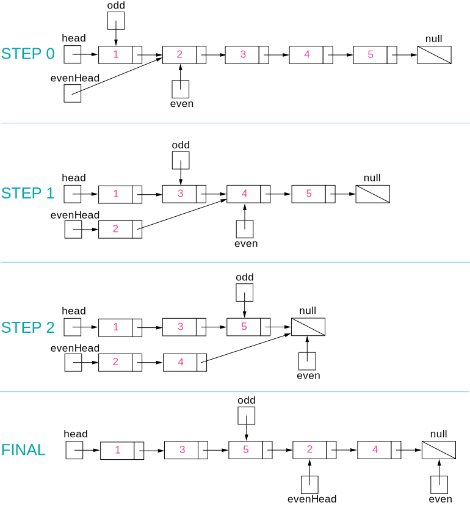

# 双指针

## 167 有序数组的 Two Sum

[Leetcode](https://leetcode.com/problems/two-sum-ii-input-array-is-sorted/description/) / [力扣](https://leetcode-cn.com/problems/two-sum-ii-input-array-is-sorted/description/)

使用双指针，一个指针指向值较小的元素，一个指针指向值较大的元素。指向较小元素的指针从头向尾遍历，指向较大元素的指针从尾向头遍历。

- 如果两个指针指向元素的和 sum == target，那么得到要求的结果；
- 如果 sum > target，移动较大的元素，使 sum 变小一些；
- 如果 sum < target，移动较小的元素，使 sum 变大一些。

数组中的元素最多遍历一次，时间复杂度为 O(N)。只使用了两个额外变量，空间复杂度为 O(1)。

## 633 两数平方和

[Leetcode](https://leetcode.com/problems/sum-of-square-numbers/description/) / [力扣](https://leetcode-cn.com/problems/sum-of-square-numbers/description/)

### Solution 1：brute force

遍历条件a*a <= c

- Time complexity : O(c) Two loops upto $\sqrt{c}$. Here, c*c* refers to the given integer(sum of squares).
- Space complexity : O(1). Constant extra space is used.

### Solution 2：better brute force

因为$a^2+b^2=c$，所以有$b^2=c-a^2$。这种时候我们只需要遍历(0, $\sqrt c$)找到一个a, 然后判断$c-a^2$是否是一个数的平方。

**数学**

第n个正整数的平方=前n个正奇整数之和
$$
n^{2}=1+3+5+\ldots+(2 \cdot n-1)=\sum_{i=1}^{n}(2 \cdot i-1)
$$
Time complexity: $O(c)$. The total number of times the $s u m$ is updated is: $1+2+3+\cdots+\sqrt{c}=\frac{\sqrt{c}(\sqrt{c}+1)}{2}=O(c)$
Space complexity : $O(1)$. Constant extra space is used.

### Solution 3：利用sqrt函数

很巧妙的是不用b\*b == c-a\*a，而是直接

```java
double b = Math.sqrt(c - a * a);
if (b == (int) b)
    return true;
```

- Time complexity: $O(\sqrt{c} \log c)$. We iterate over $\sqrt{c}$ values for choosing $a$. For every $a$ chosen, finding square root of $c-a^{2}$ takes $O(\log c)$ time in the worst case.
- Space complexity : $O(1)$. Constant extra space is used.

### Solution 4：二分查找

要判断$c-a^2$是否是一个整数的平方，利用二分查找。在[0, $c-a^2$]这个区间找到mid*mid = $c-a^2$。

- Time complexity: $O(\sqrt{c} \log c)$. Binary search taking $O(\log c)$ in the worst case is done for $\sqrt{c}$ values of $a$.
- Space complexity : $O(\log c)$. Binary Search will take $O(\log c)$ space.

### Solution 5：Fermat Theorem

费马定理：一个正整数可以分解成两个数的平方的和，当且仅当 n 的素数因式分解时，(4k+3) 形式的每个素数出现偶数次。

如果c本身是一个质数，他不能被[2, $\sqrt c$]中的任何质数分解，因此我们要去检查c是否可以表示成4k+3.如果是，要返回F，如果不是，返回T。

我们要找到c在[2, $\sqrt c$]中的所有质因数

- Time complexity: $O(\sqrt{c} \log c)$. We find the factors of $c$ and their count using repeated division. We check for the factors in the range $[0, \sqrt{c}]$. The maximum number of times a factor can occur(repeated division can be done) is $\log n$ (considering 2 as the only factor, $c=2^{x}$. Thus, $x=\log c$ ).

- Space complexity : $O(1)$. Constant space is used.

## 345 反转字符串中的元音字符

[Leetcode](https://leetcode.com/problems/reverse-vowels-of-a-string/description/) / [力扣](https://leetcode-cn.com/problems/reverse-vowels-of-a-string/description/)

### Solution 1：双指针遍历

一个l指针，一个r指针，从两头开始，分不同情况讨论怎么移动指针。判断元音的时候要小心 a e i o u A E I O U都是元音，要交换的。

### Solution 2：双指针+HashSet

使用双指针，一个指针从头向尾遍历，一个指针从尾到头遍历，当两个指针都遍历到元音字符时，交换这两个元音字符。

为了快速判断一个字符是不是元音字符，我们将全部元音字符添加到集合 HashSet 中，从而以 O(1) 的时间复杂度进行该操作。

- 时间复杂度为 O(N)：只需要遍历所有元素一次
- 空间复杂度 O(1)：只需要使用两个额外变量

## 680 回文字符串

[Leetcode](https://leetcode.com/problems/valid-palindrome-ii/description/) / [力扣](https://leetcode-cn.com/problems/valid-palindrome-ii/description/)

这不是简单的判断是否是回文，而是说至多删除一个字符，判断是否是回文。

本题的关键是处理删除一个字符。在使用双指针遍历字符串时，如果出现两个指针指向的字符不相等的情况，我们就试着删除一个字符，再判断删除完之后的字符串是否是回文字符串。

在判断是否为回文字符串时，我们不需要判断整个字符串，因为左指针左边和右指针右边的字符之前已经判断过具有对称性质，所以只需要判断中间的子字符串即可。

在试着删除字符时，我们既可以删除左指针指向的字符，也可以删除右指针指向的字符。

## 88 归并两个有序数组

[Leetcode](https://leetcode.com/problems/merge-sorted-array/description/) / [力扣](https://leetcode-cn.com/problems/merge-sorted-array/description/)

### Solution 1：从尾进行遍历

需要从尾开始遍历，否则在 nums1 上归并得到的值会覆盖还未进行归并比较的值。

## 141 判断链表是否存在环

[Leetcode](https://leetcode.com/problems/linked-list-cycle/description/) / [力扣](https://leetcode-cn.com/problems/linked-list-cycle/description/)

### Solution 1：快慢指针

循环条件

```java
while(fast != null && fast.next != null && slow != null)
```

空间复杂度O(1)

### Solution 2：HashSet

用set存放结点，判断结点是否在set里面，如果在说明true，否则是false

空间复杂度O(n)

## 524 最长子序列

[Leetcode](https://leetcode.com/problems/longest-word-in-dictionary-through-deleting/description/) / [力扣](https://leetcode-cn.com/problems/longest-word-in-dictionary-through-deleting/description/)

### Solution 1：brute force

我自己写出的，就是强制遍历判断，还引入了HashSet来存s的字母，方便判断。

github的思路跟我一样，不过代码比我简洁很多。

### Solution 2：Sorting  and checking subsequence

为了省去搜索的过程，先对字典里面的字符串进行排序。然后判断字典里的字符串是否是s的子串。

就是在我的基础上先对字典里的数组进行排序

Complexity Analysis
- Time complexity: $O(n \cdot x \log n+n \cdot x)$. Here $n$ refers to the number of strings in list $d$ and $x$ refers to average string length. Sorting takes $O(n \log n)$ and isSubsequence takes $O(x)$ to check whether a string is a subsequence of another string or not.
- Space complexity: $O(\log n)$. Sorting takes $O(\log n)$ space in average case.

### Solution 3：Without Sorting

额，就是直接遍历，然后判断是否是子串

Complexity Analysis

- Time complexity: $O(n \cdot x)$. One iteration over all strings is required. Here $n$ refers to the number of strings in list $d$ and $x$ refers to average string length.
- Space complexity : $O(x)$. max_str variable is used.

# 排序

## 快速选择

用于求解 **Kth Element** 问题，也就是第 K 个元素的问题。

可以使用快速排序的 partition() 进行实现。需要先打乱数组，否则最坏情况下时间复杂度为 O($N^2$)。

## 堆

用于求解 **TopK Elements** 问题，也就是 K 个最小元素的问题。使用最小堆来实现 TopK 问题，最小堆使用大顶堆来实现，大顶堆的堆顶元素为当前堆的最大元素。实现过程：不断地往大顶堆中插入新元素，当堆中元素的数量大于 k 时，移除堆顶元素，也就是当前堆中最大的元素，剩下的元素都为当前添加过的元素中最小的 K 个元素。插入和移除堆顶元素的时间复杂度都为$ log_2N$。

堆也可以用于求解 Kth Element 问题，得到了大小为 K 的最小堆之后，因为使用了大顶堆来实现，因此堆顶元素就是第 K 大的元素。

快速选择也可以求解 TopK Elements 问题，因为找到 Kth Element 之后，再遍历一次数组，所有小于等于 Kth Element 的元素都是 TopK Elements。

可以看到，快速选择和堆排序都可以求解 Kth Element 和 TopK Elements 问题。

### 215  Kth Largest Element in an Array

[Leetcode](https://leetcode.com/problems/kth-largest-element-in-an-array/description/) / [力扣](https://leetcode-cn.com/problems/kth-largest-element-in-an-array/description/)

#### Solution 1：小顶堆

时间复杂度 O(NlogK)，空间复杂度 O(K)

#### Solution 2：排序

时间复杂度 O(NlogN)，空间复杂度 O(1)

```java
Arrays.sort(nums);
```

#### Solution 3：快速选择

时间复杂度 O(N)，空间复杂度 O(1)

link 剑指offer 29 最小的K个数

## 桶排序

### 347 出现频率最多的 k 个元素

[Leetcode](https://leetcode.com/problems/top-k-frequent-elements/description/) / [力扣](https://leetcode-cn.com/problems/top-k-frequent-elements/description/)

#### Solution 1：HashMap + Comparator

看我写的代码！

```java
//利用Comparator接口进行排序
//这里将map.entrySet()转换成list
List<Map.Entry<Integer,Integer>> list = new ArrayList<Map.Entry<Integer,Integer>>(map.entrySet());
//然后通过比较器来实现排序
Collections.sort(list,new Comparator<Map.Entry<Integer,Integer>>() {
    //降序排序
    public int compare(Map.Entry<Integer, Integer> o1,
                       Map.Entry<Integer, Integer> o2) {
        return o2.getValue().compareTo(o1.getValue());
    }

});
int i = 0;
for(Map.Entry<Integer,Integer> mapping:list){
    if(i >= k){
        break;
    }
    ret[i++] = mapping.getKey();
}
```

#### Solution 2：Heap + HashMap

1. 建立HashMap 【元素，次数】，这一步耗费O(N)时间
2. 建立一个大小为k的heap，加入前k个元素需要O(k)时间，O(log1+log2+xxx+logK) = O(logk!) = O(klogk)。加入前k个元素后需要开始加入和弹出，一共进行N-k个操作。push/pop的时间复杂度O(logk)，要push/pop N-k次，所以时间复杂度为O((N-k)logk)。两部分加起来，这一步的时间复杂度O(Nlogk)
3. 最后，将heap转成数组，O(klogk)

Complexity Analysis
- Time complexity: $\mathcal{O}(N \log k)$ if $k<N$ and $\mathcal{O}(N)$ in the particular case of $N=k$. That ensures time complexity to be better than $\mathcal{O}(N \log N)$.
- Space complexity: $\mathcal{O}(N+k)$ to store the hash map with not more $N$ elements and a heap with $k$ elements.

#### Solution 3：Quickselect（Hoare's selection algorithm)

Quickselect经常被用于解决找到第k件事情、第k最小、第k最大、第k最频繁，第k最不频繁，平均时间复杂度O(N)，最差的情况下时间复杂度O(N2)，但出现最差情况的概率可以忽略。

Quickselect其实跟quicksort一样。

1. 建立一个hashmap（元素，频率），key是unique的，但是频率不是unique的。
2. 将频率小的元素放在左边，频率大的或相等的放在右边
3. 比较pivot_ind和N-k，如果相等，说明pivot_ind右边的是topK frequent元素，否则选择一边进行递归。

【感觉跟quicksort一样啊】

空间复杂度：up to O(N)

#### Solution 4：bucket sort

设置若干个桶，每个桶存储出现频率相同的数。桶的下标表示数出现的频率，即第 i 个桶中存储的数出现的频率为 i。

把数都放到桶之后，从后向前遍历桶，最先得到的 k 个数就是出现频率最多的的 k 个数。

### 451 按照字符出现次数对字符串排序

451. Sort Characters By Frequency (Medium)

[Leetcode](https://leetcode.com/problems/sort-characters-by-frequency/description/) / [力扣](https://leetcode-cn.com/problems/sort-characters-by-frequency/description/)

跟前面的347很像啊，不过是出现了多少次都要打印出来，而不是打印key，而是要打印value个key

看代码！

## 荷兰国旗问题

荷兰国旗包含三种颜色：红、白、蓝。

有三种颜色的球，算法的目标是将这三种球按颜色顺序正确地排列。它其实是三向切分快速排序的一种变种，在三向切分快速排序中，每次切分都将数组分成三个区间：小于切分元素、等于切分元素、大于切分元素，而该算法是将数组分成三个区间：等于红色、等于白色、等于蓝色。

### 75 按颜色进行排序

75. Sort Colors (Medium)

[Leetcode](https://leetcode.com/problems/sort-colors/description/) / [力扣](https://leetcode-cn.com/problems/sort-colors/description/)

#### Solution 1：快速排序

看我的代码

#### Solution 2：统计频率再赋值

因为只有0,1,2 第一次遍历统计0,1,2的次数，然后再赋值回原数组中。

数组里只包含 0、1、2，因此可以对数组排序，排序以后，所有的 0 就被摆放在了一起，所有的 1 就被摆放在了一起，所有的 2 就被摆放在了一起。

如果排序方法使用的是快速排序、归并排序，时间复杂度为 O(N log N)。

又由于数组里只包含 0、1、2，还可以使用计数排序，时间复杂度为 O(N)。

#### Solution 3：借助快速排序

[leetcode-cn讲解](https://leetcode-cn.com/problems/sort-colors/solution/kuai-su-pai-xu-partition-guo-cheng-she-ji-xun-huan/)

[youtube视频解析](https://youtu.be/7zuGmKfUt7s)

因为只有0,1,2 其实就已经分成3part了，而且不要求稳定排序，所以不需要递归调用，直接一次遍历就好。

题目最后给出的「进阶」要求，其实考察的是「快速排序」的子过程partition，即:通过一次遍历，把数组分成三个部分。
写代码的时候需要注意到设置的变量以及区间的定义，也就是循环不变量。循环不变量简单说就是在循环的过程中保持不变的性质，这个性质是人为根据需要解决的任务定义的。
对循环不变量的简单认识:

- 变量的值是变化的，但是保持不变的性质，就是循环不变量;
- 这里的「量」是一些人为定义的、可以判断真假的语句，在循环开始前、循环的过程中、循环结束以后，都为真;
- 这里的「循环」是广义上的，并不一定指「循环」，也有可能是在「递归」的过程中。

总结
「循环不变量」主要用于证明算法的正确性，在《算法导论》里大量使用了「循环不变量」这个工具。
·第2.1节插入排序
·第2.3.1节分治法·第6.3节建堆
·第7.1节快速排序的描述
其实「循环不变量」并不是一个很高深的概念，其实我们很多时候，在编写代码的过程中都在不自觉地维护了变量的定义。「循环不变量」只是一个学术化的名字而已，设计清楚「循环不变量」，可以帮助我们写出正确的代码。
关于「循环不变量」，我做了一个专题的视频教程，讲了4个「力扣」上的问题，感兴趣的朋友可以在B站搜索「 liweiwei1419」，专题三就是循环不变量，很好找。

# 贪心思想

保证每次操作都是局部最优的，并且最后得到的结果是全局最优的。

## 455 分配饼干

455. Assign Cookies (Easy)

[Leetcode](https://leetcode.com/problems/assign-cookies/description/) / [力扣](https://leetcode-cn.com/problems/assign-cookies/description/)

1. 给一个孩子的饼干应当尽量小并且又能满足该孩子，这样大饼干才能拿来给满足度比较大的孩子。
2. 因为满足度最小的孩子最容易得到满足，所以先满足满足度最小的孩子。

在以上的解法中，我们只在每次分配时饼干时选择一种看起来是当前最优的分配方法，但无法保证这种局部最优的分配方法最后能得到全局最优解。我们假设能得到全局最优解，并使用反证法进行证明，即假设存在一种比我们使用的贪心策略更优的最优策略。如果不存在这种最优策略，表示贪心策略就是最优策略，得到的解也就是全局最优解。

证明：假设在某次选择中，贪心策略选择给当前满足度最小的孩子分配第 m 个饼干，第 m 个饼干为可以满足该孩子的最小饼干。假设存在一种最优策略，可以给该孩子分配第 n 个饼干，并且 m < n。我们可以发现，经过这一轮分配，贪心策略分配后剩下的饼干一定有一个比最优策略来得大。因此在后续的分配中，贪心策略一定能满足更多的孩子。也就是说不存在比贪心策略更优的策略，即贪心策略就是最优策略。


复杂度分析

时间复杂度：O(mlogm+nlogn)，其中 m 和 n 分别是数组 g和 s 的长度。对两个数组排序的时间复杂度是O(mlogm+nlogn)，遍历数组的时间复杂度是 O(m+n)，因此总时间复杂度是 O(mlogm+nlogn)。

空间复杂度：O(logm+logn)，其中 m 和 n 分别是数组 g和 s 的长度。空间复杂度主要是排序的额外空间开销。

## 435 不重叠的区间个数

435. Non-overlapping Intervals (Medium)

[Leetcode](https://leetcode.com/problems/non-overlapping-intervals/description/) / [力扣](https://leetcode-cn.com/problems/non-overlapping-intervals/description/)

### Solution 1：贪心思想

先计算最多能组成的不重叠区间个数，然后用区间总个数减去不重叠区间的个数。

在每次选择中，区间的结尾最为重要，选择的区间结尾越小，留给后面的区间的空间越大，那么后面能够选择的区间个数也就越大。

按区间的结尾进行排序，每次选择结尾最小，并且和前一个区间不重叠的区间。

```java
Arrays.sort(intervals, Comparator.comparingInt(o -> o[1]));
```

```java
//使用 lambda 表示式创建 Comparator 会导致算法运行时间过长
// 如果注重运行时间，可以修改为普通创建 Comparator 语句：
//实现 compare() 函数时避免使用 return o1[1] - o2[1]; 这种减法操作，防止溢出。
Arrays.sort(intervals, new Comparator<int[]>(){
    public int compare(int[] o1, int[] o2){
        return (o1[1] < o2[1]) ? -1 : ((o1[1] == o2[1])? 0 : 1);
    }
});
```

复杂度分析

时间复杂度：O(nlogn)，其中 n 是区间的数量。我们需要 O(nlogn) 的时间对所有的区间按照右端点进行升序排序，并且需要 O(n)的时间进行遍历。由于前者在渐进意义下大于后者，因此总时间复杂度为 O(nlogn)。

空间复杂度：O(logn)，即为排序需要使用的栈空间。

### Solution 2：动态规划

[leetcode-cn](https://leetcode-cn.com/problems/non-overlapping-intervals/solution/wu-zhong-die-qu-jian-by-leetcode-solutio-cpsb/)

题目的要求等价于「选出最多数量的区间，使得它们互不重叠」。由于选出的区间互不重叠，因此我们可以将它们按照端点从小到大的顺序进行排序，并且无论我们按照左端点还是右端点进行排序，得到的结果都是唯一的。
这样一来，我们可以先将所有的n个区间按照左端点（或者右端点)从小到大进行排序，随后使用动态规划的方法求出区间数量的最大值。设排完序后这n个区间的左右端点分别为$l_0,\dots,l_{n—1}$以及$r_o, \dots, r_{n-1}$，那么我们令$f_i$表示「以区间i为最后一个区间，可以选出的区间数量的最大值」，状态转移方程即为:
$$
f_{i}=\max _{j<i \bigwedge r_j \leq l_i} \leq l_{i}\left\{f_{j}\right\}+1
$$
即我们枚举倒数第二个区间的编号j，满足j<i，并且第j个区间必须要与第i个区间不重叠。由于我们已经按照左端点进行升序排序了，因此只要第j个区间的右端点r没有越过第i个区间的左端点l，即$r_j$≤$l_i$，那么第j个区间就与第i个区间不重叠。我们在所有满足要求的j中，选择$f_j$最大的那一个进行状态转移，如果找不到满足要求的区间，那么状态转移方程中min这一项就为0，$f_i$就为1。
最终的答案即为所有$f_i$中的最大值。

时间复杂度：O(n^2)，其中 n 是区间的数量。我们需要 O(nlogn) 的时间对所有的区间按照左端点进行升序排序，并且需要 O(n^2)的时间进行动态规划。由于前者在渐进意义下小于后者，因此总时间复杂度为 O(n^2)。

注意到方法一本质上是一个「最长上升子序列」问题，因此我们可以将时间复杂度优化至 O(nlogn)

空间复杂度：O(n)，存储所有状态f_i所需要的空间

```java
public static IntStream stream(int[] array)
int maxVal = Arrays.stream(f).max().getAsInt();
//返回顺序IntStream与指定的数组作为源。 
//求出最大值，并通过流的getAsInt（）方法把返回。
```

## 452 投飞镖刺破气球

Minimum Number of Arrows to Burst Balloons (Medium)

[Leetcode](https://leetcode.com/problems/minimum-number-of-arrows-to-burst-balloons/description/) / [力扣](https://leetcode-cn.com/problems/minimum-number-of-arrows-to-burst-balloons/description/)

### Solution 1：范围大的放前面

看我的代码，自己写的

### Solution 2：即求不重叠区间个数

我没转过来为什么可以相当于求不重叠区间。后面想懂了。

1 先根据右端点从小到大排序

2 只要左端点<=end，因为按顺序遍历，右端点一定大于end，这样区间2一定和用于比较的区间有重叠。

## 406 根据身高和序号重组队列

406. Queue Reconstruction by Height(Medium)

[Leetcode](https://leetcode.com/problems/queue-reconstruction-by-height/description/) / [力扣](https://leetcode-cn.com/problems/queue-reconstruction-by-height/description/)

### Solution 1：我自己想的

1 先按人数从小到大排，如果人数相同就按照身高从小到大排

2 然后开始遍历记录下当前人前面有几个身高比他高或相等的记作cnt，并且记录下cnt == k时遍历到第几个人ind

3 如果cnt 比 k要大，就要将当前人放在记录的ind+1的位置，然后其他人顺次往后移动。

### Solution 2：github

[leetcode-cn解析](https://leetcode-cn.com/problems/queue-reconstruction-by-height/solution/xian-pai-xu-zai-cha-dui-dong-hua-yan-shi-suan-fa-g/)

为了使插入操作不影响后续的操作，身高较高的学生应该先做插入操作，否则身高较小的学生原先正确插入的第 k 个位置可能会变成第 k+1 个位置。

身高 h 降序、个数 k 值升序，然后将某个学生插入队列的第 k 个位置中。

渔（套路)︰一般这种数对，还涉及排序的，根据第一个元素正向排序，根据第二个元素反向排序，或者根据第一个元素反向排序，根据第二个元素正向排序，往往能够简化解题过程。
在本题目中，我首先对数对进行排序，按照数对的元素1降序排序，按照数对的元素⒉升序排序。原因是，按照元素1进行降序排序，对于每个元素，在其之前的元素的个数，就是大于等于他的元素的数量，而按照第二个元素正向排序，我们希望k大的尽量在后面，减少插入操作的次数。

## 121 买卖股票最大的收益

121. Best Time to Buy and Sell Stock (Easy)

[Leetcode](https://leetcode.com/problems/best-time-to-buy-and-sell-stock/description/) / [力扣](https://leetcode-cn.com/problems/best-time-to-buy-and-sell-stock/description/)

### Solution 1：brute force

就双重遍历，找到最大profit，但这种算法会超时

### Solution 2：One pass

只要记录前面的最小价格，将这个最小价格作为买入价格，然后将当前的价格作为售出价格，查看当前收益是不是最大收益。

complexity Analysis
- Time complexity: $O\left(n^{2}\right)$. Loop runs $\frac{n(n-1)}{2}$ times.
- Space complexity: $O(1)$. only two variables - maxprofit and profit are used

Complexity Analysis
- Time complexity: $O(n)$. Only a single pass is needed.
- Space complexity: $O(1)$. Only two variables are used.

## 122 买卖股票的最大收益 II

\122. Best Time to Buy and Sell Stock II (Easy)

[Leetcode](https://leetcode.com/problems/best-time-to-buy-and-sell-stock-ii/description/) / [力扣](https://leetcode-cn.com/problems/best-time-to-buy-and-sell-stock-ii/description/)

### Solution 1：Simple one pass

其实是solution 3的升级版

只要有收益就卖

github

对于 [a, b, c, d]，如果有 a <= b <= c <= d ，那么最大收益为 d - a。而 d - a = (d - c) + (c - b) + (b - a) ，因此当访问到一个 prices[i] 且 prices[i] - prices[i-1] > 0，那么就把 prices[i] - prices[i-1] 添加到收益中。


**Complexity Analysis**

- Time complexity : O(n). Single pass.
- Space complexity: O(1). Constant space needed.

### Solution 2：brute force

计算所有可能的组合，然后找到最大利润

时间复杂度O($n^n$)，因为递归要调用$n^n$次

空间复杂度O(n)， 递归深度为n

### Solution 3：peak valley approach


不断的寻找山谷和相邻的山峰

**Complexity Analysis**

- Time complexity : O(n). Single pass.
- Space complexity : O(1). Constant space required.

## 605 种植花朵

605. Can Place Flowers (Easy)

[Leetcode](https://leetcode.com/problems/can-place-flowers/description/) / [力扣](https://leetcode-cn.com/problems/can-place-flowers/description/)

### Solution 1：Single scan

遍历数组，找到为0的元素，判断相邻是否为0，如果是则可以放入1。

如果是第0个元素，只用检查第1个元素是否为0.

如果是最后一个元素，只用检查前面一个元素是否为0.

**Complexity Analysis**

- Time complexity : O(n). A single scan of the flowerbed array of size n is done.
- Space complexity : O(1). Constant extra space is used.

### Solution 2：Optimized

其实只是在Solution 1基础上优化，不用遍历完整个数组，而是一旦发现cnt >= n就可以直接return true.

## 392 判断是否为子序列

392. Is Subsequence (Medium)

[Leetcode](https://leetcode.com/problems/is-subsequence/description/) / [力扣](https://leetcode-cn.com/problems/is-subsequence/description/)

### Solution 1：双指针

### Solution 2：库函数

```java
s.toCharArray();
t.indexOf(c, index+1);
```

## 665  修改一个数成为非递减数组

665. Non-decreasing Array (Easy)

[Leetcode](https://leetcode.com/problems/non-decreasing-array/description/) / [力扣](https://leetcode-cn.com/problems/non-decreasing-array/description/)

### Solution 1：我自己想的

遇到num[i] > num[i+1]，有2种删除情况

1 删除num[i] 判断删除后的num是否符合f1

2 删除num[i+1] 判断删除后是否符合f2

还要用一个del数组判断哪个数被删除，如果f1是true，则在del中标记i，如果f2是true，在del中标记i+1。

用cnt标记删除的次数，因为最多删除一次，如果cnt已经为0，但是又遇到num[i] > num[i+1]，直接返回false。

### Solution 2：github

在出现 nums[i] < nums[i - 1] 时，需要考虑的是应该修改数组的哪个数，使得本次修改能使 i 之前的数组成为非递减数组，并且 **不影响后续的操作** 。优先考虑令 nums[i - 1] = nums[i]，因为如果修改 nums[i] = nums[i - 1] 的话，那么 nums[i] 这个数会变大，就有可能比 nums[i + 1] 大，从而影响了后续操作。还有一个比较特别的情况就是 nums[i] < nums[i - 2]，修改 nums[i - 1] = nums[i] 不能使数组成为非递减数组，只能修改 nums[i] = nums[i - 1]。

### Solution 3：贪心算法

本题是要维持一个非递减的数列，所以遇到递减的情况时(nums[i] > nums[i + 1])，要么将前面的元素缩小，要么将后面的元素放大。
但是本题唯一的易错点就在这，
如果将nums[i]缩小，可能会导致其无法融入前面已经遍历过的非递减子数列;
·如果将nums[i +1]放大，可能会导致其后续的继续出现递减;
所以要采取贪心的策略，在遍历时，每次需要看连续的三个元素，也就是瞻前顾后，遵循以下两个原则:

- 需要尽可能不放大nums[i +1]，这样会让后续非递减更困难;
- 如果缩小nums[i]，但不破坏前面的子序列的非递减性;

算法步骤:

- 遍历数组，如果遇到递减:
- 还能修改:
  - 修改方案1:将nums[i]缩小至nums[i + 1];
  - 修改方案2:将nums[i + 1]放大至nums[i];。
- 不能修改了:直接返回false;

复杂度分析
时间复杂度:O(n)

空间复杂度:O (1)

## 53. 子数组最大的和

53. Maximum Subarray (Easy)

[Leetcode](https://leetcode.com/problems/maximum-subarray/description/) / [力扣](https://leetcode-cn.com/problems/maximum-subarray/description/)

### Solution 1：动态规划

我想到的跟前面一题类似，都是

f(n - 1) > 0, 则f(n) = array[n] + f[n-1];

f(n - 1) <= 0, 则f(n) = array[n];

### Solution 2：暴力法

看我的代码

## 763  分隔字符串使同种字符出现在一起

763. Partition Labels (Medium)

[Leetcode](https://leetcode.com/problems/partition-labels/description/) / [力扣](https://leetcode-cn.com/problems/partition-labels/description/)

```java
//相当于变成[s.length()];
return new ArrayList(Arrays.asList(s.length()))
```

### Solution 1：双指针

看我的代码&ipad上草稿。

1 如果字母在0和len-1位，直接return len

2 开始遍历字符串，字母第一次出现的位置为k，最后出现的位置为j,在[k, j]之间遍历字母c，如果发现c最后出现的位置t>j， 则扩展到在[k, t]查找，如果遍历完，则进入t+1继续遍历。

LeetCode上面给的solution叫做greedy，其实就是我的算法。不过代码有优化。

Complexity Analysis
. Time Complexity: O(N ), where N is the length of S.
. Space Complexity: O(1) to keep data structure last of not more than 26 characters.

# 二分查找

代码

```java
public int binarySearch(int[] nums, int key) {
    int l = 0, h = nums.length - 1;
    while (l <= h) {
        int m = l + (h - l) / 2;
        if (nums[m] == key) {
            return m;
        } else if (nums[m] > key) {
            h = m - 1;
        } else {
            l = m + 1;
        }
    }
    return -1;
}
```

**时间复杂度**

二分查找也称为折半查找，每次都能将查找区间减半，这种折半特性的算法时间复杂度为 O(logN)。

**m 计算**

有两种计算中值 m 的方式：

- m = (l + h) / 2
- m = l + (h - l) / 2

l + h 可能出现加法溢出，也就是说加法的结果大于整型能够表示的范围。但是 l 和 h 都为正数，因此 h - l 不会出现加法溢出问题。所以，最好使用第二种计算法方法。

**未成功查找的返回值**

循环退出时如果仍然没有查找到 key，那么表示查找失败。可以有两种返回值：

- -1：以一个错误码表示没有查找到 key
- l：将 key 插入到 nums 中的正确位置

**变种**

二分查找可以有很多变种，实现变种要注意边界值的判断。例如在一个有重复元素的数组中查找 key 的最左位置的实现如下：

```java
public int binarySearch(int[] nums, int key) {
    //从nums.length-1变成nums.length
    int l = 0, h = nums.length;
    while (l < h) {
        int m = l + (h - l) / 2;
        if (nums[m] >= key) {
            h = m;
        } else {
            l = m + 1;
        }
    }
    return l;
}
```

该实现和正常实现有以下不同：

- h 的赋值表达式为 h = m
- 循环条件为 l < h
- 最后返回 l 而不是 -1

在 nums[m] >= key 的情况下，可以推导出最左 key 位于 [l, m] 区间中，这是一个闭区间。h 的赋值表达式为 h = m，因为 m 位置也可能是解。

在 h 的赋值表达式为 h = m 的情况下，如果循环条件为 l <= h，那么会出现循环无法退出的情况，因此循环条件只能是 l < h。以下演示了循环条件为 l <= h 时循环无法退出的情况：

```
nums = {0, 1, 2}, key = 1
l   m   h
0   1   2  nums[m] >= key
0   0   1  nums[m] < key
1   1   1  nums[m] >= key
1   1   1  nums[m] >= key
...
```

当循环体退出时，不表示没有查找到 key，因此最后返回的结果不应该为 -1。为了验证有没有查找到，需要在调用端判断一下返回位置上的值和 key 是否相等。

## 69  求开方

69 Sqrt(x) (Easy)

[Leetcode](https://leetcode.com/problems/sqrtx/description/) / [力扣](https://leetcode-cn.com/problems/sqrtx/description/)

### Solution 1：brute force

小心i*i会溢出，所以要转换成long进行比较。

从0开始遍历到x-1，如果i*i <= x 则i++。否则跳出循环，返回i-1。

### Solution 2：二分查找

循环条件，h l mid如何定义，我觉得拿个例子去试就ok

## 744 大于给定元素的最小元素

744. Find Smallest Letter Greater Than Target (Easy)

[Leetcode](https://leetcode.com/problems/find-smallest-letter-greater-than-target/description/) / [力扣](https://leetcode-cn.com/problems/find-smallest-letter-greater-than-target/description/)

### Solution 1：记录看过的字母

创建一个容量为26的布尔数组，将letter里面出现过的字母标记为true。

然后开始遍历那个布尔数组，每次循环target+1，因为要找比target大的。

如果target > z， 把target设置为a，否则保持target，然后判断+1后的target是否为true

Complexity Analysis

- Time Complexity: O(N), where N is the length of letters  We scan every element of the array.
- Space Complexity: O(1), the maximum size of seen 

### Solution 2：linear scan

就是我说的遍历，然后一个个比大小咯

Complexity Analysis

- Time Complexity: O(N) , where N is the length of letters . We scan every element of the array.
- Space Complexity: O(1) , as we maintain only pointers.

### Solution 3：binary search

Complexity Analysis

- Time Complexity: O(log N), where N is the length of letters . We peek only at log N elements in the array.
- Space Complexity: O(1), as we maintain only pointers.

## 540 有序数组的 Single Element

540. Single Element in a Sorted Array (Medium)

[Leetcode](https://leetcode.com/problems/single-element-in-a-sorted-array/description/) / [力扣](https://leetcode-cn.com/problems/single-element-in-a-sorted-array/description/)

### Solution 1：brute force

暴力遍历，从i = 0 遍历到 len - 1. 循环条件while( i < len - 1)。

如果nums[i] != nums[i+1]，return nums[i]。否则，i += 2.

最后返回nums[i];

### Solution 2：binary search

看我的代码+ipad上分析

### Solution 3：github上的二分查找

要求以 O(logN) 时间复杂度进行求解，因此不能遍历数组并进行异或操作来求解，这么做的时间复杂度为 O(N)。

令 index 为 Single Element 在数组中的位置。在 index 之后，数组中原来存在的成对状态被改变。如果 m 为偶数，并且 m + 1 < index，那么 nums[m] == nums[m + 1]；m + 1 >= index，那么 nums[m] != nums[m + 1]。

从上面的规律可以知道，如果 nums[m] == nums[m + 1]，那么 index 所在的数组位置为 [m + 2, h]，此时令 l = m + 2；如果 nums[m] != nums[m + 1]，那么 index 所在的数组位置为 [l, m]，此时令 h = m。

因为 h 的赋值表达式为 h = m，那么循环条件也就只能使用 l < h 这种形式。

## 278 第一个错误的版本

278. First Bad Version (Easy)

[Leetcode](https://leetcode.com/problems/first-bad-version/description/) / [力扣](https://leetcode-cn.com/problems/first-bad-version/description/)

### Solution 1：二分查找

跟前面说的【在一个有重复元素的数组中查找 key 的最左位置】很类似

## 153 旋转数组的最小数字

153. Find Minimum in Rotated Sorted Array (Medium)

[Leetcode](https://leetcode.com/problems/find-minimum-in-rotated-sorted-array/description/) / [力扣](https://leetcode-cn.com/problems/find-minimum-in-rotated-sorted-array/description/)

### Solution 1：二分法

【不能局限于m-1 m m+1 还要看两头】

当 m-1 < m < m+1 的时候 有可能是123 在左边也有可能是 2341在右边

如果没有旋转


有旋转


如果有旋转则存在一个折射点


**算法**

1 找到数组的中间元素

2 如果中间元素大于第一个元素，我们要找的折射点在右边

3 如果中间元素小于第一个元素 我们要找的点就在左边

`nums[mid] > nums[mid + 1]` Hence, **mid+1** is the smallest.

`nums[mid - 1] > nums[mid]` Hence, **mid** is the smallest.

Complexity Analysis

- Time Complexity : Same as Binary Search O(log N)

- Space Complexity : o(1)

### Solution 2：暴力法

遍历数组，然后找到最小的数，时间复杂度O(N)

### Solution 3：排序

我想到的，实在不行就排序，然后取第一个元素，hhh

## 34 查找区间

34. Find First and Last Position of Element in Sorted Array

[Leetcode](https://leetcode.com/problems/find-first-and-last-position-of-element-in-sorted-array/) / [力扣](https://leetcode-cn.com/problems/find-first-and-last-position-of-element-in-sorted-array/)

### Solution 1：二分法

我觉得就是找重复的最左最右问题。跟前面说的【在一个有重复元素的数组中查找 key 的最左位置】很类似

我先利用前面的模板找到最左，然后从最左开始直接遍历而不是再用二分法去找最右。

### Solution 2：暴力查找

实在不行就这样

### Solution 3：github

可以用二分查找找出第一个位置和最后一个位置，但是寻找的方法有所不同，需要实现两个二分查找。我们将寻找 target 最后一个位置，转换成寻找 target+1 第一个位置，再往前移动一个位置。这样我们只需要实现一个二分查找代码即可。

在寻找第一个位置的二分查找代码中，需要注意 h 的取值为 nums.length，而不是 nums.length - 1。先看以下示例：

```
nums = [2,2], target = 2
```

如果 h 的取值为 nums.length - 1，那么 last = findFirst(nums, target + 1) - 1 = 1 - 1 = 0。这是因为 findLeft 只会返回 [0, nums.length - 1] 范围的值，对于 findFirst([2,2], 3) ，我们希望返回 3 插入 nums 中的位置，也就是数组最后一个位置再往后一个位置，即 nums.length。所以我们需要将 h 取值为 nums.length，从而使得 findFirst返回的区间更大，能够覆盖 target 大于 nums 最后一个元素的情况。

### 二分法模板

【但我觉得还是前面整理的好理解，这个是来自这题的LeetCode-cn的】

模板1
当我们将区间[l, r]划分成[l, mid]和[mid + 1,r]时，其更新操作是r= mid或者l= mid +1，计算mid时不需要加1，即mid = (l + r)/2。

```java
int bsearch_1(int l, int r)
{
    while (l < r)
    {
        int mid = (l + r)/2;
        if (check(mid)) r = mid;
        else l = mid + 1;
    }
    return l;
}
```

模板2
当我们将区间[l,r]划分成[l, mid - 1]和[mid, r]时，其更新操作是r = mid - 1或者l = mid，此时为了防止死循环，计算mid时需要加1，即mid = ( l+r+ 1 )/2。

```java
int bsearch_2(int l, int r)
{
    while (l < r)
    {
        int mid = ( l + r + 1 ) /2;
        if (check(mid)) l = mid;
        else r = mid - 1;
    }
    return l;
}
```

**为什么两个二分模板的mid取值不同?**
对于第二个模板，当我们更新区间时，如果左边界I更新为|=mid，此时mid的取值就应为mid = (l + r + 1)/2。因为当右边界r =l+1时，此时mid = (l +l +1)/2，相当于下取整，mid 为l，左边界再次更新为l = mid =l，相当于没有变化。while循环就会陷入死循环。因此，我们总结出来一个小技巧，当左边界要更新为l= mid时，我们就令mid =(l + r + 1)/2,相当于上取整，此时就不会因为r取特殊值r =l+1而陷入死循环了。

而对于第一个模板，如果左边界I更新为l = mid + 1 ，是不会出现这样的困扰的。因此，大家可以熟记这两个二分模板，基本可以解决99%以上的二分问题，再也不会被二分的边界取值所困扰了。

# 分治

## 241 给表达式加括号

241. Different Ways to Add Parentheses (Medium)

[Leetcode](https://leetcode.com/problems/different-ways-to-add-parentheses/description/) / [力扣](https://leetcode-cn.com/problems/different-ways-to-add-parentheses/description/)

### Solution 1：递归

遍历到一个运算符，然后递归调用原方法，得到运算符左边和运算符右边的可能值，两者组合求得最终结果。

### Solution 2：dp

[leetcode解析](https://leetcode.com/problems/different-ways-to-add-parentheses/discuss/66333/Java-recursive-(9ms)-and-dp-(4ms)-solution)

【这个看了半天代码没看懂】

用`String.substring()`很浪费时间，所以将字符串解析成一个list，会发现所有数字都是在偶数位，运算符都在奇数位。

```
"1", "+", "2", "+", "3", "+", "4"
```

然后这个问题就变得很像`Unique Binary Search Trees II`。对于list中的每一个运算符，我们计算所有运算符左边所有可能的结果`List<Integer> left`，也计算运算符右边的所有可能的结果`List<Integer> right`, 然后将结果结合，可以通过递归或dp实现

## 95 不同的二叉搜索树

95. Unique Binary Search Trees II (Medium)

[Leetcode](https://leetcode.com/problems/unique-binary-search-trees-ii/description/) / [力扣](https://leetcode-cn.com/problems/unique-binary-search-trees-ii/description/)

### Solution 1：递归

看我的代码，写了超级久，思路对的，但是一堆bug，还好最终调试通过了！

# 搜索

## BFS


广度优先搜索一层一层地进行遍历，每层遍历都是以上一层遍历的结果作为起点，遍历一个距离能访问到的所有节点。需要注意的是，遍历过的节点不能再次被遍历。

第一层：

- 0 -> {6,2,1,5}

第二层：

- 6 -> {4}
- 2 -> {}
- 1 -> {}
- 5 -> {3}

第三层：

- 4 -> {}
- 3 -> {}

每一层遍历的节点都与根节点距离相同。设 di 表示第 i 个节点与根节点的距离，推导出一个结论：对于先遍历的节点 i 与后遍历的节点 j，有 di <= dj。利用这个结论，可以求解最短路径等 **最优解** 问题：第一次遍历到目的节点，其所经过的路径为最短路径。**应该注意的是，使用 BFS 只能求解无权图的最短路径，无权图是指从一个节点到另一个节点的代价都记为 1**。

在程序实现 BFS 时需要考虑以下问题：

- 队列：用来存储每一轮遍历得到的节点；
- 标记：对于遍历过的节点，应该将它标记，防止重复遍历。

### 1091 计算在网格中从原点到特定点的最短路径长度

1091. Shortest Path in Binary Matrix(Medium)

[Leetcode](https://leetcode.com/problems/shortest-path-in-binary-matrix/) / [力扣](https://leetcode-cn.com/problems/shortest-path-in-binary-matrix/)

#### Solution 1：BFS + Queue

求最短路径通常使用广度优先搜索，可以用队列实现。

从下标 [0,0] 开始遍历，每次寻找该点的八个方向是否可走，若可走就入队，继续执行该操作，最后走到 [n-1,n-1] 时，此时执行最外层循环的次数便是最短路径长度。（类似二叉树的层序遍历）

Leetcode上的最短路问题大部分是**无权的图**往往以二维数组的形式出现用BFS是效率比较高的做法，相比于DFS来说
我们从下标[0,0]开始遍历尝试相邻的8个方向合法就入队
为了让遍历的层数可追溯我们遍历的过程采用两层循环，外层判断是否队列已经为空。不为空先记录当前queue的size，再用一个循环处理size数量的queue，循环过程中当然可能会继续往队列里放入元素，那些元素就不在本层的处理逻辑里了。外层循环里可以用一个变量，比如ans标记当前遍历到哪一层，在当前层的循环完成后，ans++，就进入下一层的BFS循环，直到所有元素被遍历完成。这是常见的BFS追溯层数的套路。

### 279 组成整数的最小平方数数量

279. Perfect Squares (Medium)

[Leetcode](https://leetcode.com/problems/perfect-squares/description/) / [力扣](https://leetcode-cn.com/problems/perfect-squares/description/)

#### Solution 1：bfs

可以将每个整数看成图中的一个节点，如果两个整数之差为一个平方数，那么这两个整数所在的节点就有一条边。

要求解最小的平方数数量，就是求解从节点 n 到节点 0 的最短路径。

本题也可以用动态规划求解，在之后动态规划部分中会再次出现。

具体看代码注释

### 127 最短单词路径

127. Word Ladder (Medium)

[Leetcode](https://leetcode.com/problems/word-ladder/description/) / [力扣](https://leetcode-cn.com/problems/word-ladder/description/)

#### Solution 1：bfs + 最短路

跟上一题的思路一模一样

## DFS


广度优先搜索一层一层遍历，每一层得到的所有新节点，要用队列存储起来以备下一层遍历的时候再遍历。

而深度优先搜索在得到一个新节点时立即对新节点进行遍历：从节点 0 出发开始遍历，得到到新节点 6 时，立马对新节点 6 进行遍历，得到新节点 4；如此反复以这种方式遍历新节点，直到没有新节点了，此时返回。返回到根节点 0 的情况是，继续对根节点 0 进行遍历，得到新节点 2，然后继续以上步骤。

从一个节点出发，使用 DFS 对一个图进行遍历时，能够遍历到的节点都是从初始节点可达的，DFS 常用来求解这种 **可达性** 问题。

在程序实现 DFS 时需要考虑以下问题：

- 栈：用栈来保存当前节点信息，当遍历新节点返回时能够继续遍历当前节点。可以使用递归栈。
- 标记：和 BFS 一样同样需要对已经遍历过的节点进行标记。

### 695 查找最大的连通面积

695. Max Area of Island (Medium)

[Leetcode](https://leetcode.com/problems/max-area-of-island/description/) / [力扣](https://leetcode-cn.com/problems/max-area-of-island/description/)

#### Solution 1：depth-first search recursive 

Complexity Analysis

- Time Complexity: O(R * C), where R is the number of rows in the given grid , and C is the number of columns. We visit every square once.
- Space complexity:O(R * C) , the space used by seen to keep track of visited squares, and the space used by the call stack during our recursion.

#### Solution 2：depth-first search iterative

通过栈来实现迭代。

如果起始方块没被seen，就继续探索绕在他四个分析的反馈，并将方块加入到栈中。

Complexity Analysis

- Time Complexity: O(R * C), where R is the number of rows in the given grid , and C is the number of columns. We visit every square once.
- Space complexity: O(R * C), the space used by seen to keep track of visited squares, and the space used by stack .

#### Solution 3：BFS

居然还可以不用多一个数组标记是否看过 看代码。方法从LeetCode comment看到的

### 200 矩阵中的连通分量数目

200. Number of Islands (Medium)

[Leetcode](https://leetcode.com/problems/number-of-islands/description/) / [力扣](https://leetcode-cn.com/problems/number-of-islands/description/)

这题跟`695 查找最大的连通面积`思路基本一样，不过一个是计算面积，一个是计算岛屿的个数

### 547 好友关系的连通分量数目

547. Friend Circles (Medium)

[Leetcode](https://leetcode.com/problems/friend-circles/description/) / [力扣](https://leetcode-cn.com/problems/friend-circles/description/)

跟前面的很像，不过是有对称关系。

### 130 填充封闭区域

130. Surrounded Regions (Medium)

[Leetcode](https://leetcode.com/problems/surrounded-regions/description/) / [力扣](https://leetcode-cn.com/problems/surrounded-regions/description/)

#### Solution 1：我的方法

跟前面的遍历一样，也是dfs，不同的是

1 引入seen判断是否看过

2 在dfs中遍历时遇到O先改为'1' 

3 dfs返回的是flag，如果为true，说明这个区域有靠近边界的，将1修改回O，否则要进行修改，将1改为X

#### Solution 2：填充最外层

先填充最外侧，剩下的就是里侧了。

在dfs的时候直接找边界的，将O变成T，这样的话就可以把连接边界的O全部变成T。

然后再遍历全部，将余下的O变成X，将T变成O。

太机智了！

### 417  能到达的太平洋和大西洋的区域

417. Pacific Atlantic Water Flow (Medium)

[Leetcode](https://leetcode.com/problems/pacific-atlantic-water-flow/description/) / [力扣](https://leetcode-cn.com/problems/pacific-atlantic-water-flow/description/)

跟130很像，要学会逆向思考啊，从最后流出去的倒推

## Backtracking

Backtracking（回溯）属于 DFS。

- 普通 DFS 主要用在 **可达性问题** ，这种问题只需要执行到特点的位置然后返回即可。
- 而 Backtracking 主要用于求解 **排列组合** 问题，例如有 { 'a','b','c' } 三个字符，求解所有由这三个字符排列得到的字符串，这种问题在执行到特定的位置返回之后还会继续执行求解过程。

因为 Backtracking 不是立即返回，而要继续求解，因此在程序实现时，需要注意对元素的标记问题：

- 在访问一个新元素进入新的递归调用时，需要将新元素标记为已经访问，这样才能在继续递归调用时不用重复访问该元素；
- 但是在递归返回时，需要将元素标记为未访问，因为只需要保证在一个递归链中不同时访问一个元素，可以访问已经访问过但是不在当前递归链中的元素。

### 17 数字键盘组合

17. Letter Combinations of a Phone Number (Medium)

[Leetcode](https://leetcode.com/problems/letter-combinations-of-a-phone-number/description/) / [力扣](https://leetcode-cn.com/problems/letter-combinations-of-a-phone-number/description/)

#### Solution 1：暴力法

建立一个String数组map，每个位置放对应的字符串，如 map[2] = "abc"，map[9] = "wxyz"

将digit分解成各个数字，存进list. 然后

```java
int size = list.size();
Stringbuilder sb = new Stringbuilder;
int cnt = 0;
String s1 = list.get(cnt);
cnt++;
for(int i = 0; i < s1.length(); i++){
    Stringbuilder sb = new Stringbuilder;
    sb.append(i);
    sb.append(dfs(cnt, list));
}
//dfs(cnt, list) 用来获取剩下的字符
//退出条件 cnt >= s.length();
```

但上面是我瞎想的，代码没敲，感觉不太想

#### Solution 2：回溯

获取当前digit对应的string，然后开始遍历string，开始时将对应字符加入prefix， 然后递归digit对应的下一个string，递归结束后删除加入prefix的字符。

#### Solution 3：FIFO queue

```java
for(int i = 0; i < digits.length(); i++){
    int x = Character.getNumericValue(digits.charAt(i));
    while(ans.peek().length() == i){
        //删除并返回第一个元素。
        String t = ans.remove();
        for(char s: map[x].toCharArray()){
            ans.add(t+s);
        }
    }
}
```

```java
ans.add("");
while(ans.peek().length() != digits.length()){
    String remove = ans.remove();
    String m = map[digits.charAt(remove.length()) - '0'];
    for(char c: m.toCharArray()){
        //元素添加到尾部
        ans.addLast(remove+c);
        //试过了 用add也可以
    }
}
```

### 93 IP 地址划分

93. Restore IP Addresses(Medium)

[Leetcode](https://leetcode.com/problems/restore-ip-addresses/description/) / [力扣](https://leetcode-cn.com/problems/restore-ip-addresses/description/)

[YouTube解析](https://www.youtube.com/watch?v=nxBMEvLqDzY)

上面的解析讲的很好，结合解析和代码一起看

### 79 在矩阵中寻找字符串

79. Word Search (Medium)

[Leetcode](https://leetcode.com/problems/word-search/description/) / [力扣](https://leetcode-cn.com/problems/word-search/description/)

我自己写了很久终于通过了，但是效率都没有github上面的好

### 257 输出二叉树中所有从根到叶子的路径

257. Binary Tree Paths (Easy)

[Leetcode](https://leetcode.com/problems/binary-tree-paths/description/) / [力扣](https://leetcode-cn.com/problems/binary-tree-paths/description/)

### 46 排列

46. Permutations (Medium)

[Leetcode](https://leetcode.com/problems/permutations/description/) / [力扣](https://leetcode-cn.com/problems/permutations/description/)

### 47 含有相同元素求排列

47. Permutations II (Medium)

[Leetcode](https://leetcode.com/problems/permutations-ii/description/) / [力扣](https://leetcode-cn.com/problems/permutations-ii/description/)

#### Solution 0

在实现上，和 Permutations 不同的是要先排序，然后在添加一个元素时，判断这个元素是否等于前一个元素，如果等于，并且前一个元素还未访问，那么就跳过这个元素。

```java
if(i>0 &&nums[i-1]==nums[i] && !used[i-1]) continue;
```

The difficulty is to handle the duplicates.
With inputs as `[1a, 1b, 2a]`,
If we don't handle the duplicates, the results would be: `[1a, 1b, 2a], [1b, 1a, 2a]...`,
so we must make sure `1a` goes before `1b` to avoid duplicates
By using `nums[i-1]==nums[i] && !used[i-1]`, we can make sure that `1b` cannot be choosed before `1a`

#### Solution 1：backtracking with  groups of numbers

为了防止冗余，我们只考虑unique number作为真正的candidate

Algorithm

建立一个hashmap 叫做counter <number, number of occurrence>

然后建立一个函数backtrack(comb, counter)， comb是当前数字的组合

#### Solution 2：HashSet

跟46同样的做法，不过是加入hashset去重

```java
if(permutation.size() == nums.length){
    set.add(new ArrayList<Integer>(permutation));
    return;
}
return new ArrayList(set);
```

### 77 组合

77. Combinations (Medium)

[Leetcode](https://leetcode.com/problems/combinations/description/) / [力扣](https://leetcode-cn.com/problems/combinations/description/)

#### Solution 1：类似47

我自己想的 ，不过continue实现的条件不是num[i]和num[i-1] seen[i-1]比，而是要求后面加入的数不能比前面加入的数大，否则会重复

### 39 组合求和

39. Combination Sum (Medium)

[Leetcode](https://leetcode.com/problems/combination-sum/description/) / [力扣](https://leetcode-cn.com/problems/combination-sum/description/)

跟`77 组合`类似，只是return的语句有些差异。

### 40 含有相同元素的组合求和

40. Combination Sum II (Medium)

[Leetcode](https://leetcode.com/problems/combination-sum-ii/description/) / [力扣](https://leetcode-cn.com/problems/combination-sum-ii/description/)

#### Solution 1：mine

根据39和前面的77 代码改编一下即可。

#### Solution 2：backtracking with counters

counter的思路：不将每个数字当做一个candidate，而是将整个group里面的unique number才当做candidate


**Algorithm**

1. 建立一个hashmap表counter，记录每个数字对应出现的次数
2. 定义回溯函数backtrack(comb, remain, curr, candidate_groups, results)
   1. comb：到目前为止我们建立的组合
   2. remain：需要我们去凑够的剩下的sum
   3. curr：用来指明遍历到哪个unique group的指针
   4. counter：当前用来计数的表
   5. results：存放满足target sum的最终组合
3. 每次调用backtrack， 第一步是判断`sum(comb) == target`，如果sum > target，我们就停止探索
4. 如果sum<target，我们就要遍历当前计数器表以选择下一个候选者。
   1. 一旦我们选择了一个候选者，我们就会通过调用具有更新状态的 backtrack() 函数来继续探索。
   2. 更重要的是，在每次探索结束时，我们需要恢复之前更新的状态，以便为下一次探索重新开始。 正是由于这种回溯操作，该算法才得名。

时间复杂度：O(2^N)

空间复杂度：O(N)

#### Solution 3：Backtracking with index

和Solution 2不同的是，直接sort数组而非根据数组建立一个counter table。


1). `next_curr > curr`:无论其他条件如何，我们都会选择当前当前位置的数字到组合中。

2). `candidates[next_curr] == candidates[next_curr-1]`我们将跳过中间所有重复数字的出现

**Algorithm**

1. 和solution 2一样，依旧用backtrack， 但是函数定义少了counter， backtrack(comb, remain, curr, candidate_groups, results)
2. 该函数的大部分内容与 39. Combination Sum 的解决方案相同，除了我们之前讨论过的索引上的特定条件。
3. 通过early stopping来优化回溯，即一旦当前组合的总和超过目标，我们可以停止对其余数字的探索。 因为所有的数字都是正数，正如问题中所指定的，组合的总和将单调增加。 无需探索更多总和超出所需目标的组合。

时间复杂度：O(2^N)

空间复杂度：O(N)

### 216  1-9 数字的组合求和

216. Combination Sum III (Medium)

[Leetcode](https://leetcode.com/problems/combination-sum-iii/description/) / [力扣](https://leetcode-cn.com/problems/combination-sum-iii/description/)

跟前面的47 77 39 40 有异曲同工之处，学套路，会套了就简单了。

### 78 子集

78. Subsets (Medium)

[Leetcode](https://leetcode.com/problems/subsets/description/) / [力扣](https://leetcode-cn.com/problems/subsets/description/)

```java
//数组变list
List list = Arrays.asList(strArray);
```

跟前面的代码很类似

前面的`Permutations / Combinations / Subsets`， 他们都非常相似，而且有共同的解决策略

First, their solution space is often quite large:
- Permutations: $N !$
- Combinations: $C_{N}^{k}=\frac{N !}{(N-k) ! k !}$
- Subsets: $2^{N}$, since each element could be absent or present.

一般来说有以下3种策略：

- Recursion
- Backtracking
- Lexicographic generation based on the mapping between binary bitmasks and the corresponding
  permutations / combinations / subsets.

前2种方法都很复杂，第三种方法才是面试官想要看到的，因为它将问题简化为二进制数的生成，因此很容易实现并验证没有解决方案丢失。此外，该方法具有最佳的时间复杂度，并且作为奖励，它为已排序的输入生成按字典顺序排序的输出。

#### Solution 1：Cascading

让我们从输出列表中的空子集开始。 在每一步都考虑新的整数并从现有的子集生成新的子集。


- Time complexity: $\mathcal{O}(N \times 2^N)$ to generate all subsets and then copy them into output list.
- Space complexity: $\mathcal{O}(N \times 2^N)$. This is exactly the number of solutions for subsets multiplied by the number $N$ of elements to keep for each subset.
  - For a given number, it could be present or absent (*i.e.* binary choice) in a subset solution. As as result, for $N$ numbers, we would have in total $2^N$ choices (solutions).

#### Solution 2：Backtracking

这个问题也可以被定义为finding the power set from a sequence.【找幂集？】

我们遍历组合的长度，而不是候选数字，并借助回溯技术生成给定长度的所有组合。


这个思路跟我和github的思路一样

**Complexity Analysis**

- Time complexity: $\mathcal{O}(N \times 2^N)$ to generate all subsets and then copy them into output list.
- Space complexity: $\mathcal{O}(N)$. We are using $O(N)$space to maintain `curr`, and are modifying `curr` in-place with backtracking. Note that for space complexity analysis, we do not count space that is *only* used for the purpose of returning output, so the `output` array is ignored.

#### Solution 3：Lexicographic (Binary Sorted) Subsets

The idea of this solution is originated from [Donald E. Knuth](https://www-cs-faculty.stanford.edu/~knuth/taocp.html).

> The idea is that we map each subset to a bitmask of length n, where `1` on the i*th* position in bitmask means the presence of `nums[i]` in the subset, and `0` means its absence.


bitmask[0,0,0]对应一个空子集，而bitmask[1,1,1]对应一个全集

所以我们只需要生成n位的bitmsk从0..00到1.11即可

难点在于解决 [zero left padding](https://en.wikipedia.org/wiki/Padding_(cryptography)#Zero_padding)。 因为要生成的是001而不是1.可以通过一下trick解决

```java
int nthBit = 1 << n;
for (int i = 0; i < (int)Math.pow(2, n); ++i) {
    // generate bitmask, from 0..00 to 1..11
    String bitmask = Integer.toBinaryString(i | nthBit).substring(1);
```

或者直接简单地改变迭代限制

```java
for (int i = (int)Math.pow(2, n); i < (int)Math.pow(2, n + 1); ++i) {
  // generate bitmask, from 0..00 to 1..11
  String bitmask = Integer.toBinaryString(i).substring(1);
```

**Algorithm**

- Generate all possible binary bitmasks of length n.
- Map a subset to each bitmask: `1` on the i*th* position in bitmask means the presence of `nums[i]` in the subset, and `0` means its absence.
- Return output list.

**Complexity Analysis**

- Time complexity: $\mathcal{O}(N \times 2^N)$ to generate all subsets and then copy them into output list.
- Space complexity: $\mathcal{O}(N \times 2^N)$ to keep all the subsets of length $N$, since each of $N$ elements could be present or absent.

### 90 含有相同元素求子集

90. Subsets II (Medium)

[Leetcode](https://leetcode.com/problems/subsets-ii/description/) / [力扣](https://leetcode-cn.com/problems/subsets-ii/description/)

这种有重复元素，又要求结果不能重复的，就要用到

```java
Arrays.sort(nums);
boolean[] seen = new boolean[nums.length];
//判断条件
if(i != 0 && nums[i] == nums[i-1] && !seen[i])
    continue;
```

### 131 分割字符串使得每个部分都是回文数

131. Palindrome Partitioning (Medium)

[Leetcode](https://leetcode.com/problems/palindrome-partitioning/description/) / [力扣](https://leetcode-cn.com/problems/palindrome-partitioning/description/)

我自己想出来了，思路和github一样

#### Solution 1：Backtracking

The backtracking algorithms consists of the following steps:

- *Choose*: Choose the potential candidate. Here, our potential candidates are all substrings that could be generated from the given string.
- *Constraint*: Define a constraint that must be satisfied by the chosen candidate. In this case, the constraint is that the string must be a *palindrome*.
- *Goal*: We must define the goal that determines if have found the required solution and we must backtrack. Here, our goal is achieved if we have reached the end of the string.

我的思路：

1 在输入的字符串中，从头开始逐个遍历，利用s.substring(0, j)获得字符串pre。

2 判断字符串pre是否是回文，如果是则加入curList，然后利用s.substring(j)得到下一步backtracking需要输入的字符串next。

3 backtracking完后，将curList最后加入的字符串删除，进行回溯

4 当next的长度为0，说明已经遍历完了，则return。要记住s.length()==0 和 s\==null是不一样的！

**Complexity Analysis**

- Time Complexity : $\mathcal{O}(N \cdot 2^{N})$, where $N$ is the length of string $s$. This is the worst-case time complexity when all the possible substrings are palindrome.


Hence, there could be $2^{N}$ possible substrings in the worst case. For each substring, it takes $\mathcal{O}(N) $time to generate substring and determine if it a palindrome or not. This gives us time complexity as $\mathcal{O}(N \cdot 2^{N})$

- Space Complexity: $\mathcal{O}(N)$, where $N$ is the length of the string $s$. This space will be used to store the recursion stack. For s = `aaa`, the maximum depth of the recursive call stack is 3 which is equivalent to $N$.

#### Solution 2：backtracking & dynamic programming

前一种方法执行一次额外的迭代来确定给定的子串是否是回文串。 在这里，我们多次重复迭代同一个子串，结果总是相同的。 存在重叠子问题，我们可以通过使用动态规划来进一步优化该方法，以确定一个字符串在恒定时间内是否是回文。 让我们详细了解该算法。

**Algorithm**

给一个字符串s的开始指针start和结束指针end，如果s是一个回文串，则满足以下限制：

1. s.charAt(start) == s.chartAt(end);
2. s的子串从start+1到end-1也是一个回文串


字符串s的长度为N，判断一个位于[start, end]的子串是否是回文，用一个NxN的二维数组dp来记录。

其中$dp[start][end]=true$ , 说明[start, end]这段子串是回文，否则是false。

当我们发现当前子串是回文的时候要update数组dp

**Complexity Analysis**

- Time Complexity : $\mathcal{O}(N \cdot 2^{N})$, where $N$ is the length of string $s$ In the worst case, there could be $2^{N}$ possible substrings and it will take $\mathcal{O}(N)$ to generate each substring using `substr` as in *Approach 1*. However, we are eliminating one additional iteration to check if substring is a palindrome or not.
- Space Complexity: $\mathcal{O}(N \cdot N)$, where $N$ is the length of the string $s$. The recursive call stack would require $N$ space as in *Approach 1*. Additionally we also use 2 dimensional array $\text{dp}$ of size $N \cdot N$

This gives us total space complexity as$ \mathcal{O}(N \cdot N)$ + $\mathcal{O}(N)$ = $\mathcal{O}(N \cdot N)$

### 37  数独

37. Sudoku Solver (Hard)

[Leetcode](https://leetcode.com/problems/sudoku-solver/description/) / [力扣](https://leetcode-cn.com/problems/sudoku-solver/description/)

### 51 N 皇后

51. N-Queens (Hard)

[Leetcode](https://leetcode.com/problems/n-queens/description/) / [力扣](https://leetcode-cn.com/problems/n-queens/description/)

在 n*n 的矩阵中摆放 n 个皇后，并且每个皇后不能在同一行，同一列，同一对角线上，求所有的 n 皇后的解。

一行一行地摆放，在确定一行中的那个皇后应该摆在哪一列时，需要用三个标记数组来确定某一列是否合法，这三个标记数组分别为：列标记数组、45 度对角线标记数组和 135 度对角线标记数组。

45 度对角线标记数组的长度为 2 * n - 1，通过下图可以明确 (r, c) 的位置所在的数组下标为 r + c。


135 度对角线标记数组的长度也是 2 * n - 1，(r, c) 的位置所在的数组下标为 n - 1 - (r - c)。


# 动态规划

递归和动态规划都是将原问题拆成多个子问题然后求解，他们之间最本质的区别是，动态规划保存了子问题的解，避免重复计算。

## 斐波那契数列

### 70  爬楼梯

70. Climbing Stairs (Easy)

[Leetcode](https://leetcode.com/problems/climbing-stairs/description/) / [力扣](https://leetcode-cn.com/problems/climbing-stairs/description/)

定义一个数组 dp 存储上楼梯的方法数（为了方便讨论，数组下标从 1 开始），dp[i] 表示走到第 i 个楼梯的方法数目。

第 i 个楼梯可以从第 i-1 和 i-2 个楼梯再走一步到达，走到第 i 个楼梯的方法数为走到第 i-1 和第 i-2 个楼梯的方法数之和。
$$
dp[i] = dp[i - 1]+dp[i-2]
$$
考虑到 dp[i] 只与 dp[i - 1] 和 dp[i - 2] 有关，因此可以只用两个变量来存储 dp[i - 1] 和 dp[i - 2]，使得原来的 O(N) 空间复杂度优化为 O(1) 复杂度。

### 198 强盗抢劫

198. House Robber (Easy)

[Leetcode](https://leetcode.com/problems/house-robber/description/) / [力扣](https://leetcode-cn.com/problems/house-robber/description/)

定义 dp 数组用来存储最大的抢劫量，其中 dp[i] 表示抢到第 i 个住户时的最大抢劫量。

由于不能抢劫邻近住户，如果抢劫了第 i -1 个住户，那么就不能再抢劫第 i 个住户，所以
$$
dp[i] = max(dp[i-2]+nums[i], dp[i-1])
$$

### 213 强盗在环形街区抢劫

213. House Robber II (Medium)

#### Solution 1：动态规划

首先考虑最简单的情况。如果只有一间房屋，则偷窃该房屋，可以偷窃到最高总金额。如果只有两间房屋，则由于两间房屋相邻，不能同时偷窃，只能偷窃其中的一间房屋，因此选择其中金额较高的房屋进行偷窃，可以偷窃到最高总金额。

注意到当房屋数量不超过两间时，最多只能偷窃一间房屋，因此不需要考虑首尾相连的问题。如果房屋数量大于两间，就必须考虑首尾相连的问题，第一间房屋和最后一间房屋不能同时偷窃。如何才能保证第一间房屋和最后一间房屋不同时偷窃呢?如果偷窃了第一间房屋，则不能偷窃最后一间房屋，因此偷窃房屋的范围是第一间房屋到最后第二间房屋;如果偷窃了最后一间房屋，则不能偷窃第一间房屋，因此偷窃房屋的范围是第二间房屋到最后一间房屋。

假设数组nums的长度为n。如果不偷窃最后一间房屋，则偷窃房屋的下标范围是[0, n - 2];如果不偷窃第一间房屋，则偷窃房屋的下标范围是[1,n-1]。在确定偷窃房屋的下标范围之后，即可用第198题的方法解决。对于两段下标范围分别计算可以偷窃到的最高总金额，其中的最大值即为在n间房屋中可以偷窃到的最高总金额。
假设偷窃房屋的下标范围是[start, end]，用dp[i]表示在下标范围[start,i]内可以偷窃到的最高总金额，那么就有如下的状态转移方程:
dp[i]=max( dp[i-2] +nums[i], dp[i-1])

### 4 信件错排[非LeetCode]

题目描述：有 N 个 信 和 信封，它们被打乱，求错误装信方式的数量。

定义一个数组 dp 存储错误方式数量，dp[i] 表示前 i 个信和信封的错误方式数量。假设第 i 个信装到第 j 个信封里面，而第 j 个信装到第 k 个信封里面。根据 i 和 k 是否相等，有两种情况：

- i==k，交换 i 和 j 的信后，它们的信和信封在正确的位置，但是其余 i-2 封信有 dp[i-2] 种错误装信的方式。由于 j 有 i-1 种取值，因此共有 (i-1)*dp[i-2] 种错误装信方式。
- i != k，交换 i 和 j 的信后，第 i 个信和信封在正确的位置【这里应该是第j个信封在正确的位置吧】，其余 i-1 封信有 dp[i-1] 种错误装信方式。由于 j 有 i-1 种取值，因此共有 (i-1)*dp[i-1] 种错误装信方式。

综上所述，错误装信数量方式数量为：
$$
dp[i]=(i-1)*dp[i-2]+(i-1)*dp[i-1]
$$

### 5. 母牛生产

[程序员代码面试指南-P181](https://github.com/CyC2018/CS-Notes/blob/master/notes/Leetcode 题解 - 动态规划.md#)

题目描述：假设农场中成熟的母牛每年都会生 1 头小母牛，并且永远不会死。第一年有 1 只小母牛，从第二年开始，母牛开始生小母牛。每只小母牛 3 年之后成熟又可以生小母牛。给定整数 N，求 N 年后牛的数量。

第 i 年成熟的牛的数量为：
$$
dp[i] = dp[i-1] + dp[i-3]
$$
第i年未成熟的牛的数量[成熟的牛会继续生]
$$
dp'[i] = dp[i]+dp[i-1] + dp[i-2]
$$
合起来就是第i年牛的总量
$$
dp''[i] = 3dp[i-1]+dp[i-2]+2dp[i-3]
$$

## 矩阵路径

### 64 矩阵的最小路径和

64. Minimum Path Sum (Medium)

[Leetcode](https://leetcode.com/problems/minimum-path-sum/description/) / [力扣](https://leetcode-cn.com/problems/minimum-path-sum/description/)

不能用BFS，因为BFS只能用在无权的图！

#### Solution 1：recursion

来自LeetCode discuss

So basically let's begin with recursion because it is easier to understand and code. When we think about this problem, we could use a top down approach. To get a path, we need to travel from grid[0][0] to grid\[row - 1][col - 1]. So let's set grid[0][0] as the basic case. This is when we jump out of recursion. On the other hand, grid\[row - 1][col - 1] would be the starting point. We write a helper function to do the recursion work. At the starting point, this function returns (value of the end cell + value of the cell that has the less one). But we need to consider that things could happen that we reached the first row or column and we gotta make sure that we stay within the array index limit.
At last, when we reach grid\[0][0], we are done!

Both grid\[0][0] or grid\[row-1][col-1] can be taken as starting point in this question while implementing DP as Top Down approach.
But state variable(i.e, dp\[i][j]) in 2-D DP array represent different things in both cases,
case 1: If grid\[0][0] taken as starting point , dp\[i][j] => represents minimum path sum from cell (0,0) to cell (i,j) in grid.
case 2: If grid\[m-1][n-1] taken as starting point , dp\[i][j] => represents minimum path sum from cell (i,j) to cell (m-1,n-1) in grid.
Hope this clarify things a bit. :)

#### Solution 2: dynamic programming

Now, let's upgrade this algorithm from recursion to DP since we don't wanna get stackoverflow for large inputs. In fact, there is nothing fancy about DP. It is simply that we store or cache the results of every single calculation so that we don't need to calculate the same thing again and again. The whole idea is almost the same. We just involve an array to store the values. Now let's see the code:

### 62 矩阵的总路径数

62. Unique Paths (Medium)

[Leetcode](https://leetcode.com/problems/unique-paths/description/) / [力扣](https://leetcode-cn.com/problems/unique-paths/description/)

#### Solution 1：dynamic programming

定义dp\[ i ][ j ]表示到（i, j)有多少种路径

如果i = 0, 则dp\[0][j] = 1

如果j = 0, 则dp\[i][0] = 1

否则，$dp[i][j] = dp[i][j-1]+dp[i-1][j]$ 

Runtime 1 ms, Time complexity m x n, Space complexity: m x n

Bottom-up方法

#### Solution 2：recursive

这种方法当数字大的时候会报错

The time complexity would be the number of nodes in the recursion tree. In this case, there are 2 ^ (m+n) ways to reach (m,n) from (0,0). Hence time complexity = 2 ^ (m+n)

#### Solution 3：Memoization

 (Runtime 0 ms, Time complexity m x n, Space complexity: m x n):

Top-Down

这个看ipad上面画图再结合main里的debug理解

#### Solution 4：数学公式

也可以直接用数学公式求解，这是一个组合问题。机器人总共移动的次数 S=m+n-2，向下移动的次数 D=m-1，那么问题可以看成从 S 中取出 D 个位置的组合数量，这个问题的解为 C(S, D)。

排列组合公式
$$
C_{n}^{m}=\frac{A_{n}^{m}}{m !}=\frac{n !}{m !(n-m) !} ; C(n, m)=C(n, n-m), \text { 其中 } n \geqslant m
$$

## 数组区间

### 303 数组区间和

303. Range Sum Query - Immutable (Easy)

[Leetcode](https://leetcode.com/problems/range-sum-query-immutable/description/) / [力扣](https://leetcode-cn.com/problems/range-sum-query-immutable/description/)

用sum\[i]表示从nums[0]加到nums\[i-1]。则

```java
public int sumRange(int i, int j) {
    return sums[j + 1] - sums[i];
}
```

### 413 数组中等差递增子区间的个数

413. Arithmetic Slices (Medium)

[Leetcode](https://leetcode.com/problems/arithmetic-slices/description/) / [力扣](https://leetcode-cn.com/problems/arithmetic-slices/description/)

```
A = [0, 1, 2, 3, 4]

return: 6, for 3 arithmetic slices in A:

[0, 1, 2],
[1, 2, 3],
[0, 1, 2, 3],
[0, 1, 2, 3, 4],
[ 1, 2, 3, 4],
[2, 3, 4]
```

毫无思路，直接看解析了

#### Solution 1：dp

dp[i] 表示以 A[i] 为结尾的等差递增子区间的个数。

当 A[i] - A[i-1] == A[i-1] - A[i-2]，那么 [A[i-2], A[i-1], A[i]] 构成一个等差递增子区间。而且在以 A[i-1] 为结尾的递增子区间的后面再加上一个 A[i]，一样可以构成新的递增子区间。

```
dp[2] = 1
    [0, 1, 2]
dp[3] = dp[2] + 1 = 2
    [0, 1, 2, 3], // [0, 1, 2] 之后加一个 3
    [1, 2, 3]     // 新的递增子区间
dp[4] = dp[3] + 1 = 3
    [0, 1, 2, 3, 4], // [0, 1, 2, 3] 之后加一个 4
    [1, 2, 3, 4],    // [1, 2, 3] 之后加一个 4
    [2, 3, 4]        // 新的递增子区间
```

综上，在 A[i] - A[i-1] == A[i-1] - A[i-2] 时，dp[i] = dp[i-1] + 1。

因为递增子区间不一定以最后一个元素为结尾，可以是任意一个元素结尾，因此需要返回 dp 数组累加的结果。

time O(n), space O(n)

#### Solution 2：dp

Assume `A[i:j]` (both include `A[i]` and `A[j]`) is an arithmetic slice, then we have:

1. if `A[i]-A[i-1] = = A[i+1]-A[i]`, then `A[i-1:j]` is an arithmetic slice;
2. if `A[j+1]-A[j] = = A[j]-A[j-1]`, then `A[i:j+1]` is an arithmetic slice.

use `dp[i][j]` to memorize whether `A[i:j]` is an arithmetic slice, and `count` to count the num of arithmetic slices:

 time O(n^2), space: O(n^2)

## 分割整数

### 343 分割整数的最大乘积

343. Integer Break (Medim)

[Leetcode](https://leetcode.com/problems/integer-break/description/) / [力扣](https://leetcode-cn.com/problems/integer-break/description/)

#### Solution 1：动态规划

[leetcode-cn](https://leetcode-cn.com/problems/integer-break/solution/zheng-shu-chai-fen-by-leetcode-solution/)

对于的正整数n，当n≥2时，可以拆分成至少两个正整数的和。令k是拆分出的第一个正整数，则剩下的部分是n - k，n-k可以不继续拆分，或者继续拆分成至少两个正整数的和。由于每个正整数对应的最大乘积取决于比它小的正整数对应的最大乘积，因此可以使用动态规划求解。
创建数组dp，其中 dp[i]表示将正整数a拆分成至少两个正整数的和之后，这些正整数的最大乘积。特别地，0不是正整数，1是最小的正整数，0和1都不能拆分，因此 dp[0] = dp[1]=0。
当i≥2时，假设对正整数i拆分出的第一个正整数是j (1≤j<i)，则有以下两种方案:·将i拆分成j和i-j的和，且i-j不再拆分成多个正整数，此时的乘积是j×(i一j);。将i拆分成j和i-j的和，且i-j继续拆分成多个正整数，此时的乘积是j x dp[i-j]。
因此，当j固定时，有dp[i]= max(j×(i一j), j x dp[i-j])。由于j的取值范围是1到i-1，需要遍历所有的j得到dp[i]的最大值，因此可以得到状态转移方程如下:
$$
d p[i]=\max _{1 \leq j<i}\{\max (j \times(i-j), j \times d p[i-j])\}
$$
最终得到dp[n]的值即为将正整数n拆分成至少两个正整数的和之后，这些正整数的最大乘积。

**复杂度分析**

- 时间复杂度:$o(n^2)$，其中n是给定的正整数。对于从2到n的每一个整数都要计算对应的dp值，计算一个整数对应的dp值需要O(n)的时间复杂度，因此总时间复杂度是$O(n^2)$。
- 空间复杂度:O(n)，其中n是给定的正整数。创建一个数组dp，其长度为n＋1。

#### Solution 2：优化的动态规划

Solution 1中的状态转移方程包含2项，当j固定时，dp[i]的值由j×(i一j)和jx dp[i-j]中的较大值决定，因此需要对两项分别考虑。

首先考虑j x dp[i-j]这一项。
注意到dp的定义，dp[i]表示将正整数i拆分成至少两个正整数的和之后，这些正整数的最大乘积，因此对于任意$1 \leq j <i$,有$dp[i]≥j*dp[i - j]$。

当 $j$ 是奇数时，有 $j=\frac{j-1}{2}+\frac{j+1}{2}$ ，因此 $d p[i] \geq \frac{j-1}{2} \times d p[i-$ $\left.\frac{j-1}{2}\right] \geq \frac{j-1}{2} \times \frac{j+1}{2} \times d p[i-j]$

当 $j$ 是偶数时，有 $j=\frac{j}{2}+\frac{j}{2}$ ， 因此 $d p[i] \geq \frac{j}{2} \times d p\left[i-\frac{j}{2}\right] \geq \frac{j}{2} \times$ $\frac{j}{2} \times d p[i-j]$ 。

如果 $j \geq 4$ 且 $j$ 是奇数，则 $\frac{j-1}{2} \times \frac{j+1}{2}>j$ 恒成立。如果 $j \geq 4$ 且 $j$ 是偶数，则 $\frac{j}{2} \times \frac{j}{2} \geq j$ 恒成立，当且仅当 $j=4$ 时等号成 立。
由此可知，如果 $j \geq 4$ ，则 $d p[j] \geq j$ ，当且仅当 $j=4$ 时等号成 立，即当 $j \geq 4$ 时一定能将 $j$ 拆成至少两个正整数的和，这些正 整数的乘积大于或等于 $j$ 。
同时也可以得到，如果 $j \geq 4$ ，则 $d p[i] \geq j \times d p[i-j]$ ，只有当 $j=4$ 时等号可能成立。又由于
$d p[i]>2 \times d p[i-2]>2 \times(2 \times d p[i-4])=4 \times d p[i-4]$

中间省略一万字……

最终得到的结果是：

又由于在使用j×dp[i-j]计算dp[i]时，j=2和j=3的情况一定优于j≥4的情况，因此无论是考虑j x dp[i-j]还是考虑j× (i-j)，都只需要考虑j=2和j=3的情况。
由此可以对方法一的动态规划进行优化。
边界情况是n=2，此时唯一的拆分方案是2=1＋1，最大乘积是1×1 = 1。
当i≥3时，状态转移方程如下:
$$
d p[i]=\max (2 \times(i-2), 2 \times d p[i-2], 3 \times(i-3), 3 \times d p[i-3])
$$


时间复杂度：O(n)，其中 n 是给定的正整数。和方法一相比，计算每个整数对应的 $\textit{dp}$ 的值的时间复杂度降到 O(1)，因此总时间复杂度降到 O(n)。

空间复杂度：O(n)，其中 n 是给定的正整数。创建一个数组 $\textit{dp}$，其长度为 n+1。

#### Solution 3：数学

【也是来自LeetCode-cn解析，跟剑指offer一题很像】
时间复杂度:O(1)。涉及到的操作包括计算商和余数，以及幂次运算，时间复杂度都是常数。

空间复杂度:o(1)。只需要使用常数复杂度的额外空间。

### 279  按平方数来分割整数

279. Perfect Squares(Medium)

[Leetcode](https://leetcode.com/problems/perfect-squares/description/) / [力扣](https://leetcode-cn.com/problems/perfect-squares/description/)

之前已经写过，对应`搜索`的部分。

youtube讲解一直提到说这个跟`coin change`问题很相似

[youtube解析](https://www.youtube.com/watch?v=HLZLwjzIVGo)【这里面还提到了如何分析时间复杂度，虽然用Python，但是思路讲解很清楚】

还要结合前面的BFS一起看！

### 91 分割整数构成字母字符串

91. Decode Ways (Medium)

[Leetcode](https://leetcode.com/problems/decode-ways/description/) / [力扣](https://leetcode-cn.com/problems/decode-ways/description/)

总觉得这题之前写过？可能在剑指offer？

**复杂度分析**

时间复杂度：O(n)，其中 n 是字符串 s 的长度。

空间复杂度：O(n) 或 O(1)。如果使用数组进行状态转移，空间复杂度为 O(n)；如果仅使用三个变量，空间复杂度为 O(1)

## 最长递增子序列

已知一个序列 {S1, S2,...,Sn}，取出若干数组成新的序列 {Si1, Si2,..., Sim}，其中 i1、i2 ... im 保持递增，即新序列中各个数仍然保持原数列中的先后顺序，称新序列为原序列的一个 **子序列** 。

如果在子序列中，当下标 ix > iy 时，Six > Siy，称子序列为原序列的一个 **递增子序列** 。

定义一个数组 dp 存储最长递增子序列的长度，dp[n] 表示以 Sn 结尾的序列的最长递增子序列长度。对于一个递增子序列 {$S_{i1}, S_{i2},...,S_{im}$}，如果 im < n 并且 Sim < Sn，此时 {Si1, Si2,..., Sim, Sn} 为一个递增子序列，递增子序列的长度增加 1。满足上述条件的递增子序列中，长度最长的那个递增子序列就是要找的，在长度最长的递增子序列上加上 Sn 就构成了以 Sn 为结尾的最长递增子序列。因此 dp[n] = max{ dp[i]+1 | Si < Sn && i < n} 。

因为在求 dp[n] 时可能无法找到一个满足条件的递增子序列，此时 {Sn} 就构成了递增子序列，需要对前面的求解方程做修改，令 dp[n] 最小为 1，即：
$$
d p[n]=\max \left\{1, d p[i]+1 \mid S_{i}<S_{n} \& \& i<n\right\}
$$
对于一个长度为 N 的序列，最长递增子序列并不一定会以 SN 为结尾，因此 dp[N] 不是序列的最长递增子序列的长度，需要遍历 dp 数组找出最大值才是所要的结果，max{ dp[i] | 1 <= i <= N} 即为所求。

### 300 最长递增子序列

300. Longest Increasing Subsequence (Medium)

[Leetcode](https://leetcode.com/problems/longest-increasing-subsequence/description/) / [力扣](https://leetcode-cn.com/problems/longest-increasing-subsequence/description/)

#### Solution 1

根据上面对`最长递增子序列`的介绍写出的代码

```java
//一种讨巧的做法
Arrays.stream(dp).max().orElse(0);
return Arrays.stream(dp).max().getAsInt();
```

使用 Stream 求最大值会导致运行时间过长，可以改成以下形式：

```java
int ret = 0;
for (int i = 0; i < n; i++) {
    ret = Math.max(ret, dp[i]);
}
return ret;
```

#### Solution 2：二分查找优化

[leetcode-cn][https://leetcode-cn.com/problems/longest-increasing-subsequence/solution/zui-chang-shang-sheng-zi-xu-lie-by-leetcode-soluti/]

以上解法的时间复杂度为 O(N2)，可以使用二分查找将时间复杂度降低为 O(NlogN)。

定义一个 tails 数组，其中 tails[i] 存储长度为 i + 1 的最长递增子序列的最后一个元素。对于一个元素 x，

- 如果它大于 tails 数组所有的值，那么把它添加到 tails 后面，表示最长递增子序列长度加 1；
- 如果 tails[i-1] < x <= tails[i]，那么更新 tails[i] = x。

例如对于数组 [4,3,6,5]，有：

```
tails      len      num
[]         0        4
[4]        1        3
[3]        1        6
[3,6]      2        5
[3,5]      2        null
```

这个要用idea进行调试慢慢看才懂

### 646 一组整数对能够构成的最长链

646. Maximum Length of Pair Chain (Medium)

[Leetcode](https://leetcode.com/problems/maximum-length-of-pair-chain/description/) / [力扣](https://leetcode-cn.com/problems/maximum-length-of-pair-chain/description/)

#### Solution 1：dynamic programming

**Complexity Analysis**

- Time Complexity: $O(N^2)$ where $N$ is the length of `pairs`. There are two for loops, and $N^2$ dominates the sorting step.
- Space Complexity: $O(N)$ for sorting and to store `dp`.

```java
 return Arrays.stream(dp).max().orElse(0);
```

#### Solution 2：Greedy

**Intuition**

We can greedily add to our chain. Choosing the next addition to be the one with the lowest second coordinate is at least better than a choice with a larger second coordinate.

【选a[1]尽可能小的更容易增长链】

**Algorithm**

Consider the pairs in increasing order of their *second* coordinate. We'll try to add them to our chain. If we can, by the above argument we know that it is correct to do so.

**Complexity Analysis**

- Time Complexity: $O(N \log N)$ where $N$ is the length of `S`. The complexity comes from the sorting step, but the rest of the solution does linear work.
- Space Complexity: $O(N)$ The additional space complexity of storing `cur` and `ans`, but sorting uses $O(N)$ space. Depending on the implementation of the language used, sorting can sometimes use less space.

### 376 最长摆动子序列

376. Wiggle Subsequence (Medium)

[Leetcode](https://leetcode.com/problems/wiggle-subsequence/description/) / [力扣](https://leetcode-cn.com/problems/wiggle-subsequence/description/)

【我自己搞了半天没弄出来……】

#### Solution 1：Brute Force

用一个递归函数`calculate(nums,index,isUp)`， `isUp`是告诉我们需要找一个递增的还是递减的。如果函数返回是一个递增的，下一次我们就要找一个递减的，如果返回递减的，下一次我们要找一个递增的。

**Complexity Analysis**

- Time complexity :$ O(n!)$. $\text{calculate}()$ will be called maximum $n!$ times.
- Space complexity : $O(n)$. Recursion of depth $n$ is used.

#### Solution 2：dynamic programming

用2个dp数组分别叫`up`和`down`

$up[i]$ refers to the length of the longest wiggle subsequence obtained so far considering $i^{th}$element as the last element of the wiggle subsequence and ending with a rising wiggle.

Similarly, $down[i]$ refers to the length of the longest wiggle subsequence obtained so far considering $i^{th}$ element as the last element of the wiggle subsequence and ending with a falling wiggle.

$up[i]$ will be updated every time we find a rising wiggle ending with the $i^{th}$ element. Now, to find $up[i]$, we need to consider the maximum out of all the previous wiggle subsequences ending with a falling wiggle i.e. $down[j]$, for every $j<i$ and $nums[i]>nums[j]$. Similarly, $down[i]$ will be updated.

**Complexity Analysis**

- Time complexity : $O(n^2)$. Loop inside a loop.
- Space complexity : $O(n)$. Two arrays of the same length are used for dp.

#### Solution 3：linear dynamic programming

Any element in the array could correspond to only one of the three possible states:

1. up position, it means nums[i] > nums[i-1]
2. down position, it means nums[i] < nums
3. equals to position, nums[i] == nums[i-1]

The updates are done as:

If nums[i] > nums[i-1], that means it wiggles up. The element before it must be a down position. So$ up[i] = down[i-1] + 1$, $down[i]$ remains the same as $down[i-1]$. 

If $nums[i] < nums[i-1]$, that means it wiggles down. The element before it must be a up position. So $ down[i] = up[i-1] + 1$, $up[i]$ remains the same as $up[i-1]$ 

If $nums[i] == nums[i-1]$, that means it will not change anything becaue it didn't wiggle at all. So both $down[i]$ and $up[i]$ remain the same as $down[i-1]$ and $up[i-1]$

At the end, we can find the larger out of $up[length-1$ and $down[length-1]$ to find the max. wiggle subsequence length, where $length$ refers to the number of elements in the given array.

**Complexity Analysis**

- Time complexity : O(n) Only one pass over the array length.
- Space complexity : O(n). Two arrays of the same length are used for dp.

#### Solution 4：Space-Optimized Dynamic Programming

结合`solution 3`，我们不需要两个up、down数组，我们只需要存储`up[i-1]`和`down[i-1]`即可

## 最长公共子序列

对于两个子序列 S1 和 S2，找出它们最长的公共子序列。

定义一个二维数组 dp 用来存储最长公共子序列的长度，其中 $dp[i][j] $表示 S1 的前 i 个字符与 S2 的前 j 个字符最长公共子序列的长度。考虑 S1i 与 S2j 值是否相等，分为两种情况：

- 当 S1i==S2j 时，那么就能在 S1 的前 i-1 个字符与 S2 的前 j-1 个字符最长公共子序列的基础上再加上 S1i 这个值，最长公共子序列长度加 1，即$ dp[i][j] = dp[i-1][j-1] + 1$。
- 当 S1i != S2j 时，此时最长公共子序列为 S1 的前 i-1 个字符和 S2 的前 j 个字符最长公共子序列，或者 S1 的前 i 个字符和 S2 的前 j-1 个字符最长公共子序列，取它们的最大者，即 $dp[i][j] = max\{ dp[i-1][j], dp[i][j-1] \}$。

综上，最长公共子序列的状态转移方程为：
$$
d p[i][j]=\left\{\begin{array}{rr}
d p[i-1][j-1]+1 & S 1_{i}==S 2_{j} \\
\max (d p[i-1][j], d p[i][j-1]) & S 1_{i}<>S 2_{j}
\end{array}\right.
$$
对于长度为 N 的序列 S1 和长度为 M 的序列 S2，$dp[N][M] $就是序列 S1 和序列 S2 的最长公共子序列长度。

与最长递增子序列相比，最长公共子序列有以下不同点：

- 针对的是两个序列，求它们的最长公共子序列。
- 在最长递增子序列中，$dp[i]$ 表示以 Si 为结尾的最长递增子序列长度，子序列必须包含 Si ；在最长公共子序列中，$dp[i][j]$ 表示 S1 中前 i 个字符与 S2 中前 j 个字符的最长公共子序列长度，不一定包含 $S1i $和 $S2j$。
- 在求最终解时，最长公共子序列中 $dp[N][M]$就是最终解，而最长递增子序列中 $dp[N]$ 不是最终解，因为以 SN 为结尾的最长递增子序列不一定是整个序列最长递增子序列，需要遍历一遍 dp 数组找到最大者。

### 1143 最长公共子序列

1143. Longest Common Subsequence

[Leetcode](https://leetcode.com/problems/longest-common-subsequence/) / [力扣](https://leetcode-cn.com/problems/longest-common-subsequence/)

## 背包问题

[背包九讲][file:///F:/github_data/Coding/背包九讲.pdf]

[代码练习][https://www.acwing.com/problem/]

[看见一个很好的解析][https://www.cnblogs.com/mfrank/p/10849505.html]

### 0 01背包

```java
//f[i][j] 表示只看前i个物品，总体积是j的情况下，总价值最大是多少
//0-1背包问题：每个物品只能选或不选，每个物品只有一个
//n件物品 体积从0-V f[n][0-v]
result = max(f[n][0-V])
/**
1. 不选第i个物品 f[i][j] = f[i-1][j]
2. 选第i个物品 f[i][j] = f[i-1][j-v[i]]
f[i][j] = max(1,2)

初始化
f[0][0] = 0;
*/
   
```


### 1 完全背包

### 2 多重背包

### 3 混合背包

### 4 二维费用

### 5 分组背包问题

### 6 背包问题求方案数

### 7 求背包问题的方案

### 8 有依赖的背包问题

## 0-1 背包

有一个容量为 N 的背包，要用这个背包装下物品的价值最大，这些物品有两个属性：体积 w 和价值 v。

定义一个二维数组 dp 存储最大价值，其中 $dp[i][j]$ 表示前 i 件物品体积不超过 j 的情况下能达到的最大价值。设第 i 件物品体积为 w，价值为 v，根据第 i 件物品是否添加到背包中，可以分两种情况讨论：

- 第 i 件物品没添加到背包，总体积不超过 j 的前 i 件物品的最大价值就是总体积不超过 j 的前 i-1 件物品的最大价值，$dp[i][j] = dp[i-1][j]$。
- 第 i 件物品添加到背包中，$dp[i][j] = dp[i-1][j-w] + v$。

第 i 件物品可添加也可以不添加，取决于哪种情况下最大价值更大。因此，0-1 背包的状态转移方程为：
$$
dp[i][j] = max(dp[i-1][j], dp[i-1][j-w]+v)
$$

```java
// W 为背包总体积
// N 为物品数量
// weights 数组存储 N 个物品的重量
// values 数组存储 N 个物品的价值
public int knapsack(int W, int N, int[] weights, int[] values) {
    int[][] dp = new int[N + 1][W + 1];
    for (int i = 1; i <= N; i++) {
        int w = weights[i - 1], v = values[i - 1];
        for (int j = 1; j <= W; j++) {
            if (j >= w) {
                dp[i][j] = Math.max(dp[i - 1][j], dp[i - 1][j - w] + v);
            } else {
                dp[i][j] = dp[i - 1][j];
            }
        }
    }
    return dp[N][W];
}
```

**空间优化**

在程序实现时可以对 0-1 背包做优化。观察状态转移方程可以知道，前 i 件物品的状态仅与前 i-1 件物品的状态有关，因此可以将 dp 定义为一维数组，其中 dp[j] 既可以表示 $dp[i-1][j]$ 也可以表示 $dp[i][j]$。此时，
$$
dp[j] = max(dp[j], dp[j-w]+v)
$$
因为 dp[j-w] 表示 $dp[i-1][j-w]$，因此不能先求 $dp[i][j-w]$，防止将 $dp[i-1][j-w]$ 覆盖。也就是说要先计算 $dp[i][j]$ 再计算$ dp[i][j-w]$，在程序实现时需要按倒序来循环求解。

```java
public int knapsack(int W, int N, int[] weights, int[] values) {
    int[] dp = new int[W + 1];
    for (int i = 1; i <= N; i++) {
        int w = weights[i - 1], v = values[i - 1];
        for (int j = W; j >= 1; j--) {
            if (j >= w) {
                dp[j] = Math.max(dp[j], dp[j - w] + v);
            }
        }
    }
    return dp[W];
}

```

**无法使用贪心算法的解释**

0-1 背包问题无法使用贪心算法来求解，也就是说不能按照先添加性价比最高的物品来达到最优，这是因为这种方式可能造成背包空间的浪费，从而无法达到最优。考虑下面的物品和一个容量为 5 的背包，如果先添加物品 0 再添加物品 1，那么只能存放的价值为 16，浪费了大小为 2 的空间。最优的方式是存放物品 1 和物品 2，价值为 22.

| id   | w    | v    | v/w  |
| ---- | ---- | ---- | ---- |
| 0    | 1    | 6    | 6    |
| 1    | 2    | 10   | 5    |
| 2    | 3    | 12   | 4    |

**变种**

- 完全背包：物品数量为无限个
- 多重背包：物品数量有限制
- 多维费用背包：物品不仅有重量，还有体积，同时考虑这两种限制
- 其它：物品之间相互约束或者依赖

### 416 划分数组为和相等的两部分

416. Partition Equal Subset Sum (Medium)

[Leetcode](https://leetcode.com/problems/partition-equal-subset-sum/description/) / [力扣](https://leetcode-cn.com/problems/partition-equal-subset-sum/description/)

#### Solution 1：回溯

这是我想的方法，相当于把整个num加总。如果sum是奇数，则不可能平分，直接返回false。如果是偶数，则用backtracking的方法找是否数组中存在总和=sum/2的部分。

这种会导致TLE

#### Solution 2：0-1背包问题

[leetcode-cn解析](https://leetcode-cn.com/problems/partition-equal-subset-sum/solution/0-1-bei-bao-wen-ti-xiang-jie-zhen-dui-ben-ti-de-yo/)

可以看成一个背包大小为 sum/2 的 0-1 背包问题。

**转换为 「0 - 1」 背包问题**
这道问题是我学习「背包」问题的入门问题，做这道题需要做一个等价转换：是否可以从输入数组中挑选出一些正整数，使得这些数的和 **等于** 整个数组元素的和的一半。

本题与 0-1 背包问题有一个很大的不同，即：

0-1 背包问题选取的物品的容积总量 **不能超过** 规定的总量；
本题选取的数字之和需要 **恰好等于** 规定的和的一半。
这一点区别，决定了在初始化的时候，所有的值应该初始化为 false。 （《背包九讲》的作者在介绍 「0-1 背包」问题的时候，有强调过这点区别。）

**0-1背包问题的思路**

作为「0-1 背包问题」，它的特点是：「每个数只能用一次」。解决的基本思路是：**物品一个一个选，容量也一点一点增加去考虑**，这一点是「动态规划」的思想，特别重要。
在实际生活中，我们也是这样做的，一个一个地尝试把候选物品放入「背包」，通过比较得出一个物品要不要拿走。

具体做法是：画一个 `len` 行，`target + 1` 列的表格。这里 `len` 是物品的个数，`target` 是背包的容量。`len` 行表示一个一个物品考虑，`target + 1`多出来的那 1 列，表示背包容量从 0 开始考虑。很多时候，我们需要考虑这个容量为 0 的数值

**状态与状态转移方程**
状态定义：$dp[i][j]$表示从数组的 [0, i] 这个子区间内挑选一些正整数，每个数只能用一次，使得这些数的和恰好等于 j。
状态转移方程：很多时候，状态转移方程思考的角度是「分类讨论」，对于「0-1 背包问题」而言就是「当前考虑到的数字选与不选」。

- 不选择 nums[i]，如果在 [0, i - 1] 这个子区间内已经有一部分元素，使得它们的和为 j ，那么 $dp[i][j] $= true；
- 选择 nums[i]，如果在 [0, i - 1] 这个子区间内就得找到一部分元素，使得它们的和为 $j - nums[i]$。

状态转移方程：
$$
dp[i][j]=dp[i-1][j] or dp[i-1][j-nums[i]]
$$
一般写出状态转移方程以后，就需要考虑初始化条件。

j - nums[i] 作为数组的下标，一定得保证大于等于 0 ，因此 nums[i] <= j；
注意到一种非常特殊的情况：j 恰好等于 nums[i]，即单独 nums[j] 这个数恰好等于此时「背包的容积」 j，这也是符合题意的。

完整的状态转移方程：
$$
\operatorname{dp}[i][j]= \begin{cases}\operatorname{dp}[i-1][j], & \text { 至少是这个答案，如果 } \operatorname{dp}[i-1][j] \text { 为真，直接计算下一个状态 } \\ \operatorname{true}, & \operatorname{nums}[\mathrm{i}]=\mathrm{j} \\ \operatorname{dp}[i-1][j-n u m s[i] . & \operatorname{nums}[\mathrm{i}]<\mathrm{j}\end{cases}
$$
说明：虽然写成花括号，但是它们的关系是 或者。
- 初始化: $d p[0][0]=$ false，因为候选数 nums[0] 是正整数，凑不出和为 0 ;
- 输出:$ dp[len - 1][target]$，这里 len 表示数组的长度，target 是数组的元素之和（必须是偶数）的 一半。

**说明**

事实上 $dp[0][0] = true$ 也是可以的，相应地状态转移方程有所变化，请见下文；
如果觉得这个初始化非常难理解，解释性差的朋友，我个人觉得可以不用具体解释它的意义，初始化的值保证状态转移能够正确完成即可。

**复杂度分析**

- 时间复杂度:O(NC):这里N是数组元素的个数，C是数组元素的和的一半。
- 空间复杂度:O(NC)。

解释设置 $dp[0][0] = true$ 的合理性（重点）
修改状态数组初始化的定义：$dp[0][0] = true$。考虑容量为 0 的时候，即 $dp[i][0]$。按照本意来说，应该设置为 false ，但是注意到状态转移方程（代码中）：

$dp[i][j] = dp[i - 1][j] || dp[i - 1][j - nums[i]];$
当 j - nums[i] == 0 成立的时候，根据上面分析，就说明单独的 nums[i] 这个数就恰好能够在被分割为单独的一组，其余的数分割成为另外一组。因此，我们把初始化的 $dp[i][0]$ 设置成为 true 是没有问题的。

注意：观察状态转移方程，or 的结果只要为真，表格 这一列 下面所有的值都为真。因此在填表的时候，只要表格的最后一列是 true，代码就可以结束，直接返回 true。

#### Solution 3：空间优化

「从后向前」 写的过程中，一旦 nums[i] <= j 不满足，可以马上退出当前循环，因为后面的 j 的值肯定越来越小，没有必要继续做判断，直接进入外层循环的下一层。相当于也是一个剪枝，这一点是「从前向后」填表所不具备的。

**复杂度分析**

- 时间复杂度:O(NC):这里N是数组元素的个数，C是数组元素的和的一半。
- 空间复杂度:O(C)。减少了物品那个维度，无论来多少个数，用一行表示状态就够了

### 494 改变一组数的正负号使得它们的和为一给定数

494. Target Sum (Medium)

[Leetcode](https://leetcode.com/problems/target-sum/description/) / [力扣](https://leetcode-cn.com/problems/target-sum/description/)

#### Solution 1：转化为Subset Sum问题

该问题可以转换为 Subset Sum 问题，从而使用 0-1 背包的方法来求解。

可以将这组数看成两部分，P 和 N，其中 P 使用正号，N 使用负号，有以下推导：

```
                  sum(P) - sum(N) = target
sum(P) + sum(N) + sum(P) - sum(N) = target + sum(P) + sum(N)
                       2 * sum(P) = target + sum(nums)
```

记数组的元素和为 $\textit{sum}$，添加 $\texttt{-}$ 号的元素之和为 $\textit{neg}$，则其余添加 $\texttt{+}$ 的元素之和为 $\textit{sum}-\textit{neg}$，得到的表达式的结果为

$(\textit{sum}-\textit{neg})-\textit{neg}=\textit{sum}-2\cdot\textit{neg}=\textit{target}$

即

$\textit{neg}=\dfrac{\textit{sum}-\textit{target}}{2}$

因此只要找到一个子集，令它们都取正号，并且和等于 (target + sum(nums))/2，就证明存在解。

#### Solution 2：Brute Force

运用递归的思想，首先思考什么时候递归结束呢？

那当然是前面各种+-遍历到最后一个元素，然后加起来的和sum== target， 这个时候就可以cnt+1；

然后具体思考每一步递归的原理，当前sum = sum + nums[i]或者sum = sum - nums[i]. 每一步都是这样。

**Complexity Analysis**

- Time complexity: $O(2^n)$. Size of recursion tree will be $2^n$. $n$ refers to the size of nums array.
- Space complexity: $O(n)$. The depth of the recursion tree can go up to $n$.

#### Solution 3：Recursion with memoization

**Complexity Analysis**

- Time complexity: $O(t \cdot n)$. The `memo` array of size $O(t \cdot n)$ has been filled just once. Here, t*t* refers to the sum of the $nums$ array and n refers to the length of the $nums$ array.
- Space complexity: $O(t \cdot n)$. The depth of recursion tree can go up to $n$. The `memo` array contains $t \cdot n$elements.

#### Solution 4：2D dynamic programming

**Complexity Analysis**

- Time complexity: $O(t \cdot n)$ The `dp` array of size $O(t \cdot n)$ has been filled just once. Here, t*t* refers to the sum of the $nums$ array and n refers to the length of the $nums$ array.
- Space complexity: $O(t \cdot n)$. `dp` array of size $t \cdot n$ is used.

#### Solution 5： 1D Dynamic Programming

**Complexity Analysis**

- Time complexity: $O(t \cdot n)$ The `dp` array of size $O(t \cdot n)$ has been filled just once. Here, t*t* refers to the sum of the $nums$ array and n refers to the length of the $nums$ array.
- Space complexity: $O(t)$. Two `dp` arrays of size $2 \cdot t$ are used, therefore the space usage is $O(t)$

### 474 01字符构成最多的字符串

474. Ones and Zeroes (Medium)

[Leetcode](https://leetcode.com/problems/ones-and-zeroes/description/) / [力扣](https://leetcode-cn.com/problems/ones-and-zeroes/description/)

#### Solution 1：背包问题-动态规划

这是一个多维费用的 0-1 背包问题，有两个背包大小，0 的数量和 1 的数量。

这道题和经典的背包问题非常相似，但是和经典的背包问题只有一种容量不同，这道题有两种容量，即选取的字符串子集中的 0 和 1 的数量上限。

经典的背包问题可以使用二维动态规划求解，两个维度分别是物品和容量。这道题有两种容量，因此需要使用三维动态规划求解，三个维度分别是字符串、00 的容量和 11 的容量。

定义三维数组 $\textit{dp}$，其中 $\textit{dp}[i][j][k]$ 表示在前 ii 个字符串中，使用 j 个 0 和 k 个 1 的情况下最多可以得到的字符串数量。假设数组 $\textit{str}$ 的长度为 l，则最终答案为 $\textit{dp}[l][m][n]$。

当没有任何字符串可以使用时，可以得到的字符串数量只能是 0，因此动态规划的边界条件是：当 i=0 时，对任意 $0 \le j \le m$ 和 $0 \le k \le $，都有 $\textit{dp}[i][j][k]=0$。

状态转移方程：

$dp[i][j][k]=\{ dp[i−1][j][k], \\max(dp[i−1][j][k],dp[i−1][j−zeros][k−ones]+1)\}$

然后可以将内层循环倒序，将3维优化成2维。

复杂度分析

时间复杂度：$O(lmn + L)$，其中 l 是数组 $\textit{strs}$的长度，m 和 n 分别是 0 和 1 的容量，L 是数组 $\textit{strs}$ 中的所有字符串的长度之和。
动态规划需要计算的状态总数是 $O(lmn)$，每个状态的值需要 $O(1)$ 的时间计算。
对于数组 $\textit{strs}$ 中的每个字符串，都要遍历字符串得到其中的 0 和 1 的数量，因此需要 $O(L)$ 的时间遍历所有的字符串。
总时间复杂度是 $O(lmn + L)$。

空间复杂度：$O(mn)$，其中 m 和 n 分别是 0 和 1 的容量。使用空间优化的实现，需要创建 $m+1$ 行 $n+1$ 列的二维数组 $\textit{dp}$。

==和前面的和为定数不同，这里只要求不超过，对比代码研究差异==

对比完感觉就是不超过的时候加多一个判断，只有不超过才`max(dp[i−1][j][k],dp[i−1][j−zeros][k−ones]+1)`

### 322 找零钱的最少硬币数

322. Coin Change (Medium)

[Leetcode](https://leetcode.com/problems/coin-change/description/) / [力扣](https://leetcode-cn.com/problems/coin-change/description/)

#### Solution 1：bfs

link 最短路径 平方和的那题

#### Solution 2：完全背包问题

- 物品：硬币
- 物品大小：面额
- 物品价值：数量

因为硬币可以重复使用，因此这是一个完全背包问题。完全背包只需要将 0-1 背包的逆序遍历 dp 数组改为正序遍历即可。

复杂度分析

时间复杂度：O(Sn)，其中 S 是金额，n 是面额数。我们一共需要计算 O(S)个状态，S 为题目所给的总金额。对于每个状态，每次需要枚举 n 个面额来转移状态，所以一共需要 O(Sn)的时间复杂度。
空间复杂度：O(S)。数组 $\textit{dp}$ 需要开长度为总金额 S 的空间。

#### Solution 3：递归

我们注意到这个问题有一个最优的子结构性质，这是解决动态规划问题的关键。最优解可以从其子问题的最优解构造出来。如何将问题分解成子问题？假设我们知道 F(S)，即组成金额 S 最少的硬币数，最后一枚硬币的面值是 C。那么由于问题的最优子结构，转移方程应为：

$$
F(S) = F(S-C)+1
$$
复杂度分析

时间复杂度：O(Sn)，其中 S 是金额，n 是面额数。我们一共需要计算 S 个状态的答案，且每个状态 F(S)由于上面的记忆化的措施只计算了一次，而计算一个状态的答案需要枚举 n 个面额值，所以一共需要 O(Sn) 的时间复杂度。
空间复杂度：O(S)，我们需要额外开一个长为 S 的数组来存储计算出来的答案 F(S)。

### 518 找零钱的硬币数组合

518. Coin Change 2 (Medium)

[Leetcode](https://leetcode.com/problems/coin-change-2/description/) / [力扣](https://leetcode-cn.com/problems/coin-change-2/description/)

不懂什么时候要逆序啊啊啊啊啊

#### Solution 1：完全背包

二维分析
状态表示:$f[i][j]$表示从前i种硬币中选，且总金额恰好为j的所有选法集合的方案数。
那么$f[n][amount]$就表示表示从前n种硬币中选，且总金额恰好为amount的所有选法集合的方案数，即为答案。
集合划分:
按照第i种硬币可以选0个,1个，2个，3个，， ， , k个划分集合$f[i][j]$。其中$k*coin[i]<= j$，也就是说在背包能装下的情况下，枚举第i种硬币可以选择几个。

- 第i种硬币选0个，$f[i]i]=f[i-1$][i]
- 第i种硬币选1个，$f[i]i]= f[i-1][j - coins[i]]$
- 第i种硬币选k个，f[i]i]= $f[i-1][j - k*coins[i]]$

状态计算：

$f[i][j] = f[i-1][j]+f[i-1][j-coins[i]]+f[i-1][j-2*coins[i]],,,,,,+f[i-1][j-k*coins[i]] $
初始化条件：

$f[0][0] = 1$，使用0种硬币，凑0元钱，也是一种方案。

时间复杂度分析： 

$O(amount^2*n)$，其中 amount是总金额，n是数组 coins的长度。

#### Solution 2：一维优化

二维完全背包求解方案时间复杂度较高，考虑一维优化。v代表第i种硬币的面值

$f[i][j] = f[i-1][j] + f[i-1][j-v]+f[i-1][j-2v]+,,,,,+f[i-1][j-kv])$

$f[i][j-v] = f[i-1][j-v]+f[i-1][j-2v]+,,,,,+f[i-1][j-kv])$

因此：

$f[i][j] = f[i-1][j]+f[i][j-v])$


**去掉物品种类维度，状态计算方程为：** `f[j] = f[j] + f[j-v]`

**复杂度分析**

时间复杂度：$O(\textit{amount} \times n$，其中 $\textit{amount}$是总金额，$n$ 是数组 $\textit{coins}$的长度。需要使用数组 $\textit{coins}$中的每个元素遍历并更新数组 $\textit{dp}$ 中的每个元素的值。

空间复杂度：$O(\textit{amount})$，其中 $\textit{amount}$是总金额。需要创建长度为 $\textit{amount}+1$的数组 $\textit{dp}$。

### 139  字符串按单词列表分割

139. Word Break (Medium)

[Leetcode](https://leetcode.com/problems/word-break/description/) / [力扣](https://leetcode-cn.com/problems/word-break/description/)

dict 中的单词没有使用次数的限制，因此这是一个完全背包问题。

该问题涉及到字典中单词的使用顺序，也就是说物品必须按一定顺序放入背包中，例如下面的 dict 就不够组成字符串 "leetcode"：

```
["lee", "tc", "cod"]
```

==求解顺序的完全背包问题时，对物品的迭代应该放在最里层，对背包的迭代放在外层，只有这样才能让物品按一定顺序放入背包中。==

[背包问题总结][https://leetcode-cn.com/problems/word-break/solution/yi-tao-kuang-jia-jie-jue-bei-bao-wen-ti-kchg9/]

这个写的很好，看！！


### 377 组合总和

377. Combination Sum IV (Medium)

[Leetcode](https://leetcode.com/problems/combination-sum-iv/description/) / [力扣](https://leetcode-cn.com/problems/combination-sum-iv/description/)

## 股票交易

### 309 需要冷却期的股票交易

309. Best Time to Buy and Sell Stock with Cooldown(Medium)

[Leetcode](https://leetcode.com/problems/best-time-to-buy-and-sell-stock-with-cooldown/description/) / [力扣](https://leetcode-cn.com/problems/best-time-to-buy-and-sell-stock-with-cooldown/description/)

[leetcode-cn题解][https://leetcode-cn.com/problems/best-time-to-buy-and-sell-stock-with-cooldown/solution/zui-jia-mai-mai-gu-piao-shi-ji-han-leng-dong-qi-4/]

#### Solution 1：动态规划

用dp[i]表示第i天结束之后的最大收益。题目要求：最多同时买入一只股票，卖出股票之后会有冷冻期。所以有以下3种状态：

- $dp[i][0]$，目前持有一只股票，对应的累计最大收益记为`dp[i][0]`
- `dp[i][1]`，当天持有一只股票，然后卖掉了，相当于第i天结束之后没有股票，然后第i+1天要被冷冻
- `dp[i][2]`， 当天没有股票，当天也不处于冷冻期，说明第i-1天没有卖股票，也没有股票。

如何进行状态转移呢？在第 i 天时，我们可以在不违反规则的前提下进行「买入」或者「卖出」操作。第i天状态从第i-1天转移过来：

- `dp[i][0]`，目前持有的股票可以是第`i-1`天就持有的，对应状态为`dp[i-1][0]`；也有可能是第i天买入的，那第i-1天就不能持有股票且不处于冷冻期，即第i-1天不能卖股票，此时`dp[i][0] = dp[i-1][2]-prices[i]`

  `dp[i][0]=max{dp[i-1][0], dp[i-1][2]-prices[i]}`

- `dp[i][1]`说明第i-1天必须要有一只股票，对应状态为`dp[i-1][0]`加上收益

  `dp[i][1] = dp[i-1][0]+prices[i]`

- `dp[i][2]`说明第i天没有股票，也没有卖股票。那有可能是因为第i天处于冷冻期，也有可能不处于冷冻期

  `dp[i][2] = max{dp[i-1][1], dp[i-1][2]}`

一共有n天，则最终的答案为

`max{dp[n-1][0], dp[n-1][1], dp[n-1][2]}`

由于是最后一天，手上有股票是没有意义的

`max={dp[n-1][1], dp[n-1][2]}`

【下面这个版本更容易懂】

而持有股票依旧只有一种状态

所以对于每一天i，都有可能是三种状态：
0.不持股且当天没卖出,定义其最大收益`dp[i][0]`;
1.持股,定义其最大收益`dp[i][1]`；
2.不持股且当天卖出了，定义其最大收益`dp[i][2]`；

初始化：
`dp[0][0]=0;`//本来就不持有，啥也没干
`dp[0][1]=-1*prices[0]`;//第0天只买入
`dp[0][2]=0`;//可以理解成第0天买入又卖出，那么第0天就是“不持股且当天卖出了”这个状态了，其收益为0，所以初始化为0是合理的

重头戏：

一、第i天不持股且没卖出的状态dp[i][0]，也就是我没有股票，而且还不是因为我卖了它才没有的，那换句话说是从i-1天到第i天转移时，它压根就没给我股票！所以i-1天一定也是不持有，那就是不持有的两种可能：i-1天不持股且当天没有卖出`dp[i-1][0]`；i-1天不持股但是当天卖出去了`dp[i-1][2]`；
所以： `dp[i][0]=max(dp[i-1][0],dp[i-1][2])`

二、第i天持股dp[i][1]，今天我持股，来自两种可能：
1、要么是昨天我就持股，今天继承昨天的，也就是dp[i-1][1]，这种可能很好理解；
2、要么：是昨天我不持股，今天我买入的，但前提是昨天我一定没卖！因为如果昨天我卖了，那么今天我不能交易！也就是题目中所谓“冷冻期”的含义，只有昨天是“不持股且当天没卖出”这个状态，我今天才能买入！所以是`dp[i-1][0]-p[i]`
所以： `dp[i][1]=max(dp[i-1][1],dp[i-1][0]-p[i])`

三、i天不持股且当天卖出了，这种就简单了，那就是说昨天我一定是持股的，要不然我今天拿什么卖啊，而持股只有一种状态，昨天持股的收益加上今天卖出得到的新收益，就是dp[i-1][1]+p[i]啦
所以：dp[i][2]=dp[i-1][1]+p[i]

总结：最后一天的最大收益有两种可能，而且一定是“不持有”状态下的两种可能，把这两种“不持有”比较一下大小，返回即可

==看LeetCode刷题手册==

### 714 需要交易费用的股票交易

714. Best Time to Buy and Sell Stock with Transaction Fee (Medium)

[Leetcode](https://leetcode.com/problems/best-time-to-buy-and-sell-stock-with-transaction-fee/description/) / [力扣](https://leetcode-cn.com/problems/best-time-to-buy-and-sell-stock-with-transaction-fee/description/)

#### Solution 1：动态规划

定义状态 $\textit{dp}[i][0]$ 表示第 i 天交易完后手里没有股票的最大利润，$\textit{dp}[i][1]$表示第 i 天交易完后手里持有一支股票的最大利润（i 从 0 开始）。

考虑$ \textit{dp}[i][0]$ 的转移方程，如果这一天交易完后手里没有股票，那么可能的转移状态为前一天已经没有股票，即 $\textit{dp}[i-1][0]$，或者前一天结束的时候手里持有一支股票，即 $\textit{dp}[i-1][1]$，这时候我们要将其卖出，并获得 $\textit{prices}[i]$ 的收益，但需要支付$ \textit{fee}$的手续费。因此为了收益最大化，我们列出如下的转移方程：

$$dp[i][0]=max\{dp[i−1][0],dp[i−1][1]+prices[i]−fee\}$$

再来按照同样的方式考虑 $\textit{dp}[i][1]$按状态转移，那么可能的转移状态为前一天已经持有一支股票，即 $\textit{dp}[i-1][1]$，或者前一天结束时还没有股票，即 $\textit{dp}[i-1][0]$，这时候我们要将其买入，并减少 $\textit{prices}[i]$的收益。可以列出如下的转移方程：

$dp[i][1]=max\{dp[i−1][1],dp[i−1][0]−prices[i]\}$

**Complexity Analysis**

- Time Complexity: O(N) where N is the number of prices.
- Space Complexity: O(1), the space used by `cash` and `hold`.

#### Solution 2：贪心算法

方法一中，我们将手续费放在卖出时进行计算。如果我们换一个角度考虑，将手续费放在买入时进行计算，那么就可以得到一种基于贪心的方法。

我们用 $\textit{buy}$表示在最大化收益的前提下，如果我们手上拥有一支股票，那么它的最低买入价格是多少。在初始时，$\textit{buy}$ 的值为 $\textit{prices}[0]$ 加上手续费 $\textit{fee}$。那么当我们遍历到第 i~(i>0)i (i>0) 天时：

如果当前的股票价格 $\textit{prices}[i]$ 加上手续费$ \textit{fee}$小于 $\textit{buy}$，那么与其使用 $\textit{buy}$ 的价格购买股票，我们不如以 $\textit{prices}[i] + \textit{fee}$ 的价格购买股票，因此我们将 $\textit{buy}$ 更新为 $\textit{prices}[i] + \textit{fee}$；

如果当前的股票价格 $\textit{prices}[i]$ 大于 $\textit{buy}$，那么我们直接卖出股票并且获得 $\textit{prices}[i] - \textit{buy}$的收益。但实际上，我们此时卖出股票可能并不是全局最优的（例如下一天股票价格继续上升），因此我们可以提供一个反悔操作，看成当前手上拥有一支买入价格为 $\textit{prices}[i]$ 的股票，将 $\textit{buy}$ 更新为 $\textit{prices}[i]$。这样一来，如果下一天股票价格继续上升，我们会获得 $\textit{prices}[i+1] - \textit{prices}[i]$的收益，加上这一天 $\textit{prices}[i] - \textit{buy}$ 的收益，恰好就等于在这一天不进行任何操作，而在下一天卖出股票的收益；

对于其余的情况，$\textit{prices}[i]$落在区间 $[\textit{buy}-\textit{fee}, \textit{buy}]$ 内，它的价格没有低到我们放弃手上的股票去选择它，也没有高到我们可以通过卖出获得收益，因此我们不进行任何操作。

上面的贪心思想可以浓缩成一句话，即当我们卖出一支股票时，我们就立即获得了以相同价格并且免除手续费买入一支股票的权利。在遍历完整个数组 $\textit{prices}$之后之后，我们就得到了最大的总收益。

**复杂度分析**

- 时间复杂度：O(n)，其中 n为数组的长度。
- 空间复杂度：O(1)。

### 123 只能进行两次的股票交易

123. Best Time to Buy and Sell Stock III (Hard)

[Leetcode](https://leetcode.com/problems/best-time-to-buy-and-sell-stock-iii/description/) / [力扣](https://leetcode-cn.com/problems/best-time-to-buy-and-sell-stock-iii/description/)

#### Solution 1：双指针

[bilibili解析][https://www.bilibili.com/video/BV1ED4y1Q7AP?from=search&seid=11875747238153867614&spm_id_from=333.337.0.0]

#### Solution 2：动态规划

一天结束时，可能有持股、可能未持股、可能卖出过1次、可能卖出过2次、也可能未卖出过

所以定义状态转移数组`dp[天数][当前是否持股][卖出的次数]`

具体一天结束时的6种状态：

未持股，未卖出过股票：说明从未进行过买卖，利润为0
`dp[i][0][0]=0`
未持股，卖出过1次股票：可能是今天卖出，也可能是之前卖的（昨天也未持股且卖出过）
`dp[i][0][1]=max(dp[i-1][1][0]+prices[i],dp[i-1][0][1])`
未持股，卖出过2次股票:可能是今天卖出，也可能是之前卖的（昨天也未持股且卖出过）
`dp[i][0][2]=max(dp[i-1][1][1]+prices[i],dp[i-1][0][2])`
持股，未卖出过股票：可能是今天买的，也可能是之前买的（昨天也持股）
`dp[i][1][0]=max(dp[i-1][0][0]-prices[i],dp[i-1][1][0])`
持股，卖出过1次股票：可能是今天买的，也可能是之前买的（昨天也持股）
`dp[i][1][1]=max(dp[i-1][0][1]-prices[i],dp[i-1][1][1])`
持股，卖出过2次股票：最多交易2次，这种情况不存在
`dp[i][1][2]=float('-inf')`

### 188 只能进行 k 次的股票交易

188. Best Time to Buy and Sell Stock IV (Hard)

[Leetcode](https://leetcode.com/problems/best-time-to-buy-and-sell-stock-iv/description/) / [力扣](https://leetcode-cn.com/problems/best-time-to-buy-and-sell-stock-iv/description/)

[leetcode-cn解析][https://leetcode-cn.com/problems/best-time-to-buy-and-sell-stock-iv/solution/javayi-ge-si-lu-da-bao-suo-you-gu-piao-t-pd1p/]

## 字符串编辑

### 583 删除两个字符串的字符使它们相等

583. Delete Operation for Two Strings (Medium)

[Leetcode](https://leetcode.com/problems/delete-operation-for-two-strings/description/) / [力扣](https://leetcode-cn.com/problems/delete-operation-for-two-strings/description/)

#### Solution 1：递归

可以转换为求两个字符串的最长公共子序列问题

**Complexity Analysis**

- Time complexity : $O(2^{max(m,n)})$. Size of recursion tree will be $2^(m+n)$. Here, m*m* and n refer to the lengths of s1 and s2 respectively.
- Space complexity : $O(\text{max}(m,n))$. The depth of the recursion tree will go upto $\text{max}(m,n)$.

#### Solution 2：Longest Common Subsequence with Memoization

**Complexity Analysis**

- Time complexity : O*(*m∗n). memo array of size mxn needs to be filled once. Here, m and n refer to the length of the strings s1 and s2 respectively.
- Space complexity : O*(*m∗n). memo array of size mxn is used. Also, The depth of the recursion tree will go upto $\text{max}(m,n)$

#### Solution 3：Longest Common Subsequence Dynamic Programming

**Complexity Analysis**

- Time complexity :$ O(m*n)$. We need to fill in the $dp$ array of size $mxn$. Here, m and n refer to the lengths of s1 and s2
- Space complexity : O*(*m∗n). dp  array of size mxn is used.

#### Solution 4：without using lcs dynamic programming

`dp[i][j]` refers to the number of deletions required to equalize the two strings if we consider the strings' length upto $(i-1)^{th}$ index and $(j-1)^{th}$ index for s1  and s2  respectively. 

**Complexity Analysis**

- Time complexity :$ O(m*n)$. We need to fill in the $dp$ array of size $mxn$. Here, m and n refer to the lengths of s1 and s2
- Space complexity : O*(*m∗n). dp  array of size mxn is used.

#### Solution 5： 1-D dp

**Complexity Analysis**

- Time complexity :$ O(m*n)$. We need to fill in the $dp$ array of size $mxn$. Here, m and n refer to the lengths of s1 and s2
- Space complexity : O(n). dp  array of size n is used.

### 72 编辑距离

72. Edit Distance (Hard)

[Leetcode](https://leetcode.com/problems/edit-distance/description/) / [力扣](https://leetcode-cn.com/problems/edit-distance/description/)

`dp[i][j] `代表 word1 到 i 位置转换成 word2 到 j 位置需要最少步数

所以，

当 word1[i] == word2[j]，`dp[i][j] = dp[i-1][j-1]`；

当 word1[i] != word2[j]，`dp[i][j] = min(dp[i-1][j-1], dp[i-1][j], dp[i][j-1]) + 1`

其中，`dp[i-1][j-1]` 表示替换操作，`dp[i-1][j]` 表示删除操作，`dp[i][j-1] `表示插入操作。

注意，针对第一行，第一列要单独考虑，我们引入 '' 下图所示：


对“dp[i-1][j-1] 表示替换操作，dp[i-1][j] 表示删除操作，dp[i][j-1] 表示插入操作。”的补充理解：

以 word1 为 "horse"，word2 为 "ros"，且 dp[5][3] 为例，即要将 word1的前 5 个字符转换为 word2的前 3 个字符，也就是将 horse 转换为 ros，因此有：

(1) `dp[i-1][j-1]`，即先将 word1 的前 4 个字符 hors 转换为 word2 的前 2 个字符 ro，然后将第五个字符 word1[4]（因为下标基数以 0 开始） 由 e 替换为 s（即替换为 word2 的第三个字符，word2[2]）

(2) `dp[i][j-1]`，即先将 word1 的前 5 个字符 horse 转换为 word2 的前 2 个字符 ro，然后在末尾补充一个 s，即插入操作

(3) `dp[i-1][j]`，即先将 word1 的前 4 个字符 hors 转换为 word2 的前 3 个字符 ros，然后删除 word1 的第 5 个字符

### 650 复制粘贴字符

650. 2 Keys Keyboard (Medium)

[Leetcode](https://leetcode.com/problems/2-keys-keyboard/description/) / [力扣](https://leetcode-cn.com/problems/2-keys-keyboard/description/)

#### Solution 1：Prime Factorization

**Intuition**

We can break our moves into groups of `(copy, paste, ..., paste)`. Let `C` denote copying and `P` denote pasting. Then for example, in the sequence of moves `CPPCPPPPCP`, the groups would be `[CPP][CPPPP][CP]`.

Say these groups have lengths `g_1, g_2, ...`. After parsing the first group, there are `g_1` `'A'`s. After parsing the second group, there are `g_1 * g_2` `'A'`s, and so on. At the end, there are `g_1 * g_2 * ... * g_n` `'A'`s.

We want exactly `N = g_1 * g_2 * ... * g_n`. If any of the `g_i` are composite, say `g_i = p * q`, then we can split this group into two groups (the first of which has one copy followed by `p-1` pastes, while the second group having one copy and `q-1` pastes).

Such a split never uses more moves: we use `p+q` moves when splitting, and `pq` moves previously. As `p+q <= pq` is equivalent to `1 <= (p-1)(q-1)`, which is true as long as `p >= 2` and `q >= 2`.

**Algorithm** By the above argument, we can suppose `g_1, g_2, ...` is the prime factorization of `N`, and the answer is therefore the sum of these prime factors.

**Complexity Analysis**

- Time Complexity: $O(\sqrt{N})$. When `N` is the square of a prime, our loop does $O(\sqrt{N})$ steps.
- Space Complexity: $O(1)$, the space used by `ans` and `d`.

#### Solution 2：dfs

#### Solution 3：打表

我们发现，对于某个 minSteps(i) 而言为定值，且数据范围只有 1000，因此考虑使用打表来做

#### Solution 4：动态规划

[leetcode-cn解析][https://leetcode-cn.com/problems/2-keys-keyboard/solution/gong-shui-san-xie-yi-ti-san-jie-dong-tai-f035/]

#### Solution 5：动态规划+优化

观察动态规划的转移方程，不难发现有很多无效的状态，比如：

`dp[3][2]`，根据转移方程，`dp[3][2]=dp[1][2]+1`，而` dp[1][2] `表示当前字符为 1个，剪切板字符数量为 2 个，这明显是不存在的。
`dp[5][2]`，根据转移方程，`dp[5][2]=dp[3][2]+1`，因为` dp[3][2]` 是无效的，所以，`dp[5][2]` 也是无效的。
那么，什么样的状态才是有效的呢？

其实，不难发现，只有当 `i % j == 0 `的时候，这个状态才是有效的。

因为，只有当` i % j == 0` 时，`dp[i][j]=dp[i-j][j]` 中，`dp[i-j]` 也才是有效的。

比如，以 `dp[9][3]` 为例，`dp[9][3]=dp[6][3]+1`，而 `dp[6][3]=dp[3][3]+1`，而 `dp[3][3]=dp[3][1]+1`（因为`dp[3][2]` 无效，所以，只需要考虑`dp[3][1]`就可以了），最后 `dp[3][1]=dp[2][1]+1`，而 `dp[2][1]=dp[1][1]+1`，`dp[1][1]` 为我们的初始值。

所以，我们可以进一步优化我们的动态规划，当 `i%j==0` 的时候才计算。

# 数学

## 素数分解

每一个数都可以分解成素数的乘积，例如 $84 = 2^2 * 3^1 * 5^0 * 7^1 * 11^0 * 13^0 * 17^0 * …$

## 整除

令 $x = 2^{m0} * 3^{m1} * 5^{m2} * 7^{m3} * 11^{m4} *$ …

令 $y = 2^{n0} * 3^{n1} * 5^{n2} * 7^{n3} * 11^{n4} *$ …

如果 x 整除 y（y mod x == 0），则对于所有 i，mi <= ni。

## 最大公约数最小公倍数

x 和 y 的最大公约数为：$gcd(x,y) = 2^{min(m0,n0)} * 3^{min(m1,n1)} * 5^{min(m2,n2) }* ...$

x 和 y 的最小公倍数为：$lcm(x,y) = 2^{max(m0,n0)} * 3^{max(m1,n1)} * 5^{max(m2,n2)} * ...$

### 204  生成素数序列

204. Count Primes (Easy)

[Leetcode](https://leetcode.com/problems/count-primes/description/) / [力扣](https://leetcode-cn.com/problems/count-primes/description/)

埃拉托斯特尼筛法在每次找到一个素数时，将能被素数整除的数排除掉。

### 最大公约数

```java
int gcd(int a, int b) {
    return b == 0 ? a : gcd(b, a % b);
}
```

最小公倍数为两数的乘积除以最大公约数。

```java
int lcm(int a, int b) {
    return a * b / gcd(a, b);
}
```

### 使用位操作和减法求解最大公约数

[编程之美：2.7](https://github.com/CyC2018/CS-Notes/blob/master/notes/Leetcode 题解 - 数学.md#)

对于 a 和 b 的最大公约数 f(a, b)，有：

- 如果 a 和 b 均为偶数，f(a, b) = 2*f(a/2, b/2);
- 如果 a 是偶数 b 是奇数，f(a, b) = f(a/2, b);
- 如果 b 是偶数 a 是奇数，f(a, b) = f(a, b/2);
- 如果 a 和 b 均为奇数，f(a, b) = f(b, a-b);

乘 2 和除 2 都可以转换为移位操作。

```java
public int gcd(int a, int b) {
    if (a < b) {
        return gcd(b, a);
    }
    if (b == 0) {
        return a;
    }
    boolean isAEven = isEven(a), isBEven = isEven(b);
    if (isAEven && isBEven) {
        return 2 * gcd(a >> 1, b >> 1);
    } else if (isAEven && !isBEven) {
        return gcd(a >> 1, b);
    } else if (!isAEven && isBEven) {
        return gcd(a, b >> 1);
    } else {
        return gcd(b, a - b);
    }
}
```

## 进制转换

### 504 7进制

504. Base 7 (Easy)

[Leetcode](https://leetcode.com/problems/base-7/description/) / [力扣](https://leetcode-cn.com/problems/base-7/description/)

Java 中 static String toString(int num, int radix) 可以将一个整数转换为 radix 进制表示的字符串。

```java
public String convertToBase7(int num) {
    return Integer.toString(num, 7);
}
```

StringBuilder里面有个将字符串反向输出的函数

```java
String ret = sb.reverse().toString();
```

### 405 16进制

405. Convert a Number to Hexadecimal (Easy)

[Leetcode](https://leetcode.com/problems/convert-a-number-to-hexadecimal/description/) / [力扣](https://leetcode-cn.com/problems/convert-a-number-to-hexadecimal/description/)

#### Solution 1：位运算

【效率最高】

题目要求将给定的整数 $\textit{num}$ 转换为十六进制数，负整数使用补码运算方法。

在补码运算中，最高位表示符号位，符号位是 0 表示正整数和零，符号位是 1 表示负整数。32 位有符号整数的二进制数有 32 位，由于一位十六进制数对应四位二进制数，因此 32 位有符号整数的十六进制数有 8 位。将 $\textit{num}$的二进制数按照四位一组分成 8 组，依次将每一组转换为对应的十六进制数，即可得到 $\textit{num}$ 的十六进制数。

假设二进制数的 8 组从低位到高位依次是第 0 组到第 7 组，则对于第 i 组，可以通过 ($\textit{nums}$ >> ($4 \times i $)) $ \& $0xf 得到该组的值，其取值范围是 0 到 15（即十六进制的 $\text{f}$）。将每一组的值转换为十六进制数的做法如下：

复杂度分析

时间复杂度：O(k)，其中 k 是整数的十六进制数的位数，这道题中 k=8。无论 num 的值是多少，都需要遍历 num 的十六进制表示的全部数位。

空间复杂度：O(k)，其中 k 是整数的十六进制数的位数，这道题中 k=8。空间复杂度主要取决于中间结果的存储空间，这道题中需要存储 num 的十六进制表示中的除了前导零以外的全部数位。

#### Solution 2：模拟+进制转换

不断循环`num % k`和`num/k`的操作来构造出`k`进制的每一位。

但需要处理`补码`，对于负数的`num`，我们需要先在`num`基础上加上$2^{32}$的偏移量，再进行进制转换。

时间复杂度：复杂度取决于构造的十六进制数的长度，固定为 C = 8 。整体复杂度为 O(C) 
空间复杂度：复杂度取决于构造的十六进制数的长度，固定为 C = 8 。整体复杂度为 O(C) 

字符和数字的转换

```java
char c = (char)(u+'0');
c = (char)(u-10+'a');
```

#### Solution 3：位运算+分组换算

同时，由于我们是直接对长度为32的二进制进行分组转算(4个为一组，共8组)，而长度为32的二进制本身就是使用补码规则来表示的，因此我们无须额外处理「补码」问题。
具体的，我们将num 与15= $(1111)_2$进行&运算，然后对num进行无符号右移4位来实现每4位处理。

### 168 26进制

168. Excel Sheet Column Title (Easy)

[Leetcode](https://leetcode.com/problems/excel-sheet-column-title/description/) / [力扣](https://leetcode-cn.com/problems/excel-sheet-column-title/description/)

#### Solution 1：github

因为是从 1 开始计算的，而不是从 0 开始，因此需要对 n 执行 -1 操作。

#### Solution 2：mine

发现只有26的整数倍的时候才会出错，那就将26的整数倍单独领出来，然后n不是 n/=26 而是 n/=27.【举个28的例子就可以理解了】

## 阶乘

### 172  统计阶乘尾部有多少个 0

172. Factorial Trailing Zeroes (Easy)

[Leetcode](https://leetcode.com/problems/factorial-trailing-zeroes/description/) / [力扣](https://leetcode-cn.com/problems/factorial-trailing-zeroes/description/)

#### Solution 1：Math

尾部的 0 由 2 * 5 得来，2 的数量明显多于 5 的数量，因此只要统计有多少个 5 即可。

对于一个数 N，它所包含 5 的个数为：$N/5 + {N/5}^2 + {N/5}^3 + ...$，其中 N/5 表示不大于 N 的数中 5 的倍数贡献一个 5，${N/5}^2$ 表示不大于 N 的数中 $5^2$ 的倍数再贡献一个 5 ...。

```java
public int trailingZeroes(int n) {
    return n == 0 ? 0 : n / 5 + trailingZeroes(n / 5);
}
```

如果统计的是 N! 的二进制表示中最低位 1 的位置，只要统计有多少个 2 即可，该题目出自 [编程之美：2.2](https://github.com/CyC2018/CS-Notes/blob/master/notes/Leetcode 题解 - 数学.md#) 。和求解有多少个 5 一样，2 的个数为 $N/2 + {N/2}^2 + {N/2}^3 + ...$

## 字符串加法减法

### 67 二进制加法

67. Add Binary (Easy)

[Leetcode](https://leetcode.com/problems/add-binary/description/) / [力扣](https://leetcode-cn.com/problems/add-binary/description/)

#### Solution 1：java函数

```java
public static String addBinary3(String a, String b) {
    return Integer.toBinaryString(Integer.parseInt(a, 2) + Integer.parseInt(b,2));
}
```

如果 a  的位数是 n ，b  的位数为 m ，这个算法的渐进时间复杂度为 O(n + m) 。

并且在 Java 中：

如果字符串超过 33  位，不能转化为 Integer
如果字符串超过 65  位，不能转化为 Long
如果字符串超过 500000001  位，不能转化为 BigInteger

#### Solution 2：模拟

我们可以借鉴「列竖式」的方法，末尾对齐，逐位相加。在十进制的计算中「逢十进一」，二进制中我们需要「逢二进一」。

具体的，我们可以取 n=max{∣a∣,∣b∣}，循环 n  次，从最低位开始遍历。我们使用一个变量  carry  表示上一个位置的进位，初始值为 0 。记当前位置对其的两个位为 $a_i$  和 $b_i$ ，则每一位的答案为 $({\rm carry} + a_i + b_i) \bmod{2}$，下一位的进位为 $\lfloor \frac{{\rm carry} + a_i + b_i}{2} \rfloor$。重复上述步骤，直到数字 a  和 b  的每一位计算完毕。最后如果 carry 的最高位不为  0，则将最高位添加到计算结果的末尾。

注意，为了让各个位置对齐，你可以先反转这个代表二进制数字的字符串，然后低下标对应低位，高下标对应高位。当然你也可以直接把 a  和 b  中短的那一个补  0 直到和长的那个一样长，然后从高位向低位遍历，对应位置的答案按照顺序存入答案字符串内，最终将答案串反转。这里的代码给出第一种的实现。

复杂度分析

假设 $n = \max\{ |a|, |b| \}$。

时间复杂度： O(n)，这里的时间复杂度来源于顺序遍历 a  和  b。
空间复杂度： O(1)，除去答案所占用的空间，这里使用了常数个临时变量。

####  Solution 3：位运算

如果不允许使用加减乘除，则可以使用位运算替代上述运算中的一些加减乘除的操作。

```python
A  B  ^  &  +
0  0  0  0  0+0=00
0  1  1  0  0+1=01
1  0  1  0  1+0=01
1  1  0  1  1+1=10
```

统一先计算^这样没有进位，然后统一把进位求出来，加进去。 这样可能还会有进位，所以就继续循环，直到没有进位

我们可以设计这样的算法来计算：

把 a  和 b  转换成整型数字 x  和 y ，在接下来的过程中， x 保存结果， y 保存进位。
当进位不为  0 时
计算当前  x 和 y  的无进位相加结果：answer = x ^ y
计算当前  x 和 y  的进位：carry = (x & y) << 1
完成本次循环，更新 x = answer，y = carry
返回 x  的二进制形式

 为什么这个方法是可行的呢？在第一轮计算中，answer 的最后一位是 x 和 y  相加之后的结果，carry 的倒数第二位是 x 和 y  最后一位相加的进位。接着每一轮中，由于 carry 是由 x  和 y  按位与并且左移得到的，那么最后会补零，所以在下面计算的过程中后面的数位不受影响，而每一轮都可以得到一个低  i 位的答案和它向低 i + 1 位的进位，也就模拟了加法的过程。

复杂度分析

时间复杂度：$O(|a| + |b| + X \cdot \max ({|a| + |b|}))$，字符串转化成数字需要的时间代价为 $O(|a| + |b|)$，计算的时间代价为 $O(\max \{ |a|, |b| \})$， X 为位运算所需的时间，因为这里用到了高精度计算，所以位运算的时间不一定为 O(1) 。
空间复杂度：这里使用了 x  和 y  来保存 a  和 b  的整数形式，如果用 Python 实现，这里用到了 Python 的高精度功能，实际的空间代价是 $O(|a| + |b|) $。

### 415 字符串加法

415. Add Strings (Easy)

[Leetcode](https://leetcode.com/problems/add-strings/description/) / [力扣](https://leetcode-cn.com/problems/add-strings/description/)

#### Solution 1: lib function

```java
//不管是Integer.parseInt 还是Long.parseLong 都会有更大更长的数
long a = Long.parseLong(num1);
int b = Integer.parseInt(num2);
```

会报错的

#### Solution 2：模拟

跟前面的二进制加法类似

## 相遇问题

### 462 改变数组元素使所有的数组元素都相等

462. Minimum Moves to Equal Array Elements II (Medium)

[Leetcode](https://leetcode.com/problems/minimum-moves-to-equal-array-elements-ii/description/) / [力扣](https://leetcode-cn.com/problems/minimum-moves-to-equal-array-elements-ii/description/)

#### Solution 1：mine

要相等，那就可能跟平均数、中位数、众数有关。然后我就一个个试，先试平均数，发现报错，错误的案例用中位数可以过，那就用中位数，然后就通过了。

#### Solution 2：中位数

这是个典型的相遇问题，移动距离最小的方式是所有元素都移动到中位数。理由如下：

设 m 为中位数。a 和 b 是 m 两边的两个元素，且 b > a。要使 a 和 b 相等，它们总共移动的次数为 b - a，这个值等于 (b - m) + (m - a)，也就是把这两个数移动到中位数的移动次数。

设数组长度为 N，则可以找到 N/2 对 a 和 b 的组合，使它们都移动到 m 的位置。

## 多数投票问题

### 169  数组中出现次数多于 n / 2 的元素

169. Majority Element (Easy)

[Leetcode](https://leetcode.com/problems/majority-element/description/) / [力扣](https://leetcode-cn.com/problems/majority-element/description/)

#### Solution 1：排序

先对数组排序，最中间那个数出现次数一定多于 n / 2。

**Complexity Analysis**

- Time complexity : $O(nlgn)$

  Sorting the array costs $O(nlgn)$ time in Python and Java, so it dominates the overall runtime.

- Space complexity : $O(1)$ or ($O(n)$)

  We sorted `nums` in place here - if that is not allowed, then we must spend linear additional space on a copy of `nums` and sort the copy instead.

#### Solution 2：多数投票

可以利用 Boyer-Moore Majority Vote Algorithm 来解决这个问题，使得时间复杂度为 O(N)。可以这么理解该算法：使用 cnt 来统计一个元素出现的次数，当遍历到的元素和统计元素不相等时，令 cnt--。如果前面查找了 i 个元素，且 cnt == 0，说明前 i 个元素没有 majority，或者有 majority，但是出现的次数少于 i / 2，因为如果多于 i / 2 的话 cnt 就一定不会为 0。此时剩下的 n - i 个元素中，majority 的数目依然多于 (n - i) / 2，因此继续查找就能找出 majority。

投票法是遇到相同的则票数 + 1，遇到不同的则票数 - 1。
且“多数元素”的个数> ⌊ n/2 ⌋，其余元素的个数总和<= ⌊ n/2 ⌋。
因此“多数元素”的个数 - 其余元素的个数总和 的结果 肯定 >= 1。
这就相当于每个“多数元素”和其他元素 两两相互抵消，抵消到最后肯定还剩余至少1个“多数元素”。

无论数组是1 2 1 2 1，亦或是1 2 2 1 1，总能得到正确的候选人。

 

**Complexity Analysis**

- Time complexity : O(n) 

  Boyer-Moore performs constant work exactly n*n* times, so the algorithm runs in linear time.

- Space complexity : O(1) 

  Boyer-Moore allocates only constant additional memory.

#### Solution 3：Brute Force

**Complexity Analysis**

- Time complexity : $O(n^2)$

  The brute force algorithm contains two nested `for` loops that each run for n  iterations, adding up to quadratic time complexity.

- Space complexity : O(1) 

  The brute force solution does not allocate additional space proportional to the input size.

## 其它

### 367 平方数

367. Valid Perfect Square (Easy)

[Leetcode](https://leetcode.com/problems/valid-perfect-square/description/) / [力扣](https://leetcode-cn.com/problems/valid-perfect-square/description/)

#### Solution 1：等差数列

平方序列：1,4,9,16,..

间隔：3,5,7,...

间隔为等差数列，使用这个特性可以得到从 1 开始的平方序列。

### 326  3 的 n 次方

326. Power of Three (Easy)

[Leetcode](https://leetcode.com/problems/power-of-three/description/) / [力扣](https://leetcode-cn.com/problems/power-of-three/description/)

#### Solution 1：循环迭代

n < 1，F

然后进行循环判断，如果 n % 3 == 0, n /= 3; 否则

```java
return n == 1;
```

**Complexity Analysis**

- Time complexity : $O(\log_b(n))$. In our case that is $O(\log_3n)$. The number of divisions is given by that logarithm.
- Space complexity : $O(1)$. We are not using any additional memory.

#### Solution 2：Base Conversion

```java
String baseChange = Integer.toString(number, base);
```

Regular Expression匹配判断

```java
boolean powerOfThree = baseChange.matches("^10*$")
```

一定要是1开头，后面都是0，才是3的倍数

**Complexity Analysis**

- Time complexity : $O(\log_3n)$

  Assumptions:

  - `Integer.toString()` - Base conversion is generally implemented as a repeated division. The complexity of should be similar to our Approach 1: $O(\log_3n)$.
  - `String.matches()` - Method iterates over the entire string. The number of digits in the base 3 representation of `n` is $O(\log_3n)$.

- Space complexity : $O(\log_3n)$.

  We are using two additional variables,

  - The string of the base 3 representation of the number (size $\log_3n$)
  - The string of the regular expression (constant size)

#### Solution 3：Mathematics

$n=3^i$

$i = log_3(n)$

$i = \frac{log_b(n)}{log_b(3)}$

只用判断i是否是整数即可

**Common pitfalls**

This solution is problematic because we start using `double`s, which means we are subject to precision errors. This means, we should never use `==` when comparing `double`s. That is because the result of `Math.log10(n) / Math.log10(3)` could be `5.0000001` or `4.9999999`. This effect can be observed by using the function `Math.log()` instead of `Math.log10()`.

In order to fix that, we need to compare the result against an `epsilon`.

```java
return (Math.log(n) / Math.log(3) + epsilon) % 1 <= 2 * epsilon;
```

#### Solution 5：Integer Limitation

【这个似乎可以扩展到所有质数的平方判断】

In particular, `n` is of type `int`. In Java, this means it is a 4 byte, signed integer [ref]. The maximum value of this data type is **2147483647**. Three ways of calculating this value are

- [Google](http://stackoverflow.com/questions/15004944/max-value-of-integer)
- `System.out.println(Integer.MAX_VALUE);`

- MaxInt = $\frac{ 2^{32} }{2} - 1$ since we use 32 bits to represent the number, half of the range is used for negative numbers and 0 is part of the positive numbers

Knowing the limitation of `n`, we can now deduce that the maximum value of `n` that is also a power of three is **1162261467**. We calculate this as:

$3^{\lfloor{}\log_3{MaxInt}\rfloor{}} = 3^{\lfloor{}19.56\rfloor{}} = 3^{19} = 11622614673$

Therefore, the possible values of `n` where we should return `true` are $3^0$, $3^1$ ... $3^{19}$. Since 3 is a prime number, the only divisors of $3^{19}$ are $3^0$, $3^1$ ... $3^{19}$, therefore all we need to do is divide $3^{19}$ by `n`. A remainder of **0** means `n` is a divisor of $3^{19}$ and therefore a power of three.

**Complexity Analysis**

- Time complexity : O(1) . We are only doing one operation.
- Space complexity : O(1) . We are not using any additional memory

### 238 乘积数组

238. Product of Array Except Self (Medium)

[Leetcode](https://leetcode.com/problems/product-of-array-except-self/description/) / [力扣](https://leetcode-cn.com/problems/product-of-array-except-self/description/)

#### Solution 1：mine

求出全部的乘积，然后除以对应的数。但如果遇到有0的就尴尬了，要求出排除0之后的乘积。

但如果给的数组本身就都是0，就不好办了。-->加多一个数来统计有多少个0，如果cnt == len(num) 或者 cnt >= 2，就全部都填0。

Another 特例：

[0, 4, 0] ---> [0, 0, 0]

看代码吧，特例太多了

#### Solution 2：双指针

看github代码， 很巧妙！

### 628 找出数组中的乘积最大的三个数

628. Maximum Product of Three Numbers (Easy)

[Leetcode](https://leetcode.com/problems/maximum-product-of-three-numbers/description/) / [力扣](https://leetcode-cn.com/problems/maximum-product-of-three-numbers/description/)

#### Solution 1：mine

看我写的代码，分成以下几种情况

1 全是正数 or 全是负数 

排序都取最大的3个相乘

2 有正数有负数

res1 = 取最大的3个相乘

res2 = 取最小的2个负数【如果有2个负数的话】*最大的正数

返回最大的res

#### Solution 2：Brute Force

The simplest solution is to consider every triplet out of the given nums array and check their product and find out the maximum product out of them.

**Complexity Analysis**

- Time complexity : $O(n^3)$. We need to consider every triplet from nums array of length n.
- Space complexity : O(1). Constant extra space is used.

#### Solution 3：Using sorting

跟我的思想类似，不过他简略很多

```java
public class Solution {
    public int maximumProduct(int[] nums) {
        Arrays.sort(nums);
        return Math.max(nums[0] * nums[1] * nums[nums.length - 1], nums[nums.length - 1] * nums[nums.length - 2] * nums[nums.length - 3]);
    }
}
```

**Complexity Analysis**

- Time complexity : $O\big(n\log n\big)$. Sorting the nums array takes $n\log n$ time.
- Space complexity : $O(\log n)$. Sorting takes $O(\log n)$space.

#### Solution 3：Single Scan

我们没有必要进行排序，根据`Solution 2`，我们只需要找到最小的2个数，和最大的3个数，然后比较他们的乘积即可。

**Complexity Analysis**

- Time complexity : O(n) . Only one iteration over the nums array of length n is required.
- Space complexity : O(1) . Constant extra space is used.

# 链表

## 160 找出两个链表的交点

160. Intersection of Two Linked Lists (Easy)

[Leetcode](https://leetcode.com/problems/intersection-of-two-linked-lists/description/) / [力扣](https://leetcode-cn.com/problems/intersection-of-two-linked-lists/description/)

设 A 的长度为 a + c，B 的长度为 b + c，其中 c 为尾部公共部分长度，可知 a + c + b = b + c + a。

当访问 A 链表的指针访问到链表尾部时，令它从链表 B 的头部开始访问链表 B；同样地，当访问 B 链表的指针访问到链表尾部时，令它从链表 A 的头部开始访问链表 A。这样就能控制访问 A 和 B 两个链表的指针能同时访问到交点。

如果不存在交点，那么 a + b = b + a，以下实现代码中 l1 和 l2 会同时为 null，从而退出循环。

如果只是判断是否存在交点，那么就是另一个问题，即 [编程之美 3.6](https://github.com/CyC2018/CS-Notes/blob/master/notes) 的问题。有两种解法：

- 把第一个链表的结尾连接到第二个链表的开头，看第二个链表是否存在环；
- 或者直接比较两个链表的最后一个节点是否相同。

## 206 链表反转

206. Reverse Linked List (Easy)

[Leetcode](https://leetcode.com/problems/reverse-linked-list/description/) / [力扣](https://leetcode-cn.com/problems/reverse-linked-list/description/)

#### Solution 1：递归

#### Solution 2：头插法

## 21 归并两个有序的链表

21. Merge Two Sorted Lists (Easy)

[Leetcode](https://leetcode.com/problems/merge-two-sorted-lists/description/) / [力扣](https://leetcode-cn.com/problems/merge-two-sorted-lists/description/)

#### Solution 1：递归

终止条件：当两个链表都为空时，表示我们对链表已合并完成。
如何递归：我们判断 l1 和 l2 头结点哪个更小，然后较小结点的 next 指针指向其余结点的合并结果。（调用递归）

时间复杂度：O(m+n)。

m，n为 l1 和 l2 的元素个数。递归函数每次去掉一个元素，直到两个链表都为空，因此需要调用  R=O(m+n) 次。而在递归函数中我们只进行了 next 指针的赋值操作，复杂度为  O(1)，故递归的总时间复杂度为 ${\mathcal{O}(T) = R * \mathcal{O}(1)}={\mathcal{O}}(m + n)$。

空间复杂度：${\mathcal{O}}(m + n)$。**

对于递归调用 self.mergeTwoLists()，当它遇到终止条件准备回溯时，已经递归调用了 m+n  次，使用了 m+nm+n 个栈帧，故最后的空间复杂度为 ${\mathcal{O}}(m + n)$ 。

#### Solution 2：头结点

同时遍历两个链表，当前遍历的结点，谁的结点小，就把谁的结点摘下来，安装在新的链表上

时间复杂度：O(n + m) ，其中 n  和 m 分别为两个链表的长度。因为每次循环迭代中，l1 和 l2 只有一个元素会被放进合并链表中， 因此 while 循环的次数不会超过两个链表的长度之和。所有其他操作的时间复杂度都是常数级别的，因此总的时间复杂度为 O(n+m) 。

空间复杂度：O(1) 。我们只需要常数的空间存放若干变量。

## 83 从有序链表中删除重复节点

83. Remove Duplicates from Sorted List (Easy)

[Leetcode](https://leetcode.com/problems/remove-duplicates-from-sorted-list/description/) / [力扣](https://leetcode-cn.com/problems/remove-duplicates-from-sorted-list/description/)

#### Solution 1：一次遍历

由于给定的链表是排好序的，因此重复的元素在链表中出现的位置是连续的，因此我们只需要对链表进行一次遍历，就可以删除重复的元素。

具体地，我们从指针  cur 指向链表的头节点，随后开始对链表进行遍历。如果当前  cur 与  cur.next 对应的元素相同，那么我们就将 cur.next 从链表中移除；否则说明链表中已经不存在其它与  cur 对应的元素相同的节点，因此可以将  cur 指向 cur.next。

当遍历完整个链表之后，我们返回链表的头节点即可。

 **复杂度分析**

- 时间复杂度：O(n) ，其中 n  是链表的长度。
- 空间复杂度：O(1) 。

#### Solution 2：递归

看gituhb代码

## 19 删除链表的倒数第 n 个节点

19. Remove Nth Node From End of List (Medium)

[Leetcode](https://leetcode.com/problems/remove-nth-node-from-end-of-list/description/) / [力扣](https://leetcode-cn.com/problems/remove-nth-node-from-end-of-list/description/)

#### Solution 1：计算链表的长度

从引入的头结点开始算，计算链表的长度为len. 则要删除的节点为[len - n]【从0开始计算】，遍历的时候遍历到[len-n+1]即为删除节点的前一个结点

**复杂度分析**

- 时间复杂度：O(L) ，其中 L  是链表的长度。
- 空间复杂度：O(1) 。

#### Solution 2：栈

我们也可以在遍历链表的同时将所有节点依次入栈。根据栈「先进后出」的原则，我们弹出栈的第 n 个节点就是需要删除的节点，并且目前栈顶的节点就是待删除节点的前驱节点。这样一来，删除操作就变得十分方便了。

**复杂度分析**

- 时间复杂度：O(L) ，其中 L 是链表的长度。
- 空间复杂度：O(L) ，其中 L  是链表的长度。主要为栈的开销。

#### Solution 3：双指针

【最高效】

我们也可以在不预处理出链表的长度，以及使用常数空间的前提下解决本题。

由于我们需要找到倒数第 n  个节点，因此我们可以使用两个指针 first 和  second 同时对链表进行遍历，并且  first 比 second 超前  n 个节点。当 first 遍历到链表的末尾时， second 就恰好处于倒数第 n  个节点。【这里的遍历到末尾即遍历到null】

具体地，初始时 first 和  second 均指向头节点。我们首先使用  first 对链表进行遍历，遍历的次数为  n。此时， first 和  second 之间间隔了 n−1 个节点，即  first 比  second 超前了 n  个节点。

在这之后，我们同时使用  first 和  second 对链表进行遍历。当  first 遍历到链表的末尾（即 first 为空指针）时， second 恰好指向倒数第 n  个节点。

根据方法一和方法二，如果我们能够得到的是倒数第  n 个节点的前驱节点而不是倒数第  n 个节点的话，删除操作会更加方便。因此我们可以考虑在初始时将  second 指向哑节点，其余的操作步骤不变。这样一来，当  first 遍历到链表的末尾时， second 的下一个节点就是我们需要删除的节点。

 

**复杂度分析**

- 时间复杂度：O(L) ，其中 L 是链表的长度。
- 空间复杂度：O(1) 。

## 24 交换链表中的相邻结点

24. Swap Nodes in Pairs (Medium)

[Leetcode](https://leetcode.com/problems/swap-nodes-in-pairs/description/) / [力扣](https://leetcode-cn.com/problems/swap-nodes-in-pairs/description/)

#### Solution 1：递归

终止条件：链表没有结点，或者链表中只有一个结点

如果链表中至少有两个节点，则在两两交换链表中的节点之后，原始链表的头节点变成新的链表的第二个节点，原始链表的第二个节点变成新的链表的头节点。链表中的其余节点的两两交换可以递归地实现。在对链表中的其余节点递归地两两交换之后，更新节点之间的指针关系，即可完成整个链表的两两交换。

用 head 表示原始链表的头节点，新的链表的第二个节点，用 newHead 表示新的链表的头节点，原始链表的第二个节点，则原始链表中的其余节点的头节点是 newHead.next。令 head.next = swapPairs(newHead.next)，表示将其余节点进行两两交换，交换后的新的头节点为 head 的下一个节点。然后令 newHead.next = head，即完成了所有节点的交换。最后返回新的链表的头节点 newHead。

复杂度分析

时间复杂度：O(n) ，其中 n  是链表的节点数量。需要对每个节点进行更新指针的操作。

空间复杂度：O(n) ，其中 n 是链表的节点数量。空间复杂度主要取决于递归调用的栈空间。

#### Solution 2：迭代

**复杂度分析**

- 时间复杂度：O(n) ，其中 n  是链表的节点数量。需要对每个节点进行更新指针的操作。
- 空间复杂度：O(1) 。

## 445 链表求和

445. Add Two Numbers II (Medium)

[Leetcode](https://leetcode.com/problems/add-two-numbers-ii/description/) / [力扣](https://leetcode-cn.com/problems/add-two-numbers-ii/description/)

#### Solution 1：栈

遇到需要倒着求的要学会用栈！

复杂度分析

时间复杂度： O(max(m,n))，其中 m  和 n  分别为两个链表的长度。我们需要遍历两个链表的全部位置，而处理每个位置只需要 O(1) 的时间。

空间复杂度：O(m + n) ，其中 m  和 n  分别为两个链表的长度。空间复杂度主要取决于我们把链表内容放入栈中所用的空间。

#### Solution 2：反转

对链表反转，相加，得到的结果再反转

#### Solution 3：一次反转

【我对solution 2的改进】对链表反转后，相加，结果采用头插入的方式添加

## 234 回文链表

234. Palindrome Linked List (Easy)

[Leetcode](https://leetcode.com/problems/palindrome-linked-list/description/) / [力扣](https://leetcode-cn.com/problems/palindrome-linked-list/description/)

#### Solution 1：翻转整个链表

注意这里的翻转不能照搬`206`里面的代码，因为206里面的代码是在原链表上翻转，而我们需要创建一个新的链表进行比较。否则用之前的代码翻转完，原先的链表也会改变，无论是否是回文都会返回true。

#### Solution 2：双指针

利用`ArrayList`将链表的值存入list，然后利用双指针进行比较遍历。

复杂度分析

时间复杂度：O(n) ，其中 n  指的是链表的元素个数。
第一步： 遍历链表并将值复制到数组中， O(n)。
第二步：双指针判断是否为回文，执行了  O(n/2) 次的判断，即 O(n) 。
总的时间复杂度：O(2n) = O(n) 。
空间复杂度：O(n) ，其中 n  指的是链表的元素个数，我们使用了一个数组列表存放链表的元素值。

#### Solution 3：递归

#### Solution 4：快慢指针

将链表的后半部分翻转，然后将前半部分和后半部分进行比较，比较完成后我们也应该将链表回复原样，因为使用该函数的人不希望链表结构被改变。

使用快慢指针：慢指针一次走一步，快指针一次走2步，同时出发。当快指针移动到链表的末尾时，慢指针恰好到链表的中间。如果是奇数结点，也可以将中间的节点看做是前半部分。

复杂度分析

时间复杂度：O(n) ，其中 n  指的是链表的大小。

空间复杂度：O(1) 。我们只会修改原本链表中节点的指向，而在堆栈上的堆栈帧不超过 O(1) 。

 【LeetCode-cn discuss】快慢指针在寻找中间结点的过程直接反正链表的前半部分

## 725 分隔链表

725. Split Linked List in Parts(Medium)

[Leetcode](https://leetcode.com/problems/split-linked-list-in-parts/description/) / [力扣](https://leetcode-cn.com/problems/split-linked-list-in-parts/description/)

#### Solution 1：mine

分两种情况讨论：

1 k >= len，那ListNode[]里面只能每个空放一个new ListNode(cur.val)， 然后index >= len 的部分直接空即可

2 k < len

这个时候为了保证任意两个部分差距不大于1，最好的情况就是每个格子放 `avg=len / k`个数，但是会有余数more, 这样的话，只要more > 0，每个格子就比avg多放1个，同时more--。

至于怎么放格子，就需要一个start， 一个end，格子中放的是[start, end]， 然后下次开始数格子是从end.next开始。

Runtime: 0 ms, faster than 100.00% of Java online submissions for Split Linked List in Parts.

Memory Usage: 39.2 MB, less than 23.94% of Java online submissions for Split Linked List in Parts.

#### Solution 2：Create New Lists

思路和我一样，不过后面怎么将链表拆了放进格子的部分这里是通过建立新链表来实现的。

**Complexity Analysis**

- Time Complexity: O(N + k) , where N is the number of nodes in the given list. If k  is large, it could still require creating many new empty lists.
- Space Complexity: O(max(N, k)) , the space used in writing the answer.

#### Solution 3：Split Input List

跟我的思路一模一样

**Complexity Analysis**

- Time Complexity: O(N + k) , where N  is the number of nodes in the given list. If k  is large, it could still require creating many new empty lists.
- Space Complexity: O(k) , the additional space used in writing the answer.

## 328 链表元素按奇偶聚集

328. Odd Even Linked List (Medium)

[Leetcode](https://leetcode.com/problems/odd-even-linked-list/description/) / [力扣](https://leetcode-cn.com/problems/odd-even-linked-list/description/)

#### Solution 1：mine

根据链表长度分成奇数、偶数分别讨论。详情见ipad笔记

#### Solution 2：LeetCode



用两个链表，两个头，分别形成奇数和偶数链，然后把偶数链的头连在奇数链后面。

**Complexity Analysis**

- Time complexity : O(n) . There are total n  nodes and we visit each node once.
- Space complexity : O(1) . All we need is the four pointers.

# 树

## 递归

一棵树要么是空树，要么有两个指针，每个指针指向一棵树。树是一种递归结构，很多树的问题可以使用递归来处理。

### 104 树的高度

104. Maximum Depth of Binary Tree (Easy)

[Leetcode](https://leetcode.com/problems/maximum-depth-of-binary-tree/description/) / [力扣](https://leetcode-cn.com/problems/maximum-depth-of-binary-tree/description/)

#### Solution 1：DFS

其实就是递归，如果当前结点不为空，则返回1+Max(左子树高度，右子树高度)。

递归结束：结点为空，返回0。

复杂度分析

时间复杂度： O(n)，其中 n 为二叉树节点的个数。每个节点在递归中只被遍历一次。

空间复杂度： O(height)，其中 height 表示二叉树的高度。递归函数需要栈空间，而栈空间取决于递归的深度，因此空间复杂度等价于二叉树的高度。

#### Solution 2：BFS

我们也可以用「广度优先搜索」的方法来解决这道题目，但我们需要对其进行一些修改，此时我们广度优先搜索的队列里存放的是「当前层的所有节点」。每次拓展下一层的时候，不同于广度优先搜索的每次只从队列里拿出一个节点，我们需要将队列里的所有节点都拿出来进行拓展，这样能保证每次拓展完的时候队列里存放的是当前层的所有节点，即我们是一层一层地进行拓展，最后我们用一个变量  ans 来维护拓展的次数，该二叉树的最大深度即为 ans。

 复杂度分析

时间复杂度：O(n) ，其中 n  为二叉树的节点个数。与方法一同样的分析，每个节点只会被访问一次。

空间复杂度：此方法空间的消耗取决于队列存储的元素数量，其在最坏情况下会达到 O(n) 。

 【对比BFS和DFS， DFS在时间和空间上效率都明显优于BFS】

### 110 平衡树

110. Balanced Binary Tree (Easy)

[Leetcode](https://leetcode.com/problems/balanced-binary-tree/description/) / [力扣](https://leetcode-cn.com/problems/balanced-binary-tree/description/)

#### Solution 1：自顶向下

有了计算节点高度的函数，即可判断二叉树是否平衡。具体做法类似于二叉树的前序遍历，即对于当前遍历到的节点，首先计算左右子树的高度，如果左右子树的高度差是否不超过 1，再分别递归地遍历左右子节点，并判断左子树和右子树是否平衡。这是一个自顶向下的递归的过程

【这就是我用的方法】

【评论区：重复计算很多次子树的高度，这样写是拿不到offer的。。】

【实属扎心】

复杂度分析

时间复杂度：$O(n^2)$，其中 n是二叉树中的节点个数。
最坏情况下，二叉树是满二叉树，需要遍历二叉树中的所有节点，时间复杂度是 O(n) 。
对于节点 p ，如果它的高度是 d ，则  height(p) 最多会被调用 d  次（即遍历到它的每一个祖先节点时）。对于平均的情况，一棵树的高度 h  满足 O(h)= O(logn)，因为 $d \leq h$，所以总时间复杂度为 $O(n \log n)$。对于最坏的情况，二叉树形成链式结构，高度为 $O(n)$，此时总时间复杂度为$ O(n^2)$。

空间复杂度：O(n) ，其中 n  是二叉树中的节点个数。空间复杂度主要取决于递归调用的层数，递归调用的层数不会超过 n 。

####  Solution 2：自底向上

自底向上递归的做法类似于后序遍历，对于当前遍历到的节点，先递归地判断其左右子树是否平衡，再判断以当前节点为根的子树是否平衡。如果一棵子树是平衡的，**则返回其高度（高度一定是非负整数），否则返回 -1** 。如果存在一棵子树不平衡，则整个二叉树一定不平衡。

  复杂度分析

时间复杂度：O(n) ，其中 n 是二叉树中的节点个数。使用自底向上的递归，每个节点的计算高度和判断是否平衡都只需要处理一次，最坏情况下需要遍历二叉树中的所有节点，因此时间复杂度是 O(n) 。

空间复杂度：O(n) ，其中 n  是二叉树中的节点个数。空间复杂度主要取决于递归调用的层数，递归调用的层数不会超过 n 。

### 543 两节点的最长路径

543. Diameter of Binary Tree (Easy)

[Leetcode](https://leetcode.com/problems/diameter-of-binary-tree/description/) / [力扣](https://leetcode-cn.com/problems/diameter-of-binary-tree/description/)

#### Solution 1：mine

自底向上，左子树高度+右子树高度，取max即为答案。

### 226 翻转树

226. Invert Binary Tree (Easy)

[Leetcode](https://leetcode.com/problems/invert-binary-tree/description/) / [力扣](https://leetcode-cn.com/problems/invert-binary-tree/description/)

因为后面会改变`root.left`，所以要记得先把`root.left`保留

### 617 归并两棵树

617. Merge Two Binary Trees (Easy)

[Leetcode](https://leetcode.com/problems/merge-two-binary-trees/description/) / [力扣](https://leetcode-cn.com/problems/merge-two-binary-trees/description/)

#### Solution 1：递归

**Complexity Analysis**

- Time complexity : O(m) . A total of m*m* nodes need to be traversed. Here, m*m* represents the minimum number of nodes from the two given trees.
- Space complexity : O(m) . The depth of the recursion tree can go upto m*m* in the case of a skewed tree. In average case, depth will be O(logm) .

#### Solution 2：Iterative

**Complexity Analysis**

- Time complexity : O(n) . We traverse over a total of n  nodes. Here, n  refers to the smaller of the number of nodes in the two trees.
- Space complexity : O(n) . The depth of stack can grow upto n  in case of a skewed tree.

#### Solution 3：BFS

【这和我一开始想的一样，可惜我代码都是bug】

使用三个队列分别存储合并后的二叉树的节点以及两个原始二叉树的节点。初始时将每个二叉树的根节点分别加入相应的队列。每次从每个队列中取出一个节点，判断两个原始二叉树的节点的左右子节点是否为空。如果两个原始二叉树的当前节点中至少有一个节点的左子节点不为空，则合并后的二叉树的对应节点的左子节点也不为空。对于右子节点同理。

如果合并后的二叉树的左子节点不为空，则需要根据两个原始二叉树的左子节点计算合并后的二叉树的左子节点以及整个左子树。考虑以下两种情况：

如果两个原始二叉树的左子节点都不为空，则合并后的二叉树的左子节点的值为两个原始二叉树的左子节点的值之和，在创建合并后的二叉树的左子节点之后，将每个二叉树中的左子节点都加入相应的队列；

如果两个原始二叉树的左子节点有一个为空，即有一个原始二叉树的左子树为空，则合并后的二叉树的左子树即为另一个原始二叉树的左子树，此时也不需要对非空左子树继续遍历，因此不需要将左子节点加入队列。

> - ti 为空，t2 为空：返回空
> - ti 为空，t2 不为空：将 t2 直接嫁接到父结点，此时没必要知道 t2 有多少分支了。

对于右子节点和右子树，处理方法与左子节点和左子树相同。

 复杂度分析

时间复杂度：$O(\min(m,n))$，其中 m 和  n 分别是两个二叉树的节点个数。对两个二叉树同时进行广度优先搜索，只有当两个二叉树中的对应节点都不为空时才会访问到该节点，因此被访问到的节点数不会超过较小的二叉树的节点数。

空间复杂度：$O(min(m,n))$，其中 m  和 n  分别是两个二叉树的节点个数。空间复杂度取决于队列中的元素个数，队列中的元素个数不会超过较小的二叉树的节点数。

### 112 判断路径和是否等于一个数

112. Path Sum (Easy)

[Leetcode](https://leetcode.com/problems/path-sum/description/) / [力扣](https://leetcode-cn.com/problems/path-sum/description/)

#### Solution 1：递归求解

复杂度分析

时间复杂度：O(N) ，其中 N  是树的节点数。对每个节点访问一次。

空间复杂度：O(H) ，其中 H  是树的高度。空间复杂度主要取决于递归时栈空间的开销，最坏情况下，树呈现链状，空间复杂度为  O(N)。平均情况下树的高度与节点数的对数正相关，空间复杂度为  O(logN)。

####  Solution 2：BFS

首先我们可以想到使用广度优先搜索的方式，记录从根节点到当前节点的路径和，以防止重复计算。

这样我们使用两个队列，分别存储将要遍历的节点，以及根节点到这些节点的路径和即可。

 复杂度分析

时间复杂度：O(N) ，其中 N  是树的节点数。对每个节点访问一次。

空间复杂度：O(N) ，其中 N  是树的节点数。空间复杂度主要取决于队列的开销，队列中的元素个数不会超过树的节点数。 

### 437 统计路径和等于一个数的路径数量

437. Path Sum III (Easy)

[Leetcode](https://leetcode.com/problems/path-sum-iii/description/) / [力扣](https://leetcode-cn.com/problems/path-sum-iii/description/)

#### Solution 1：DFS

我们首先想到的解法是穷举所有的可能，我们访问每一个节点  node，检测以  node 为起始节点且向下延深的路径有多少种。我们递归遍历每一个节点的所有可能的路径，然后将这些路径数目加起来即为返回结果。

我们首先定义 rootSum(p,val) 表示以节点 p  为起点向下且满足路径总和为 val  的路径数目。我们对二叉树上每个节点 p  求出 rootSum(p,targetSum)，然后对这些路径数目求和即为返回结果。

我们对节点 p  求 rootSum(p,targetSum) 时，以当前节点 p  为目标路径的起点递归向下进行搜索。假设当前的节点 p  的值为  val，我们对左子树和右子树进行递归搜索，对节点 p  的左孩子节点 $p_{l}$求出 $\textit{rootSum}(p_{l},\textit{targetSum}-\textit{val})$，以及对右孩子节点 $p_{r}$求出$ \textit{rootSum}(p_{r},\textit{targetSum}-\textit{val})$。节点  p 的 $\textit{rootSum}(p,\textit{targetSum})$即等于 $\textit{rootSum}(p_{l},\textit{targetSum}-\textit{val})$与 $\textit{rootSum}(p_{r},\textit{targetSum}-\textit{val})$之和，同时我们还需要判断一下当前节点 p  的值是否刚好等于  targetSum。

我们采用递归遍历二叉树的每个节点  p，对节点  p 求  rootSum(p,val)，然后将每个节点所有求的值进行相加求和返回。

 复杂度分析

时间复杂度：$O(N^2)$  ，其中  N 为该二叉树节点的个数。对于每一个节点，求以该节点为起点的路径数目时，则需要遍历以该节点为根节点的子树的所有节点，因此求该路径所花费的最大时间为  O(N)，我们会对每个节点都求一次以该节点为起点的路径数目，因此时间复杂度为 $O(N^{2}) $。

空间复杂度：O(N) ，考虑到递归需要在栈上开辟空间。

####  Solution 2：前缀和

>在「解法一」中，我们统计的是以每个节点为根的（往下的）所有路径，也就是说统计的是以每个节点为「路径开头」的所有合法路径。
>
>本题的一个优化切入点为「路径只能往下」，因此如果我们转换一下，统计以每个节点为「路径结尾」的合法数量的话，配合原本就是「从上往下」进行的数的遍历（最完整的路径必然是从原始根节点到当前节点的唯一路径），相当于只需要在完整路径中找到有多少个节点到当前节点的路径总和为targetSum.
>
>于是这个树上问题彻底转换一维问题：求解从原始起点（根节点）到当前节点 b  的路径中，有多少节点 a  满足 sum[a...b]=targetSum，由于从原始起点（根节点）到当前节点的路径唯一，因此这其实是一个「一维前缀和」问题。
>
>一些细节：由于我们只能统计往下的路径，但是树的遍历会同时搜索两个方向的子树。因此我们应当在搜索完以某个节点为根的左右子树之后，应当回溯地将路径总和从哈希表中删除，防止统计到跨越两个方向的路径。

我们仔细思考一下，解法一中应该存在许多重复计算。我们定义节点的前缀和为：由根结点到当前结点的路径上所有节点的和。我们利用先序遍历二叉树，记录下根节点  root 到当前节点  p 的路径上除当前节点以外所有节点的前缀和，在已保存的路径前缀和中查找是否存在前缀和刚好等于当前节点到根节点的前缀和 curr  减去 targetSum。

 对于空路径我们也需要保存预先处理一下，此时因为空路径不经过任何节点，因此它的前缀和为  0。

假设根节点为  root，我们当前刚好访问节点  node，则此时从根节点 root 到节点 node 的路径（无重复节点）刚好为 $\textit{root} \rightarrow p_1 \rightarrow p_2 \rightarrow \ldots \rightarrow p_k \rightarrow \textit{node}$ ，此时我们可以已经保存了节点 $p_1, p_2, p_3, \ldots, p_k$的前缀和，并且计算出了节点  node 的前缀和。

假设当前从根节点  root 到节点  node 的前缀和为  curr，则此时我们在已保存的前缀和查找是否存在前缀和刚好等于 $\textit{curr} - \textit{targetSum}$。假设从根节点  root 到节点  node 的路径中存在节点 $p_i$ 到根节点  root 的前缀和为  curr−targetSum，则节点 $p_{i+1}$到  node 的路径上所有节点的和一定为  targetSum。

我们利用深度搜索遍历树，当我们退出当前节点时，我们需要及时更新已经保存的前缀和。

**复杂度分析**

- 时间复杂度：O(N) ，其中 N  为二叉树中节点的个数。利用前缀和只需遍历一次二叉树即可。
- 空间复杂度：O(N) 。

### 572 子树

572. Subtree of Another Tree (Easy)

[Leetcode](https://leetcode.com/problems/subtree-of-another-tree/description/) / [力扣](https://leetcode-cn.com/problems/subtree-of-another-tree/description/)

#### Solution 1：深度优先搜索暴力匹配

这是一种最朴素的方法——深度优先搜索枚举  s 中的每一个节点，判断这个点的子树是否和 t 相等。如何判断一个节点的子树是否和  t 相等呢，我们又需要做一次深度优先搜索来检查，即让两个指针一开始先指向该节点和 t  的根，然后「同步移动」两根指针来「同步遍历」这两棵树，判断对应位置是否相等。

 复杂度分析

时间复杂度：对于每一个 s 上的点，都需要做一次深度优先搜索来和 t  匹配，匹配一次的时间代价是 $O(|t|)$，那么总的时间代价就是 $O(|s| \times |t|)$。故渐进时间复杂度为 $O(|s| \times |t|)$。
空间复杂度：假设 s  深度为 $d_s$，t  的深度为$ d_t$，任意时刻栈空间的最大使用代价是 $O(\max \{ d_s, d_t \})$。故渐进空间复杂度为 $O(\max \{ d_s, d_t \})$

####  Solution 2：深度优先搜索序列上做串匹配KMP

这个方法需要我们先了解一个「小套路」：一棵子树上的点在深度优先搜索序列（即先序遍历）中是连续的。了解了这个「小套路」之后，我们可以确定解决这个问题的方向就是：把 s  和 t  先转换成深度优先搜索序列，然后看 t  的深度优先搜索序列是否是 s  的深度优先搜索序列的「子串」。

 这样做正确吗？ 假设 s  由两个点组成，1 是根，2是 1 的左孩子；t  也由两个点组成，1  是根，2  是 1  的右孩子。这样一来 s  和 t  的深度优先搜索序列相同，可是  t 并不是 s  的某一棵子树。由此可见「s  的深度优先搜索序列包含 t  的深度优先搜索序列」是「t  是 s  子树」的必要不充分条件，所以单纯这样做是不正确的。

为了解决这个问题，我们可以引入两个空值 lNull 和 rNull，当一个节点的左孩子或者右孩子为空的时候，就插入这两个空值，这样深度优先搜索序列就唯一对应一棵树。处理完之后，就可以通过判断「 s 的深度优先搜索序列包含  t 的深度优先搜索序列」来判断答案。

 在判断「s  的深度优先搜索序列包含 t  的深度优先搜索序列」的时候，可以暴力匹配，也可以使用$ \text{KMP}$ 或者 $\text{Rabin-Karp}$ 算法，在使用 $\text{Rabin-Karp}$算法的时候，要注意串中可能有负值。

复杂度分析

时间复杂度：遍历两棵树得到深度优先搜索序列的时间代价是  O(∣s∣+∣t∣)，在匹配的时候，如果使用暴力匹配，时间代价为 $O(|s| \times |t|)$，使用 $\text{KMP}KMP$ 或 $\text{Rabin-Karp}$ 进行串匹配的时间代价都是 $O(|s| + |t|)$。由于这里的代码使用 $\text{KMP}$ 实现的，所以渐进时间复杂度为 $O(|s| + |t|)$。
空间复杂度：这里保存了两个深度优先搜索序列，还计算了  ∣t∣ 长度的 fail 数组，辅助空间的总代价为 $O(|s| + |t|)$，任意时刻栈空间的最大使用代价是 $O(\max \{ d_s, d_t \})$，由于 $\max \{ d_s, d_t \} = O(|s| + |t|)$，故渐进空间复杂度为$O(|s| + |t|)$。

#### KMP

[Youtube][https://www.youtube.com/watch?v=BXCEFAzhxGY]

#### Solution 3：HashMap

【没细看】

考虑把每个子树都映射成一个唯一的数，如果 t  对应的数字和 s  中任意一个子树映射的数字相等，则 t  是 s  的某一棵子树。如何映射呢？我们可以定义这样的哈希函数：

$$
f_{o}=v_{o}+31 \cdot f_{l} \cdot p\left(s_{l}\right)+179 \cdot f_{r} \cdot p\left(s_{r}\right)
$$
这里 $f_x$  表示节点  x 的哈希值，$s_x $表示节点 x  对应的子树大小，$v_x$ 代表节点 x  的 val，p(n)  表示第 n  个素数，o  表示当前节点，l  和 r 分别表示左右孩子。这个式子的意思是：当前节点 o  的哈希值等于这个点的 val 加上 31 倍左子树的哈希值乘以第 $s_l $个素数，再加上 179  倍右子树的哈希值乘以第 $s_r$个素数。这里的  31 和 179  这两个数字只是为了区分左右子树，你可以自己选择你喜欢的权值。

 这样做为什么可行呢？ 回到我们的初衷，我们希望把每个子树都映射成一个唯一的数，这样真的能够确保唯一吗？实际上未必。但是我们在这个哈希函数中考虑到每个点的 val、子树哈希值、子树大小以及左右子树的不同权值，所以这些因素共同影响一个点的哈希值，所以出现冲突的几率较小，一般我们可以忽略。当然你也可以设计你自己的哈希函数，只要考虑到这些因素，就可以把冲突的可能性设计得比较小。可是如果还是出现了冲突怎么办呢？ 我们可以设计两个哈希函数`f1`,`f2`, 用这两个哈希函数生成第三个哈希函数，比如 $f = f_1 + f_2$、$f = f_1 \times f_2$等等，这样可以进一步缩小冲突，如果 f_1  的冲突概率是 P_1 ，f_2  的冲突概率是 P_2 ，那么 f 的冲突概率就是 $P_1 \times P_2$，理论上已经非常小了，这就是「双哈希」。当然，为了减少冲突，你也可以设计「三哈希」、「四哈希」等，可是这样编程的复杂度就会增加。实际上，一般情况下，只要运气不是太差，一个哈希函数就足够了。

 我们可以用「埃氏筛法」或者「欧拉筛法」求出前 $\arg \pi (\max \{ |s|, |t| \})$ 个素数（其中$ \pi (x)$ 表示 x  以内素数个数，$\arg \pi (x)$为它的反函数，表示有多少以内包含 x  个素数，这个映射是不唯一的，我们取最小值），然后深度优先搜索计算哈希值，最后比较 s  的所有子树是否有和 t 相同的哈希值即可

 复杂度分析

时间复杂度：筛选素数（此处为欧拉筛）的时间代价是 $O(\arg \pi (\max \{ |s|, |t| \}))$，对于 $10^6$以下的 x ，一般有 $\arg \pi (x) < 15 x$，也就是在$ 15 x$ 个自然数里一定能找到 x 个素数，所以这里可以认为它比线性稍微慢一点。深度优先搜索求解和循环比较的时间代价是 $O(|s| + |t|)$。故渐进时间复杂度为 $O(\arg \pi (\max \{ |s|, |t| \}) + |s| + |t|) = O(\arg \pi (\max \{ |s|, |t| \}))$。
空间复杂度：这里用了哈希表来记录每个点的哈希值和子树大小，空间代价是 $O(|s| + |t|)$，筛选素数的 vis 数组的空间代价为 $O(\arg \pi (\max \{ |s|, |t| \}))$，任意时刻栈空间的最大使用代价是 $O(\max \{ d_s, d_t \})$，故渐进空间复杂度为 $O(\arg \pi (\max \{ |s|, |t| \}))$。

### 101 树的对称

101. Symmetric Tree (Easy)

[Leetcode](https://leetcode.com/problems/symmetric-tree/description/) / [力扣](https://leetcode-cn.com/problems/symmetric-tree/description/)

#### Solution 1：递归

同时满足下面条件，两个树互为镜像：

1 两个根结点都具有相同的值

2 每个树的右子树与另一个树的左子树镜像对称

3 每个树的左子树和另一个树的右子树镜像对称

复杂度分析

假设树上一共 nn 个节点。

时间复杂度：这里遍历了这棵树，渐进时间复杂度为 O(n) 。
空间复杂度：这里的空间复杂度和递归使用的栈空间有关，这里递归层数不超过 n ，故渐进空间复杂度为 O(n) 。

####  Solution 2：迭代

方法一」中我们用递归的方法实现了对称性的判断，那么如何用迭代的方法实现呢？首先我们引入一个队列，这是把递归程序改写成迭代程序的常用方法。初始化时我们把根节点入队两次。每次提取两个结点并比较它们的值（队列中每两个连续的结点应该是相等的，而且它们的子树互为镜像），然后将两个结点的左右子结点按相反的顺序插入队列中。当队列为空时，或者我们检测到树不对称（即从队列中取出两个不相等的连续结点）时，该算法结束

 复杂度分析

时间复杂度：O(n) ，同「方法一」。
空间复杂度：这里需要用一个队列来维护节点，每个节点最多进队一次，出队一次，队列中最多不会超过 n 个点，故渐进空间复杂度为 O(n) 。

### 111 最小路径

111. Minimum Depth of Binary Tree (Easy)

[Leetcode](https://leetcode.com/problems/minimum-depth-of-binary-tree/description/) / [力扣](https://leetcode-cn.com/problems/minimum-depth-of-binary-tree/description/)

#### Solution 1：DFS递归

复杂度分析

时间复杂度：O(N) ，其中 N  是树的节点数。对每个节点访问一次。

空间复杂度：O(H) ，其中 H  是树的高度。空间复杂度主要取决于递归时栈空间的开销，最坏情况下，树呈现链状，空间复杂度为 O(N) 。平均情况下树的高度与节点数的对数正相关，空间复杂度为  O(logN)。

####  Solution 2：BFS迭代

同样，我们可以想到使用广度优先搜索的方法，遍历整棵树。

当我们找到一个叶子节点时，直接返回这个叶子节点的深度。广度优先搜索的性质保证了最先搜索到的叶子节点的深度一定最小。

复杂度分析

时间复杂度：O(N) ，其中 N  是树的节点数。对每个节点访问一次。

空间复杂度：O(N) ，其中 N  是树的节点数。空间复杂度主要取决于队列的开销，队列中的元素个数不会超过树的节点数。

### 404 统计左叶子节点的和

404. Sum of Left Leaves (Easy)

[Leetcode](https://leetcode.com/problems/sum-of-left-leaves/description/) / [力扣](https://leetcode-cn.com/problems/sum-of-left-leaves/description/)

#### Solution 1：DFS

一个节点为「左叶子」节点，当且仅当它是某个节点的左子节点，并且它是一个叶子结点。因此我们可以考虑对整棵树进行遍历，当我们遍历到节点  node 时，如果它的左子节点是一个叶子结点，那么就将它的左子节点的值累加计入答案。

 复杂度分析

时间复杂度：O(n) ，其中 n  是树中的节点个数。

空间复杂度：O(n) 。空间复杂度与深度优先搜索使用的栈的最大深度相关。在最坏的情况下，树呈现链式结构，深度为 O(n) ，对应的空间复杂度也为 O(n)。

####  Solution 2：BFS

广度优先就是用Queue遍历

复杂度分析

时间复杂度：O(n) ，其中 n  是树中的节点个数。

空间复杂度：O(n) 。空间复杂度与广度优先搜索使用的队列需要的容量相关，为 O(n) 。

### 687 相同节点值的最大路径长度

687. Longest Univalue Path (Easy)

[Leetcode](https://leetcode.com/problems/longest-univalue-path/) / [力扣](https://leetcode-cn.com/problems/longest-univalue-path/)

#### Solution 1：递归

**Intuition**

We can think of any path (of nodes with the same values) as up to two arrows extending from it's root.

Specifically, the *root* of a path will be the unique node such that the parent of that node does not appear in the path, and an *arrow* will be a path where the root only has one child node in the path.

Then, for each node, we want to know what is the longest possible arrow extending left, and the longest possible arrow extending right? We can solve this using recursion.

**Algorithm**

Let `arrow_length(node)` be the length of the longest arrow that extends from the `node`. That will be `1 + arrow_length(node.left)` if `node.left` exists and has the same value as `node`. Similarly for the `node.right` case.

While we are computing arrow lengths, each candidate answer will be the sum of the arrows in both directions from that node. We record these candidate answers and return the best one.

- Time Complexity: O(N) , where N is the number of nodes in the tree. We process every node once.
- Space Complexity: O(H) , where H  is the height of the tree. Our recursive call stack could be up to H layers deep.

### 337 间隔遍历

337. House Robber III (Medium)

[Leetcode](https://leetcode.com/problems/house-robber-iii/description/) / [力扣](https://leetcode-cn.com/problems/house-robber-iii/description/)

#### Solution 1：递归

我自己想出来的，

case 1: 偷root

case1 = root.val + rob(root.left.left) + rob(root.left.right) + rob(root.right.left) + rob(root.right.right);

case 2: 不偷root

case2 = rob(root.left) + rob(root.right);

返回的结果：

Math.max(case1, case2)

但是会TLE

#### Solution 2：递归+记忆化

在计算case2的时候，对于rob(root.left)， 如果不偷root.left, 则rob(root.left.left) + rob(root.left.right) 。这样就会发现在第一次递归就已经计算过了，现在又要计算一次。

这个时候就需要记忆化。斐波那契数列是用数组来记忆，而二叉树不适合拿数组当缓存，所以要用HashMap来存储结果，TreeNode当做key，偷的钱当做value。

#### Solution 3：动态规划

简化一下这个问题：一棵二叉树，树上的每个点都有对应的权值，每个点有两种状态（选中和不选中），问在不能同时选中有父子关系的点的情况下，能选中的点的最大权值和是多少。

我们可以用 $f(o)$表示选择  o 节点的情况下，o  节点的子树上被选择的节点的最大权值和；g(o) 表示不选择  o 节点的情况下，o  节点的子树上被选择的节点的最大权值和；l  和 r  代表 o  的左右孩子。

当 o  被选中时，o  的左右孩子都不能被选中，故  o 被选中情况下子树上被选中点的最大权值和为 l  和 r  不被选中的最大权值和相加，即 f(o) = g(l) + g(r) 。
当 o  不被选中时，o  的左右孩子可以被选中，也可以不被选中。对于 o  的某个具体的孩子 x ，它对 o  的贡献是 x  被选中和不被选中情况下权值和的较大值。故  g(o)=max{f(l),g(l)}+max{f(r),g(r)}。

 至此，我们可以用哈希表来存  f 和  g 的函数值，用深度优先搜索的办法后序遍历这棵二叉树，我们就可以得到每一个节点的 f  和 g 。根节点的 f  和 g 的最大值就是我们要找的答案。

 假设二叉树的节点个数为  n。

我们可以看出，以上的算法对二叉树做了一次后序遍历，时间复杂度是 O(n) ；由于递归会使用到栈空间，空间代价是 O(n) ，哈希表的空间代价也是 O(n)，故空间复杂度也是 O(n)。

我们可以做一个小小的优化，我们发现无论是 f(o) 还是 g(o) ，他们最终的值只和  f(l)、 g(l)、 f(r)、 g(r) 有关，所以对于每个节点，我们只关心它的孩子节点们的 f 和 g  是多少。我们可以设计一个结构，表示某个节点的 f 和 g  值，在每次递归返回的时候，都把这个点对应的 f 和 g  返回给上一级调用，这样可以省去哈希表的空间。

复杂度分析

时间复杂度：O(n) 。上文中已分析。

空间复杂度：O(n) 。虽然优化过的版本省去了哈希表的空间，但是栈空间的使用代价依旧是  O(n)，故空间复杂度不变。

### 671 找出二叉树中第二小的节点

671. Second Minimum Node In a Binary Tree (Easy)

[Leetcode](https://leetcode.com/problems/second-minimum-node-in-a-binary-tree/description/) / [力扣](https://leetcode-cn.com/problems/second-minimum-node-in-a-binary-tree/description/)

#### Solution 1：Brute Force

学会用

```java
long a = Long.MAX_VALUE;
```

**Complexity Analysis**

- Time Complexity: O(N)  where N  is the total number of nodes in the given tree. We visit each node exactly once, and scan through the  O*(*N ) values in `unique` once.
- Space Complexity: O(N)  the information stored in `uniques`.

#### Solution 2：Ad-Hoc

Ad-Hoc means "Specific and tricky approach"

【仔细看题目描述】【给定一个非空特殊的二叉树，每个节点都是正数，并且每个节点的子节点数量只能为 2 或 0。如果一个节点有两个子节点的话，那么该节点的值等于两个子节点中较小的一个。】

> root 一定是最小的，即`min1 = root.val`。不可能存在结点 < min1;
>
> 如果结点 > min1 && cur.val < min2, 则min2 = cur.val。
>
> 如果结点 == min1, 那该结点的左结点或右节点就有可能 < min2. 
>
> 如果结点 > min2，则不用理，继续遍历

Let min1 = root.val. When traversing the tree at some node, node, if $\text{node.val > min1}$, we know all values in the subtree at $node$ are at least $\text{node.val}$, so there cannot be a better candidate for the second minimum in this subtree. Thus, we do not need to search this subtree.

Also, as we only care about the second minimum $\text{ans}$, we do not need to record any values that are larger than our current candidate for the second minimum, so unlike Approach #1 we can skip maintaining a Set of values(`uniques`) entirely.

**Complexity Analysis**

- Time Complexity: O(N) , where N  is the total number of nodes in the given tree. We visit each node at most once.
- Space Complexity: O(N) . The information stored in $\text{ans}$ and $\text{min1}$ is O(1) , but our depth-first search may store up to O(h) = O(N) information in the call stack, where h   is the height of the tree.

## 层次遍历

使用 BFS 进行层次遍历。不需要使用两个队列来分别存储当前层的节点和下一层的节点，因为在开始遍历一层的节点时，当前队列中的节点数就是当前层的节点数，只要控制遍历这么多节点数，就能保证这次遍历的都是当前层的节点。

### 637 一棵树每层节点的平均数

637. Average of Levels in Binary Tree (Easy)

[Leetcode](https://leetcode.com/problems/average-of-levels-in-binary-tree/description/) / [力扣](https://leetcode-cn.com/problems/average-of-levels-in-binary-tree/description/)

#### Solution 1：Depth First Search

To make use of DFS to solve the given problem, we make use of two lists count and res  . Here, count[i]  refers to the total number of nodes found at the $i^{th}$ level(counting from root at level 0) till now, and res[i]  refers to the sum of the nodes at the $i^{th}$ level encountered till now during the Depth First Search.

We make use of a function `average(t, i, res, count)`, which is used to fill the res and count  array if we start the DFS from the node t  at the $i^{th}$ level in the given tree. We start by making the function call `average(root, 0, res, count)`.

**Complexity Analysis**

- Time complexity : O(n) . The whole tree is traversed once only. Here, n  refers to the total number of nodes in the given binary tree.
- Space complexity : O(h) . res  and count  array of size h  are used. Here, h  refers to the height(maximum number of levels) of the given binary tree. Further, the depth of the recursive tree could go upto h  only.

#### Solution 2：Breadth First Search

这个看我的代码就ok

**Complexity Analysis**

- Time complexity : O(n) . The whole tree is traversed atmost once. Here, n  refers to the number of nodes in the given binary tree.
- Space complexity : O(m) . The size of queue can grow upto atmost the maximum number of nodes at any level in the given binary tree. Here, m*m* refers to the maximum number of nodes at any level in the input tree.

### 513 得到左下角的节点

513. Find Bottom Left Tree Value (Easy)

[Leetcode](https://leetcode.com/problems/find-bottom-left-tree-value/description/) / [力扣](https://leetcode-cn.com/problems/find-bottom-left-tree-value/description/)

看代码，尤其是github的方法，很绝！

## 前中后序遍历

```
    1
   / \
  2   3
 / \   \
4   5   6
```

- 层次遍历顺序：[1 2 3 4 5 6]
- 前序遍历顺序：[1 2 4 5 3 6]
- 中序遍历顺序：[4 2 5 1 3 6]
- 后序遍历顺序：[4 5 2 6 3 1]

层次遍历使用 BFS 实现，利用的就是 BFS 一层一层遍历的特性；而前序、中序、后序遍历利用了 DFS 实现。

前序、中序、后序遍只是在对节点访问的顺序有一点不同，其它都相同。

① 前序

```java
void dfs(TreeNode root) {
    visit(root);
    dfs(root.left);
    dfs(root.right);
}
```

② 中序

```java
void dfs(TreeNode root) {
    dfs(root.left);
    visit(root);
    dfs(root.right);
}
```

③ 后序

```java
void dfs(TreeNode root) {
    dfs(root.left);
    dfs(root.right);
    visit(root);
}
```

### 144 非递归实现二叉树的前序遍历

144. Binary Tree Preorder Traversal (Medium)

[Leetcode](https://leetcode.com/problems/binary-tree-preorder-traversal/description/) / [力扣](https://leetcode-cn.com/problems/binary-tree-preorder-traversal/description/)

#### Solution 1：递归

复杂度分析

时间复杂度：O(n) ，其中 n  是二叉树的节点数。每一个节点恰好被遍历一次。

空间复杂度：O(n) ，为递归过程中栈的开销，平均情况下为  O(logn)，最坏情况下树呈现链状，为 O(n) 。

#### Solution 2：非递归

```java
public List<Integer> preorderTraversal(TreeNode root) {
    List<Integer> ret = new ArrayList<>();
    Stack<TreeNode> stack = new Stack<>();
    stack.push(root);
    while (!stack.isEmpty()) {
        TreeNode node = stack.pop();
        if (node == null) continue;
        ret.add(node.val);
        stack.push(node.right);  // 先右后左，保证左子树先遍历
        stack.push(node.left);
    }
    return ret;
}
```

复杂度分析

时间复杂度：O(n) ，其中 n  是二叉树的节点数。每一个节点恰好被遍历一次。

空间复杂度：O(n) ，为迭代过程中显式栈的开销，平均情况下为  O(logn)，最坏情况下树呈现链状，为 O(n) 。

#### Solution 3：Mirros遍历

【2021-11-09没仔细看】

有一种巧妙的方法可以在线性时间内，只占用常数空间来实现前序遍历。这种方法由 J. H. Morris 在 1979 年的论文「Traversing Binary Trees Simply and Cheaply」中首次提出，因此被称为 Morris 遍历。

Morris 遍历的核心思想是利用树的大量空闲指针，实现空间开销的极限缩减。其前序遍历规则总结如下：

1. 新建临时节点，令该节点为 root；
2. 如果当前节点的左子节点为空，将当前节点加入答案，并遍历当前节点的右子节点；
3. 如果当前节点的左子节点不为空，在当前节点的左子树中找到当前节点在中序遍历下的前驱节点：
   1. 如果前驱节点的右子节点为空，将前驱节点的右子节点设置为当前节点。然后将当前节点加入答案，并将前驱节点的右子节点更新为当前节点。当前节点更新为当前节点的左子节点。
   2. 如果前驱节点的右子节点为当前节点，将它的右子节点重新设为空。当前节点更新为当前节点的右子节点。

4. 重复步骤 2 和步骤 3，直到遍历结束。

这样我们利用 Morris 遍历的方法，前序遍历该二叉树，即可实现线性时间与常数空间的遍历

复杂度分析

时间复杂度：O(n) ，其中 n  是二叉树的节点数。没有左子树的节点只被访问一次，有左子树的节点被访问两次。

空间复杂度：O(1) 。只操作已经存在的指针（树的空闲指针），因此只需要常数的额外空间。

### 145  非递归实现二叉树的后序遍历

145. Binary Tree Postorder Traversal (Medium)

[Leetcode](https://leetcode.com/problems/binary-tree-postorder-traversal/description/) / [力扣](https://leetcode-cn.com/problems/binary-tree-postorder-traversal/description/)

前序遍历为 root -> left -> right，后序遍历为 left -> right -> root。可以修改前序遍历成为 root -> right -> left，那么这个顺序就和后序遍历正好相反。

```java
public List<Integer> postorderTraversal(TreeNode root) {
    List<Integer> ret = new ArrayList<>();
    Stack<TreeNode> stack = new Stack<>();
    stack.push(root);
    while (!stack.isEmpty()) {
        TreeNode node = stack.pop();
        if (node == null) continue;
        ret.add(node.val);
        stack.push(node.left);
        stack.push(node.right);
    }
    Collections.reverse(ret);
    return ret;
}

```


### 94 非递归实现二叉树的中序遍历

94. Binary Tree Inorder Traversal (Medium)

[Leetcode](https://leetcode.com/problems/binary-tree-inorder-traversal/description/) / [力扣](https://leetcode-cn.com/problems/binary-tree-inorder-traversal/description/)

#### Solution 1：递归

**Complexity Analysis**

Time complexity: O(n) 

- The time complexity is O(n)  because the recursive function is $T(n) = 2 \cdot T(n/2)+1$.

Space complexity: O(n) 

- The worst case space required is O(n)  and in the average case it's $O(\log n)$ where n  is number of nodes.

#### Solution 2：非递归

```java
public List<Integer> inorderTraversal2(TreeNode root) {
    List<Integer> ret = new ArrayList<>();
    if(root == null)
        return ret;
    Stack<TreeNode> s = new Stack<>();
    TreeNode cur = root;
    while(cur != null || !s.isEmpty()){
        while(cur != null){
            s.push(cur);
            cur = cur.left;
        }
        cur = s.pop();
        ret.add(cur.val);
        cur = cur.right;
    }
    return ret;
}
```

**Complexity Analysis**

Time complexity: O(n) 

Space complexity: O(n) 

#### Solution 3： Morris Traversal

[Youtube视频讲解，看！][https://www.youtube.com/watch?v=wGXB9OWhPTg]

In this method, we have to use a new data structure-Threaded Binary Tree, and the strategy is as follows:

> Step 1: Initialize current as root
>
> Step 2: While current is not NULL,
>
> ```
> If current does not have left child
> 
>     a. Add current’s value
> 
>     b. Go to the right, i.e., current = current.right
> 
> Else
> 
>     a. In current's left subtree, make current the right child of the rightmost node
> 
>     b. Go to this left child, i.e., current = current.left
> ```

For example:

```
          1
        /   \
       2     3
      / \   /
     4   5 6
```

First, 1 is the root, so initialize 1 as current, 1 has left child which is 2, the current's left subtree is

```
         2
        / \
       4   5
```

So in this subtree, the rightmost node is 5, then make the current(1) as the right child of 5. Set current = cuurent.left (current = 2). The tree now looks like:

```
         2
        / \
       4   5
            \
             1
              \
               3
              /
             6
```

For current 2, which has left child 4, we can continue with the same process as we did above

```
        4
         \
          2
           \
            5
             \
              1
               \
                3
               /
              6
```

then add 4 because it has no left child, then add 2, 5, 1, 3 one by one, for node 3 which has left child 6, do the same as above. Finally, the inorder taversal is [4,2,5,1,6,3].

Time complexity: O(n) 

Space complexity: O(1) 

## BST

二叉查找树（BST）：根节点大于等于左子树所有节点，小于等于右子树所有节点。

二叉查找树中序遍历有序。

### 669 修剪二叉查找树

669. Trim a Binary Search Tree (Easy)

[Leetcode](https://leetcode.com/problems/trim-a-binary-search-tree/description/) / [力扣](https://leetcode-cn.com/problems/trim-a-binary-search-tree/description/)

#### Solution 1：Recursion

When `node.val > high`, we know that the trimmed binary tree must occur to the left of the node. Similarly, when `node.val < low`, the trimmed binary tree occurs to the right of the node. Otherwise, we will trim both sides of the tree.

**Complexity Analysis**

- Time Complexity: O(N) , where N  is the total number of nodes in the given tree. We visit each node at most once.
- Space Complexity: O(N) . Even though we don't explicitly use any additional memory, the call stack of our recursion could be as large as the number of nodes in the worst case.

#### Solution 2：Iteration

多看代码理解思考吧

### 230 寻找二叉查找树的第 k 个元素

230. Kth Smallest Element in a BST (Medium)

[Leetcode](https://leetcode.com/problems/kth-smallest-element-in-a-bst/description/) / [力扣](https://leetcode-cn.com/problems/kth-smallest-element-in-a-bst/description/)

#### Solution 1：递归

**Complexity Analysis**

- Time complexity :  O(*N*) to build a traversal.
- Space complexity :  O(*N*) to keep an inorder traversal.

#### Solution 2：迭代

**Complexity Analysis**

- Time complexity:  O(*H*+*k*), where H  is a tree height. This complexity is defined by the stack, which contains at least H + k  elements, since before starting to pop out one has to go down to a leaf. This results in `O(logN+k)` for the balanced tree and `O(N+k)` for completely unbalanced tree with all the nodes in the left subtree.
- Space complexity: `O(H)` to keep the stack, where H is a tree height. That makes  O(*N*) in the worst case of the skewed tree, and  O(log*N*) in the average case of the balanced tree.

### 538  把二叉查找树每个节点的值都加上比它大的节点的值

538. Convert BST to Greater Tree (Easy)

[Leetcode](https://leetcode.com/problems/convert-bst-to-greater-tree/description/) / [力扣](https://leetcode-cn.com/problems/convert-bst-to-greater-tree/description/)

#### Solution 1: recursion

Time complexity: $O(n)$

Space complexity: $O(n)$

#### Solution 2: iteration with a stack

Time complexity: $O(n)$

Space complexity: $O(n)$

#### Solution 3：Reverse Morris In-order traversal

【这个我没细看】

Time complexity: $O(n)$

Space complexity: $O(1)$

### 235 二叉查找树的最近公共祖先

235. Lowest Common Ancestor of a Binary Search Tree (Easy)

[Leetcode](https://leetcode.com/problems/lowest-common-ancestor-of-a-binary-search-tree/description/) / [力扣](https://leetcode-cn.com/problems/lowest-common-ancestor-of-a-binary-search-tree/description/)

#### Solution 1：递归

#### Solution 2: 1次遍历

O(n), O(1)

#### Solution 3：2 次遍历

O(n), O(n)

### 236 二叉树的最近公共祖先

236. Lowest Common Ancestor of a Binary Tree (Medium)

[Leetcode](https://leetcode.com/problems/lowest-common-ancestor-of-a-binary-tree/description/) / [力扣](https://leetcode-cn.com/problems/lowest-common-ancestor-of-a-binary-tree/description/)

#### Solution 1：递归

1. 从根结点开始遍历
2. 如果当前结点是p 或者是 q， 则标记`mid = true`，然后继续搜索另一个结点的左子树和右子树
3. 如果左子树或右子树返回true，说明其中一个要找的节点就在下面。
4. 如果任意一个时刻，`mid, left, right`中有2个是True，则说明我们找到了LCA

**Complexity Analysis**

- Time Complexity: O(N) , where N  is the number of nodes in the binary tree. In the worst case we might be visiting all the nodes of the binary tree.
- Space Complexity: O(N) . This is because the maximum amount of space utilized by the recursion stack would be N since the height of a skewed binary tree could be N .

#### Solution 2: Iterative using parent pointers

1. 从root遍历树
2. 直到找到p和q， 我们将parent存储
3. 一旦找到p和q，用p的所有祖先去和q的所有祖先对比，然后找到共同祖先

[Java 容器源码分析之 Deque 与 ArrayDeque][https://blog.jrwang.me/2016/java-collections-deque-arraydeque/]

**Complexity Analysis**

- Time Complexity : O(N) , where N  is the number of nodes in the binary tree. In the worst case we might be visiting all the nodes of the binary tree.
- Space Complexity : O(N) . In the worst case space utilized by the stack, the parent pointer dictionary and the ancestor set, would be N  each, since the height of a skewed binary tree could be N .

#### Solution 3：Iterative without parent pointers

1. 从root节点开始
2. 将`(root, root_state)`放入栈，`root_state`表示是否有孩子没被遍历
3. 当栈不为空，获得top元素，记为`(parent_node, parent_state)`
4. 先判断`parent_node`是否是p或者q，然后才开始遍历他的孩子结点。
5. 第一次找到p或者q， 将boolean标记`one_node_found`记为true。然后开始

【这个时间复杂度和空间复杂度和Solution 2一样，就没看了】

### 108 从有序数组中构造二叉查找树

108. Convert Sorted Array to Binary Search Tree (Easy)

[Leetcode](https://leetcode.com/problems/convert-sorted-array-to-binary-search-tree/description/) / [力扣](https://leetcode-cn.com/problems/convert-sorted-array-to-binary-search-tree/description/)

### 109  根据有序链表构造平衡的二叉查找树

109. Convert Sorted List to Binary Search Tree (Medium)

[Leetcode](https://leetcode.com/problems/convert-sorted-list-to-binary-search-tree/description/) / [力扣](https://leetcode-cn.com/problems/convert-sorted-list-to-binary-search-tree/description/)

#### Solution 1：将链表转成数组调用108方法

#### Solution 2：分治

当前链表的左端点`left`,右端点`right`, `[left, right)`，即 right 不在链表中。

找链表中位数结点的方法较为简单的是【快慢指针】。初始时，快指针和慢指针都指向链表做左端点，fast 向右移动2格，slow 向右移动一次，当 fast 到达边界，即fast 到达右端点，或者快指针的下一个结点是右端点时，slow对应的就是中位数。找到中位结点后，作为当前根结点的元素，递归构造左子树和右子树。

复杂度分析

时间复杂度：$O(n \log n)$，其中 n 是链表的长度。

设长度为 n  的链表构造二叉搜索树的时间为 T(n) ，递推式为 $T(n) = 2 \cdot T(n/2) + O(n)$，根据主定理， T(n)=O(nlogn)。

空间复杂度：O(\log n)O(logn)，这里只计算除了返回答案之外的空间。平衡二叉树的高度为  O(logn)，即为递归过程中栈的最大深度，也就是需要的空间。

#### Solution 3：分治 + 中序遍历优化

方法一的时间复杂度的瓶颈在于寻找中位数节点。由于构造出的二叉搜索树的中序遍历结果就是链表本身，因此我们可以将分治和中序遍历结合起来，减少时间复杂度。

具体地，设当前链表的左端点编号为  left，右端点编号为  right，包含关系为「双闭」，即  left 和  right 均包含在链表中。链表节点的编号为  [0,n)。中序遍历的顺序是「左子树 - 根节点 - 右子树」，那么在分治的过程中，我们不用急着找出链表的中位数节点，而是使用一个占位节点，等到中序遍历到该节点时，再填充它的值。

我们可以通过计算编号范围来进行中序遍历：

中位数节点对应的编号为$ \textit{mid} = (\textit{left} + \textit{right} + 1) / 2$；

根据方法一中对于中位数的定义，编号为 $(\textit{left} + \textit{right}) / 2$ 的节点同样也可以是中位数节点。

左右子树对应的编号范围分别为 $[\textit{left}, \textit{mid}-1]$和$ [\textit{mid}+1, \textit{right}]$。

如果 $\textit{left} > \textit{right}$，那么遍历到的位置对应着一个空节点，否则对应着二叉搜索树中的一个节点。

这样一来，我们其实已经知道了这棵二叉搜索树的结构，并且题目给定了它的中序遍历结果，那么我们只要对其进行中序遍历，就可以还原出整棵二叉搜索树了。

 复杂度分析

时间复杂度：O(n) ，其中 n  是链表的长度。

设长度为 n  的链表构造二叉搜索树的时间为  T(n)，递推式为 $T(n) = 2 \cdot T(n/2) + O(1)$，根据主定理，T(n) = O(n) 。

空间复杂度：$O(\log n)$，这里只计算除了返回答案之外的空间。平衡二叉树的高度为 $O(\log n)$，即为递归过程中栈的最大深度，也就是需要的空间。

### 653 在二叉查找树中寻找两个节点，使它们的和为一个给定值

653. Two Sum IV - Input is a BST (Easy)

[Leetcode](https://leetcode.com/problems/two-sum-iv-input-is-a-bst/description/) / [力扣](https://leetcode-cn.com/problems/two-sum-iv-input-is-a-bst/description/)

【我觉得一点都不easy啊】

### 530  在二叉查找树中查找两个节点之差的最小绝对值

530. Minimum Absolute Difference in BST (Easy)

[Leetcode](https://leetcode.com/problems/minimum-absolute-difference-in-bst/description/) / [力扣](https://leetcode-cn.com/problems/minimum-absolute-difference-in-bst/description/)

利用二叉查找树的中序遍历为有序的性质，计算中序遍历中临近的两个节点之差的绝对值，取最小值。

用递归比用栈的时间和空间的效率都高很多

复杂度分析

时间复杂度：O(n) ，其中 n  为二叉搜索树节点的个数。每个节点在中序遍历中都会被访问一次且只会被访问一次，因此总时间复杂度为 O(n) 。

空间复杂度：O(n) 。递归函数的空间复杂度取决于递归的栈深度，而栈深度在二叉搜索树为一条链的情况下会达到 O(n)  级别。

### 501 寻找二叉查找树中出现次数最多的值

501. Find Mode in Binary Search Tree (Easy)

[Leetcode](https://leetcode.com/problems/find-mode-in-binary-search-tree/description/) / [力扣](https://leetcode-cn.com/problems/find-mode-in-binary-search-tree/description/)

## Trie


Trie，又称前缀树或字典树，用于判断字符串是否存在或者是否具有某种字符串前缀。

### 208 实现一个 Trie

208. Implement Trie (Prefix Tree) (Medium)

[Leetcode](https://leetcode.com/problems/implement-trie-prefix-tree/description/) / [力扣](https://leetcode-cn.com/problems/implement-trie-prefix-tree/description/)

复杂度分析

时间复杂度：初始化为 O(1) ，其余操作为  O(∣S∣)，其中  ∣S∣ 是每次插入或查询的字符串的长度。

空间复杂度： O(∣T∣⋅Σ)，其中 ∣T∣ 为所有插入字符串的长度之和， Σ 为字符集的大小，本题 Σ=26。

记得看LeetCode的solution ，但是注意，这里面包含了两个类，一个是Trie 一个是 TrieNode;

### 677 实现一个 Trie，用来求前缀和

677. Map Sum Pairs (Medium)

[Leetcode](https://leetcode.com/problems/map-sum-pairs/description/) / [力扣](https://leetcode-cn.com/problems/map-sum-pairs/description/)

【Trie这部分看懂代码了，但是又好像没有进脑子】

# 栈和队列

## 232 用栈实现队列

232. Implement Queue using Stacks (Easy)

栈的顺序为后进先出，而队列的顺序为先进先出。使用两个栈实现队列，一个元素需要经过两个栈才能出队列，在经过第一个栈时元素顺序被反转，经过第二个栈时再次被反转，此时就是先进先出顺序。

## 225 用队列实现栈

225. Implement Stack using Queues (Easy)

[Leetcode](https://leetcode.com/problems/implement-stack-using-queues/description/) / [力扣](https://leetcode-cn.com/problems/implement-stack-using-queues/description/)

在将一个元素 x 插入队列时，为了维护原来的后进先出顺序，需要让 x 插入队列首部。而队列的默认插入顺序是队列尾部，因此在将 x 插入队列尾部之后，需要让除了 x 之外的所有元素出队列，再入队列。

【LeetCode的solution写的很详细，看！】

## 155 最小值栈

155. Min Stack (Easy)

[Leetcode](https://leetcode.com/problems/min-stack/description/) / [力扣](https://leetcode-cn.com/problems/min-stack/description/)

对于实现最小值队列问题，可以先将队列使用栈来实现，然后就将问题转换为最小值栈，这个问题出现在 编程之美：3.7。

## 20 用栈实现括号匹配

20. Valid Parentheses (Easy)

[Leetcode](https://leetcode.com/problems/valid-parentheses/description/) / [力扣](https://leetcode-cn.com/problems/valid-parentheses/description/)

## 739 数组中元素与下一个比它大的元素之间的距离

739. Daily Temperatures (Medium)

[Leetcode](https://leetcode.com/problems/daily-temperatures/description/) / [力扣](https://leetcode-cn.com/problems/daily-temperatures/description/)

#### Solution 1：Brute Force

#### Solution 2：Monotonic Stack

跟我想的一样

**Complexity Analysis**

Given N  as the length of `temperatures`,

- Time complexity: O(N) 

  At first glance, it may look like the time complexity of this algorithm should be $O(N^2)$, because there is a nested while loop inside the for loop. However, each element can only be added to the stack once, which means the stack is limited to N  pops. Every iteration of the while loop uses 1 pop, which means the while loop will not iterate more than N times in total, across all iterations of the for loop.

  An easier way to think about this is that in the worst case, every element will be pushed and popped once. This gives a time complexity of $O(2 \cdot N) = O(N)$.

- Space complexity: O(N) 

  If the input was non-increasing, then no element would ever be popped from the stack, and the stack would grow to a size of `N` elements at the end.

  Note: `answer` does not count towards the space complexity because space used for the output format does not count.

#### Solution 3：Array, Optimized Space

**Complexity Analysis**

Given N  as the length of `temperatures`,

- Time complexity: O(N) 

  Similar to the first approach, the nested while loop makes this algorithm look worse than O(N) . However, same as in the first approach, the total number of iterations in the while loop does not exceed N , which gives this algorithm a time complexity of $O(2 \cdot N) = O(N)$.

  The reason the iterations in the while loop does not exceed N  is because the "jumps" prevent an index from being visited twice. If we had the example `temperatures = [45, 43, 45, 43, 45, 31, 32, 33, 50]`, after 5 iterations we would have `answer = [..., 4, 1, 1, 1, 0]`. The day at index `2` will use `answer[4]` to jump to the final day (which is the next warmer day), and then `answer[4]` will not be used again. This is because at the first day, `answer[2]` will be used to jump all the way to the end. The final solution is `answer = [8,1,6,1,4,1,1,1,0]`. The `6` was found with the help of the `4` and the `8` was found with the help of the `6`.

- Space complexity: O(1) 

  As stated above, while `answer` does use $O(N)$ space, the space used for the output does not count towards the space complexity. Thus, only constant extra space is used.

## 503 循环数组中比当前元素大的下一个元素

503. Next Greater Element II (Medium)

[Leetcode](https://leetcode.com/problems/next-greater-element-ii/description/) / [力扣](https://leetcode-cn.com/problems/next-greater-element-ii/description/)

与 739. Daily Temperatures (Medium) 不同的是，数组是循环数组，并且最后要求的不是距离而是下一个元素。

#### Solution 1：Brute Force

**Complexity Analysis**

- Time complexity : $O(n^2)$. The complete nums array of size n  is scanned for all the elements of nums  in the worst case.
- Space complexity : O(n) . res  array of size n*n* is used.

#### Solution 2：Stack

**Complexity Analysis**

- Time complexity : O(n) . Only two traversals of the nums  array are done. Further, atmost  2n elements are pushed and popped from the stack.
- Space complexity : O(n) . A stack of size n  is used. res  array of size n is used.

# 哈希表

哈希表使用 O(N) 空间复杂度存储数据，并且以 O(1) 时间复杂度求解问题。

- Java 中的 **HashSet** 用于存储一个集合，可以查找元素是否在集合中。如果元素有穷，并且范围不大，那么可以用一个布尔数组来存储一个元素是否存在。例如对于只有小写字符的元素，就可以用一个长度为 26 的布尔数组来存储一个字符集合，使得空间复杂度降低为 O(1)。

Java 中的 **HashMap** 主要用于映射关系，从而把两个元素联系起来。HashMap 也可以用来对元素进行计数统计，此时键为元素，值为计数。和 HashSet 类似，如果元素有穷并且范围不大，可以用整型数组来进行统计。在对一个内容进行压缩或者其它转换时，利用 HashMap 可以把原始内容和转换后的内容联系起来。例如在一个简化 url 的系统中 [Leetcode : 535. Encode and Decode TinyURL (Medium)

[Leetcode](https://leetcode.com/problems/encode-and-decode-tinyurl/description/) / [力扣](https://leetcode-cn.com/problems/encode-and-decode-tinyurl/description/)，利用 HashMap 就可以存储精简后的 url 到原始 url 的映射，使得不仅可以显示简化的 url，也可以根据简化的 url 得到原始 url 从而定位到正确的资源 

## 1 数组中两个数的和为给定值

1. Two Sum (Easy)

[Leetcode](https://leetcode.com/problems/two-sum/description/) / [力扣](https://leetcode-cn.com/problems/two-sum/description/)

可以先对数组进行排序，然后使用双指针方法或者二分查找方法。这样做的时间复杂度为 O(NlogN)，空间复杂度为 O(1)。

用 HashMap 存储数组元素和索引的映射，在访问到 nums[i] 时，判断 HashMap 中是否存在 target - nums[i]，如果存在说明 target - nums[i] 所在的索引和 i 就是要找的两个数。该方法的时间复杂度为 O(N)，空间复杂度为 O(N)，使用空间来换取时间。

## 217 判断数组是否含有重复元素

217. Contains Duplicate (Easy)

[Leetcode](https://leetcode.com/problems/contains-duplicate/description/) / [力扣](https://leetcode-cn.com/problems/contains-duplicate/description/)

## 594 最长和谐序列

594. Longest Harmonious Subsequence (Easy)

[Leetcode](https://leetcode.com/problems/longest-harmonious-subsequence/description/) / [力扣](https://leetcode-cn.com/problems/longest-harmonious-subsequence/description/)

#### Solution 1：Brute Force

找出所有子序列，判断子序列中的最大值和最小值是否相差1，如果是，判断哪个符合条件的子序列长。

**Complexity Analysis**

- Time complexity : $O(2^n)$. Number of subsequences generated will be $2^n$.
- Space complexity : $O(1)$. Constant space required.

#### Solution 2：排序

复杂度分析

时间复杂度：$O(N\log N)$，其中  N 为数组的长度。我们首先需要对数组进行排序，花费的时间复杂度为 $O(NlogN)$，我们需要利用双指针遍历数组花费的时间为 O(2N) ，总的时间复杂度 $T(N) = O(N\log N) + O(2N) = O(N\log N)$。

空间复杂度：O(1) ，需要常数个空间保存中间变量。

####  Solution 3：哈希表

复杂度分析

时间复杂度：O(N) ，其中  N 为数组的长度。

空间复杂度：O(N) ，其中  N 为数组的长度。数组中最多有 N  个不同元素，因此哈希表最多存储  N 个数据。

####  Solution 4：Better Brute Force

**Complexity Analysis**

- Time complexity : $O(n^2)$. Two nested loops are there.
- Space complexity : O(1) . Constant space required.

#### Solution 5 ：In single loop

**Complexity Analysis**

- Time complexity : O(n) . Only one loop is there.
- Space complexity : O(n) . map  size grows upto size n .

## 128 最长连续序列

128. Longest Consecutive Sequence (Hard)

[Leetcode](https://leetcode.com/problems/longest-consecutive-sequence/description/) / [力扣](https://leetcode-cn.com/problems/longest-consecutive-sequence/description/)

#### Solution 1：我自己想的

排序，然后用HashMap记录每个元素出现的次数，然后遍历一直找比当前元素+1, +2，..., +3的数，并且用`carry`记录下一次遍历从哪个索引开始，因为`carry`表示这个序列中有多少元素【包含重复的】，这些是要跳过的。

#### Solution 2：Brute Force

**Complexity Analysis**

- Time complexity : $O(n^3)$.

  The outer loop runs exactly n*n* times, and because `currentNum` increments by 1 during each iteration of the `while` loop, it runs in O(n)  time. Then, on each iteration of the `while` loop, an O(n)  lookup in the array is performed. Therefore, this brute force algorithm is really three nested O(n) loops, which compound multiplicatively to a cubic runtime.

- Space complexity : O(1) .

  The brute force algorithm only allocates a handful of integers, so it uses constant additional space.

#### Solution 2：Sorting

**Complexity Analysis**

- Time complexity : O(nlgn) 

  The main `for` loop does constant work n  times, so the algorithm's time complexity is dominated by the invocation of `sort`, which will run in O(nlgn) time for any sensible implementation.

- Space complexity : O(1)  (or O(n) ).

  For the implementations provided here, the space complexity is constant because we sort the input array in place. If we are not allowed to modify the input array, we must spend linear space to store a sorted copy.

#### Solution 4: HashSet and Intelligent Sequence Building

**Complexity Analysis**

- Time complexity : O(n) .

  Although the time complexity appears to be quadratic due to the `while` loop nested within the `for` loop, closer inspection reveals it to be linear. Because the `while` loop is reached only when `currentNum` marks the beginning of a sequence (i.e. `currentNum-1` is not present in `nums`), the `while` loop can only run for n*n* iterations throughout the entire runtime of the algorithm. This means that despite looking like $O(n \cdot n)$complexity, the nested loops actually run in $O(n + n) = O(n)$ time. All other computations occur in constant time, so the overall runtime is linear.

- Space complexity : O(n) .

  In order to set up O(1) containment lookups, we allocate linear space for a hash table to store the O(n)  numbers in `nums`. Other than that, the space complexity is identical to that of the brute force solution.

