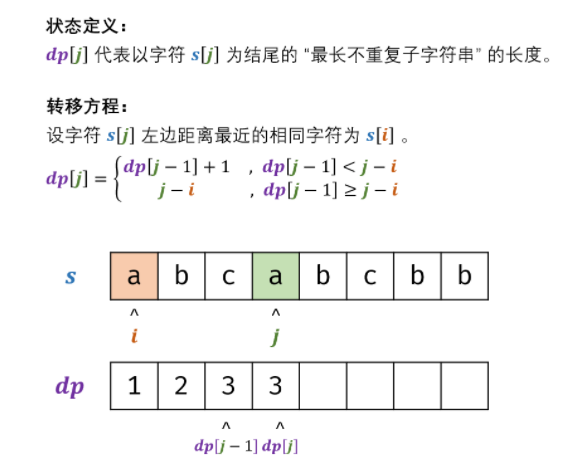
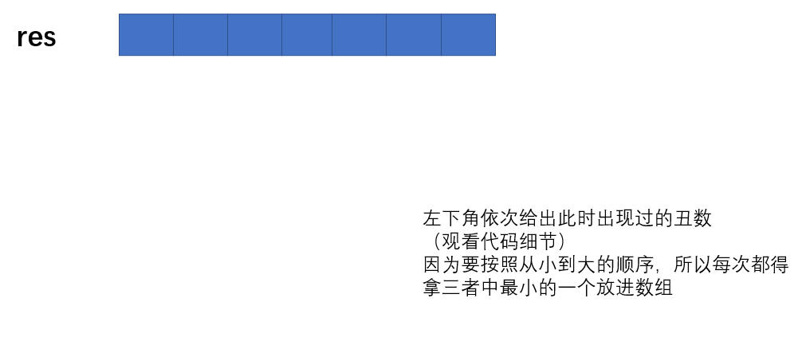
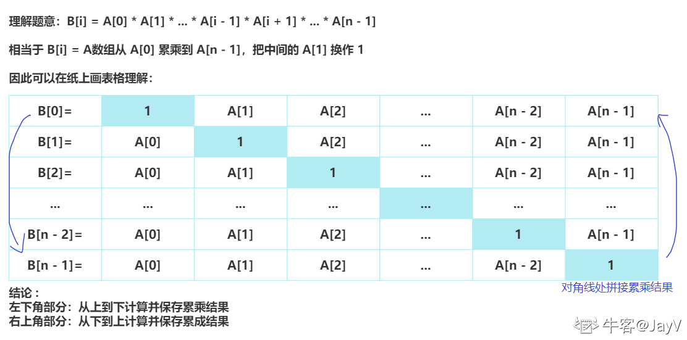
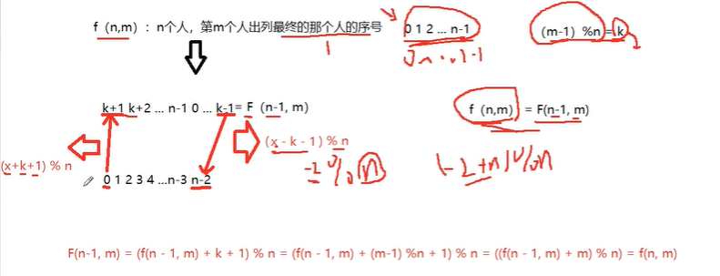
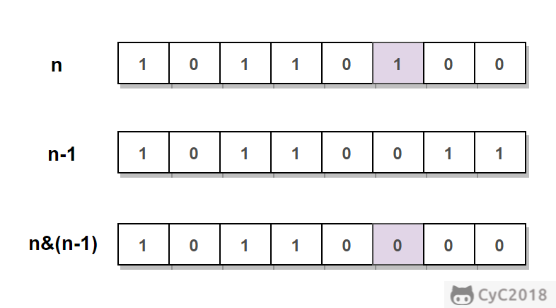
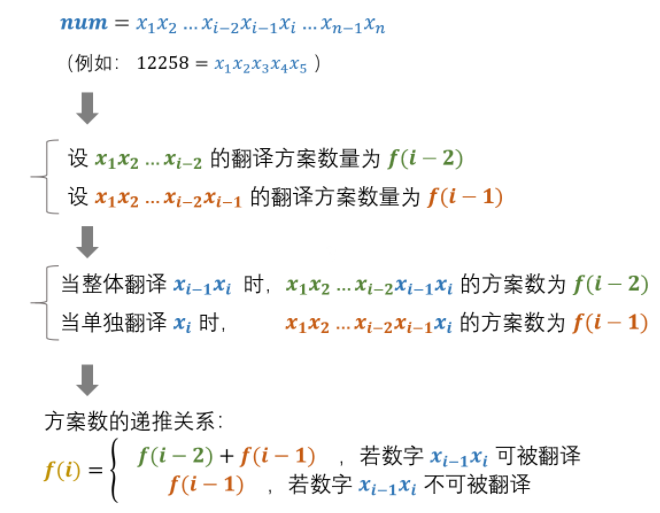

# 树链表数组

## 1 二维数组中的查找

暴力法

利用数组规律从左下找

## 2 替换空格

### Solution 1： StringBuilder

```
StringBuilder ret = new StringBuilder();
ret.append(" ");
ret.toString();
```

字符串转成字符数组

```
char[] tmp = s.toCharArray();
```

### Solution 2：StringBuffer 双指针

① 在字符串尾部填充任意字符，使得字符串的长度等于替换之后的长度。因为一个空格要替换成三个字符（%20），所以当遍历到一个空格时，需要在尾部填充两个任意字符。

② 令 P1 指向字符串原来的末尾位置，P2 指向字符串现在的末尾位置。P1 和 P2 从后向前遍历，当 P1 遍历到一个空格时，就需要令 P2 指向的位置依次填充 02%（注意是逆序的），否则就填充上 P1 指向字符的值。从后向前遍是为了在改变 P2 所指向的内容时，不会影响到 P1 遍历原来字符串的内容。

③ 当 P2 遇到 P1 时（P2 <= P1），或者遍历结束（P1 < 0），退出。

## 6 从尾到头打印链表

### Solution 1：递归

github上的方法运行有误

### Solution 2：头插入

创建一个头结点

```java
while(listNode != null){
            ListNode memo = listNode.next;
            listNode.next = head.next;
            head.next = listNode;
            listNode = memo;
        }
```

### Solution 3：使用栈

遍历链表，栈内存放结点的数值

### Solution 4：用ArrayList函数

 from newcoder 利用ArrayList本身的函数add

```java
//其实也是利用了头插入的思想
list.add(0, listnode.val);
```

## 7 重建二叉树

### Solution 1：递归调用

1. 给定节点数为 n 二叉树的前序遍历和中序遍历结果，请重建出该二叉树并返回它的头结点。
2. 前序遍历的第一个值为根节点的值，使用这个值将中序遍历结果分成两部分
3. 左部分为树的左子树中序遍历结果，右部分为树的右子树中序遍历的结果。
4. 然后分别对左右子树递归地求解。

## 8 二叉树的下一个结点

### Solution 1：分类讨论

我自己想的。

中序遍历顺序：左，根， 右

1. 结点存在右子树，返回右子树最左

2. 不存在右子树，找父结点

   1. 如果是父结点的左子树，返回父结点
   2. 如果是父结点的右子树，继续找父结点

   一直找，直到父结点为null，返回null即可

### Solution 2：中序遍历返回匹配结点

先找到所给结点的树对应的根结点，然后进行中序遍历。

## 18.1 在O(1)时间内删除结点

① 如果该节点不是尾节点，那么可以直接将下一个节点的值赋给该节点，然后令该节点指向下下个节点，再删除下一个节点，时间复杂度为 O(1)。

② 否则，就需要先遍历链表，找到节点的前一个节点，然后让前一个节点指向 null，时间复杂度为 O(N)。

综上，如果进行 N 次操作，那么大约需要操作节点的次数为 N-1+N=2N-1，其中 N-1 表示 N-1 个不是尾节点的每个节点以 O(1) 的时间复杂度操作节点的总次数，N 表示 1 个尾节点以 O(N) 的时间复杂度操作节点的总次数。(2N-1)/N ~ 2，因此该算法的平均时间复杂度为 O(1)。

## 19 顺时针打印矩阵

简单来说，就是不断地收缩矩阵的边界

时间复杂度O(n) 空间复杂度O(1)

定义四个变量代表范围，up、down、left、right

1. 向右走存入整行的值，当存入后，该行再也不会被遍历，代表上边界的 up 加一，同时判断是否和代表下边界的 down 交错
2. 向下走存入整列的值，当存入后，该列再也不会被遍历，代表右边界的 right 减一，同时判断是否和代表左边界的 left 交错
3. 向左走存入整行的值，当存入后，该行再也不会被遍历，代表下边界的 down 减一，同时判断是否和代表上边界的 up 交错
4. 向上走存入整列的值，当存入后，该列再也不会被遍历，代表左边界的 left 加一，同时判断是否和代表右边界的 right 交错


## 20 包含min函数的栈

### Solution 1：两个栈

一个栈存入栈的，令一个栈存当前最小的

(3 2 1 4) --- (3 2 1 1)

### Solution 2：单个栈

那么为了实现这一目的，在栈中需要保留冗余的曾经的最小值，这样能够比较方便到找到当前的此小值

## 21 栈的压入弹出序列

使用一个栈来模拟压入弹出操作。每次入栈一个元素后，都要判断一下栈顶元素是不是当前出栈序列 popSequence 的第一个元素，如果是的话则一直执行出栈操作并将 popSequence 往后移一位，直到不符合条件，继续进行判断。

## 22 链表中倒数最后k个结点

### Solution 1：运用两个指针，k和n-k关系

### Solution 2：压栈处理

弹出最后k个栈

### Solution 3：递归求解

## 23 链表中环的入口结点

### Solution 1：双指针

利用快慢指针走，第一次快慢指针重合时，再让临时指针从头结点开始走1步，慢指针从重合的地方走一步，当临时指针和慢指针重合时即为入口结点。

注意在第一次找快慢指针重合时，如果退出循环，不一定说明两个指针重合，也有可能不存在环，要记得判断

### Solution 2：寻找重复的值

利用HashMap存储结点的值，遍历链表走路一圈，遇到重复的说明有环。

但如果链表中的结点值有重复的，这种应该就不能用了。

## 24 反转链表

### Solution 1：头插入法

引入头结点

### Solution 2：递归

## 25 合并两个排序的链表

### Solution 1：递归

简单地理一下思路：

- 从头结点开始考虑，比较两表头结点的值，值较小的`list`的头结点后面接`merge`好的链表（进入递归了）；
- 若两链表有一个为空，返回非空链表，递归结束；
- 当前层不考虑下一层的细节，当前层较小的结点接上该结点的`next`与另一结点`merge`好的表头就ok了；
- 每层返回选定的较小结点就ok；

重新整理一下：

- 终止条件：两链表其中一个为空时，返回另一个链表；
- 当前递归内容：若`list1.val <= list2.val` 将较小的`list1.next`与merge后的表头连接，即`list1.next = Merge(list1.next,list2);` `list2.val`较大时同理；
- 每次的返回值：排序好的链表头；

### Solution 2：迭代

通过设立头结点，然后遍历两个链表，按顺序插在头结点后面。

## 26 树的子结构

### Solution 1：递归

1. 先写一个方法，传入两棵根结点值相同的树，判断t1和t2的结构是否一样
2. 再写一个方法遍历大树，找到一个和小树根节点值相等的节点，以该节点和小树根节点的值为参数调用上面的方法。

## 27 二叉树的镜像

### Solution 1：递归调用

交换左右子树节点

### Solution 2：BFS

运用队列，交换左右子树后，先将交换后的左子树加入队列，再将右子树加入队列

### Solution 3：DFS

运用栈，根节点压栈后，出栈结点交换左右结点，再将左结点入栈，右节点入栈。

## 28 对称的二叉树

### Solution 1：递归

1. 根节点是否为null

2. 判断左右子树是否对称

   这里需要另开一个新方法判断是否对称，即判断左子树的左孩子和右子树的右孩子相等吗，左子树的右孩子和右子树的左孩子相等吗

```java
if(l == null && r == null)
    return true;
if(l == null && r != null)
    return false;
if(l != null && r == null)
    return false;
```

上面可以简化为下面

```java
if (node1 == null && node2 == null) {
    return true;
} else if (node1 == null || node2 == null) {
    return false;
}
```

### Solution 2：非递归

设置两个链表，分别代表`左子树`和`右子树`。左子树每次都从左往右添加节点，右子树每次都从右往左添加节点。

## 29 最小的K个数

思路1 全排序然后找出靠前的K个

思路2 定义优先队列， 取头部的K个数

思路3 这题更多考的是堆

### Solution 1：堆

堆可以被看成完全二叉树的数组

大顶堆：节点大于左右孩子节点。

小顶堆：节点小于左右孩子节点

> 节点规律

root节点的下标从0开始，对于某一个节点index，左孩子L：2\*index+1, 右孩子R：2\*index+2

非叶子结点下标=结点个数/2 -1

> 大顶堆的建立

从非叶子节点开始维护


### Solution 2：快速排序

- 复杂度：O(N) + O(1)
- 只有当允许修改数组元素时才可以使用

快速排序的 partition() 方法，会返回一个整数 j 使得 a[l..j-1] 小于等于 a[j]，且 a[j+1..h] 大于等于 a[j]，此时 a[j] 就是数组的第 j 大元素。可以利用这个特性找出数组的第 K 个元素，这种找第 K 个元素的算法称为快速选择算法。

会把数组中的一个数当做基准数，一般把数组中最左边的当做基准数，从两边进行检索，先从右边检索比基准数小的，然后再从左边检索比基准数大的，如果检索到了就停下来，交换两个元素，再继续检索。

一旦i和j相遇，就停止检索，把基准数和相遇位置的元素交换，表示第一轮排序结束。特点：基准数左边都比他小，右边都比他大。

第二轮：先拍基准数左边，排完之后再排基准数右边，方式和第一轮一样。

```java
private void quickSort(int[] arr, int left, int right){
    //进行判断，如果左边索引比右边索引大，直接return
    if(left > right)
        return;
    //定义变量保存基准数
    int base = arr[left];
    //定义变量i 指向最左边
    int i = left;
    //定义变量j 指向最右边
    int j = right;
    //i != j 在循环中进行检索
    while( i != j){
        //先由j从右往左检索比基准数小的就停下
        //检索到比基准数大的或相等 就继续检索
        while(arr[j] >= base && i < j){
            j--; //j从右往左移动
        }
        while(arr[i] <= base && i < j){
            i++;
        }
        //代码走到这里，说明i停下 j停下 然后交换i和j
        int temp = arr[i];
        arr[i] = arr[j];
        arr[j] = temp;
    }
    //while条件不成立 就会向下执行
    //即i和j相遇 交换基准数和相遇位置的元素
    //把相遇位置的元素赋值给基准数位置的元素
    arr[left] = arr[i];
    arr[i] = base;

    //基准数在这里就归位，左边比他小 右边比他大
    //排基准数左边
    quickSort(arr, left, i - 1);
    quickSort(arr, i + 1, right);
} 
```

## 32 从上往下打印二叉树

### Solution 1：运用队列进行层次遍历

实际上跟BFS一样的道理

## 33 二叉搜索树的后序遍历序列

### Solution 1：分治递归

（1）将数组的元素分为两部分：左子树序列值和右子树序列值，左子树值都小于根节点值，右子树值都大于根节点值

（2）分别对左右子树序列值进行（1）方法递归，如果递归过程中发现其右子树序列中有值小于根节点值，则不是一个后续序列

### Solution 2：单调栈

1）初始化： 单调栈 stack ，父节点值 root（初始值为正无穷大，可把树的根节点看为此无穷大节点的左孩子）；
（2）倒序遍历数组：记每个节点为 ri ，判断： 若 ri > root ，说明此后序遍历序列不满足二叉搜索树定义，直接返回false ；
（3）更新父节点 root： 当栈不为空 且 ri < stack.peek() 时，循环执行出栈，并将出栈节点赋给 root 。
（4）入栈： 将当前节点 ri 入栈；
（5）若遍历完成，则说明后序遍历满足二叉搜索树定义，返回 true。

**这个没看懂**

## 34  二叉树中和为某一值的路径

==好难==

### Solution 1：递归

前置知识：

1. 首先清楚叶子的表示：如果节点为`root`, 那么当前节点为叶子节点的必要条件为`!root->left && !root->right`
2. 找出路径，当然需要遍历整棵树，这里采用先序遍历，即：`根节点，左子树，右子树`

递归算法三部曲：

1. 明白递归函数的功能：`FindPath(TreeNode* root,int sum)`，从root节点出发，找和为sum的路径

2. 递归终止条件：当root节点为叶子节点并且`sum==root->val`, 表示找到了一条符合条件的路径

3. 下一次递归：如果左子树不空，递归左子树`FindPath(root->left, sum - root->val)`,如果右子树不空，递归右子树，`FindPath(root->right, sum - root->val)`

   **看我的代码jz24解析。**

## 34 第一个只出现一次字符

### Solution 1：HashMap

**思路**

最直观的解法是使用 HashMap 对出现次数进行统计：字符做为 key，出现次数作为 value，遍历字符串每次都将 key 对应的 value 加 1。最后再遍历这个 HashMap 就可以找出出现次数为 1 的字符。

**用法**

HashMap 是一个散列表，它存储的内容是键值对(key-value)映射。

HashMap 实现了 Map 接口，根据键的 HashCode 值存储数据，具有很快的访问速度，最多允许一条记录的键为 null，不支持线程同步。

HashMap 是无序的，即不会记录插入的顺序。

HashMap 继承于AbstractMap，实现了 Map、Cloneable、java.io.Serializable 接口。

```java
//添加键值对
Sites.put(1, "Google");
//根据key得到Value
s.get(key);
//删除元素
s.remove(key);
//删除所有键值对
s.clear();
//计算键值对个数
s.size();
//得到所有value
s.values();
//得到所有key
s.keySet();
//判断是否为空
s.isEmpty();
//获取指定 key 对应对 value，如果找不到 key ，则返回设置的默认值。
hashmap.get(Object key, V defaultValue)
//如果 hashMap 中是否存在指定的 key 对应的映射关系返回 true，否则返回 false
hashmap.containsKey(Object key)
//如果 hashMap 中是否存在指定的 value 对应的映射关系返回 true，否则返回 false。
hashmap.containsValue(Object value)
//如果 oldValue 不存，对 key 对应对 value 执行替换，返回 key 对应的旧值，如果存在则替换成功返回 true。
hashmap.replace(K key, V oldValue, V newValue)
```

### Solution 2：ASCII

考虑到要统计的字符范围有限，也可以使用整型数组代替 HashMap。ASCII 码只有 128 个字符，因此可以使用长度为 128 的整型数组来存储每个字符出现的次数。

### Solution 3：BitSet类

**思路**

以上实现的空间复杂度还不是最优的。考虑到只需要找到只出现一次的字符，那么需要统计的次数信息只有 0,1,更大，使用两个比特位就能存储这些信息。

**用法**

一个Bitset类创建一种特殊类型的数组来保存位值。BitSet中数组大小会随需要增加。这和位向量（vector of bits）比较类似。

**我觉得可以看看 很巧妙**

## 35 复杂链表的复制

### Solution 1：多次遍历

我连题目都没看懂……

1. 在旧链表中创建新链表，此时不处理新链表的兄弟结点

   遍历链表，复制每个结点，如复制结点A得到A1，将结点A1插到结点A后面；

2. 根据旧链表的兄弟结点，初始化新链表的兄弟结点

   重新遍历链表，复制老结点的随机指针给新结点，如A1.random = A.random.next;

3. 从旧链表中拆分得到新链表

### Solution 2：HashMap建立新旧链表联系

1. 用一个 hashmap 建立新旧链表节点的对应的结点关系
2. 迭代旧链表，从而在 hashmap 中更新新链表的 next 与 random 两个字段

## 36 二叉搜索树与双向链表

==好难==

### Solution 1：中序遍历优化

对于二叉树进行中序遍历，在遍历的同时调整结点之间的指针，使之成为双向链表

1、特殊情况，二叉树为空，则直接返回 null

2、创建保留上一个结点 pre，返回链表结点 root

3、递归遍历左子树；root = pRootOfTree

4、遍历当前结点，并修改为双向链表 pRootOfTree.left=pre; pre.right=pRootOfTree; 

5、更新 pre = pRootOfTree

6、递归遍历右子树

7、递归结束返回 root


## 37 序列化二叉树

### Solution 1：先序遍历

利用indexOf定位头结点，将头结点和剩下的序列化好的字符串分割

## 41 数据流中的中位数

### Solution 1：大顶堆&小顶堆

左边存放大顶堆，右边存放小顶堆，保证大顶堆所有数都小于小顶堆。

## 50 数组中重复的数字

### Solution 1：HashSet

HashSet 基于 HashMap 来实现的，是一个不允许有重复元素的集合。

HashSet 允许有 null 值。

HashSet 是无序的，即不会记录插入的顺序。

HashSet 不是线程安全的， 如果多个线程尝试同时修改 HashSet，则最终结果是不确定的。 您必须在多线程访问时显式同步对 HashSet 的并发访问。

HashSet 实现了 Set 接口。

```java
    //添加元素
    set.add();
    //判断元素是否存在
    boolean flag = set.contains('a');
	//删除元素
	set.remove("a");
	//删除所有元素
	set.clear();
	//元素数量
	int num = set.size();
	//遍历
	for(String i: set){}
```

### Solution 2：替换法

要求时间复杂度 O(N)，空间复杂度 O(1)

```
遍历数组所有元素，交换不符合数组存放原则的元素：
  ``例如[2,3,1,0,2]
  ``遍历0位元素2：（交换0位元素2和2位元素1）->[1,3,2,0,2]
  ``遍历0位元素1：（交换0位元素1和1位元素3）->[3,1,2,0,2]
  ``遍历0位元素3：（交换0位元素3和3位元素0）->[0,1,2,3,2]
  ``依次遍历0、1、2、3位置元素，都符合存放原则numbers[i] = i，不做任何操作
  ``遍历末位元素2，此时末位元素2和2位元素2相等，出现了两次，即数字2位重复元素
```

## 52 两个链表的第一个公共结点

### Solution 1：HashSet

我自己想的方法，遍历两条链，存进HashSet之前判断是否存在ListNode，存在则说明就是公共结点。不能单纯判断ListNode.val是否相等，因为有可能存在重复的val。所以set里面存的是ListNode

### Solution 2：数学思维

设 A 的长度为 a + c，B 的长度为 b + c，其中 c 为尾部公共部分长度，可知 a + c + b = b + c + a。

当访问链表 A 的指针访问到链表尾部时，令它从链表 B 的头部重新开始访问链表 B；同样地，当访问链表 B 的指针访问到链表尾部时，令它从链表 A 的头部重新开始访问链表 A。这样就能控制访问 A 和 B 两个链表的指针能同时访问到交点。

## 54 二叉搜索树的第k个结点

### Solution 1：中序遍历栈实现

### Solution 2：中序遍历递归实现

## 55 二叉树的深度

### Solution 1：递归遍历

规律为结点所在的层 1 + max（左子树的高度，右子树的高度）

如果结点为空，返回0即可。

### Solution 2：层次遍历

我们先来回顾一下二叉树的层次遍历，一般我们都是用队列去实现的。

步骤：

1、先创建一个队列，将根节点入队；

2、队列不为空，进入循环：

- 出队一个节点
- 将当前节点的左右节点入队（不为空时）
- 此时当前层的所有节点的左右子节点都入队

4、最后当队列中无节点的时候，此时已全部遍历完全部节点。

有了上面的步骤，我们只需要在每一层的所有节点的左右子节点都入完队的时候，就计数，最后则可以得到结果。

其实就是在一行一行打印二叉树结点的基础上增加一个记录high的操作。

时间复杂度：O(n)。 节点的个数。

空间复杂度：O(n)。队列占用的空间。

### Solution 3：深度遍历

其实就是利用递归。

我们知道二叉树的深度，肯定是等于其左子树与右子树的深度的最大值再+1。（加1就是加上当前层）

深度遍历可以采用栈或者递归实现，本文采用递归的做法实现，代码很简单易懂。

当递归到节点为null的时候，则为终止条件，此时会返回0。

接着会取左右子树中最大值+1。

例子：

假设父节点F，左节点为L，L的左右节点都为null。

则此时父节点F的左子树的深度则为1。

时间复杂度：O(n)。 遍历的节点的个数。

空间复杂度：O(n)。退化成链表的时候，则递归深度为n。

## 57 和为S的两个数字

### Solution 1: 双指针

使用双指针，一个指针指向元素较小的值，一个指针指向元素较大的值。指向较小元素的指针从头向尾遍历，指向较大元素的指针从尾向头遍历。

- 如果两个指针指向元素的和 sum == target，那么这两个元素即为所求。
- 如果 sum > target，移动较大的元素，使 sum 变小一些；
- 如果 sum < target，移动较小的元素，使 sum 变大一些。

## 58 左旋转字符串

### Solution 1：对字符串进行操作

可以运用substring来截取然后再拼接

也可以用数组来存放字符，用队列记录需要左移的元素，然后调换位置

### Solution 2：字符串翻转

```
先将 "abc" 和 "XYZdef" 分别翻转，得到 "cbafedZYX"
然后再把整个字符串翻转得到 "XYZdefabc"。
```

字符串常用操作

```java
char[] c = str.toCharArray();
String str = new String(c);
str.substring(n);
```


## 59 滑动窗口的最大值

### Solution 1：PriorityQueue

运用大顶堆实现

## 68 树中两个结点的最低公共祖先

### 68.1 二叉查找树

[Leetcode : 235. Lowest Common Ancestor of a Binary Search Tree](https://leetcode.com/problems/lowest-common-ancestor-of-a-binary-search-tree/description/)

### 68.2 普通二叉树

[Leetcode : 236. Lowest Common Ancestor of a Binary Tree](https://leetcode.com/problems/lowest-common-ancestor-of-a-binary-tree/description/)

### Solution 1：Recursive

1. 从根结点开始遍历树
2. 如果当前结点就是p或者q，标志mid为true，然后在左子树和右子树搜索另一个结点
3. 如果一个结点的左子树或右子树有该结点，返回true
4. 有3个指标 left right mid， 如果有三个中有两个是true，说明找到最低的公共结点。

### Solution 2：iterative using parent pointers

用两个指针从p和q开始去遍历他们的祖先，当两个指针重合时，所指的节点则是LCA.

1. 从根结点遍历树
2. 在找到p和q之前，在字典里存储指针。
3. 一旦我们找到p和q，可以从字典里得到p的所有祖先并构建一个祖先set。
4. 遍历q的祖先，如果q的祖先已经在p的祖先set里面，说明这就是LCA。

### Solution 3：


## 73 翻转单词序列

输入：

```
"nowcoder. a am I"
```

返回值：

```
"I am a nowcoder."
```

### Solution 1：StringBuilder + String.split

根据空格分隔单词，然后再重新拼接。记住，除了最后一个单词，其他单词拼接的时候后面要带空格！

### Solution 2：先翻转句子再翻转单词

也可以先翻转单词再翻转句子

```java
//char[] to string
String s = new String(array);
//char[] to string
String.valueOf(arr);
```

用两个指针定义单词的首字母和末字母

特别的，

```java
else if(end == arr.length || arr[end] == ' '){
                //要么尾部是空格，要么end刚刚超过数组最后一个角标，这两种情况就应该翻转了
                //end之所以会超过最后角标，是因为当最后一个字符不是空格时，会让end++，所以会越界
                reverse(arr, start, end-1);
                //翻转后，应该重新记录下个单词，因此更新end和start。
                end++;
                start = end;//这句和上一句可以写成start = ++end;
            }
```

### Solution 3: Stack

其实用栈就相当于Solution1里面的手动反转，也是利用了spilt函数

## 74 和为S的连续正数序列

### Solution 1：双指针

因为要求是连续正数序列，所以一开始定义start = 1, end = 2, tmpSum = 3;

然后进入循环，循环条件：

1. start < end
2. end < sum

循环内部：

1. tmpSum < sum 要增加多一个元素，右指针移动
2. tmpSum > sum 要减少一个元素，即减少最小的元素，左指针移动
3. tmpSum == sum 满足条件 记录下来，然后将左指针往后挪一个，右指针为左指针的下一个，重新计算tmpSum

## 75 字符流中第一个不重复的字符

### Solution 1：copy 34

建立一个StringBuffer来记录当前的字符串，但是这种方式不能通过newcoder的编译。虽然没有测试过，但我觉得逻辑是可行的

### Solution 2：Queue

来自github的方法。运用队列存储第一个出现一次的字符 + 用128位的数组来记录每个字符出现的次数

## 76 删除链表中重复的结点

### Solution 1： 递归调用删除结点

### Solution 2： 多次遍历 + set 

### Solution 3：一边遍历一边删除

## 77 按之字形顺序打印二叉树

### Solution 1：双重循环+队列+函数

跟78很类似，不过是加进tmpList的时候，通过增加一个boolean来判断要顺序插入还是倒序插入，如果是倒序则用tmp.add(0, val)进行倒序插入。

- list.add(T): 按照索引顺序从小到大依次添加
- list.add(index, T): 将元素插入index位置，index索引后的元素依次后移,这就完成了每一行元素的倒序，或者使用Collection.reverse()方法倒序也可以

### Solution 2：两个栈

先把根结点放入第一个栈，第一个栈的元素出栈，出栈结点的左右结点依次放入第二个栈中。

然后第二个栈元素出栈，出栈结点的左右结点依次放入第一个栈中，依次进行下去。

```java
int num = stack.size();
```

## 78 把二叉树打印成多行

### Solution 1：双重循环+队列

外层循环用于遍历树，即将结点加进去。内层循环则用于遍历队列，实现将同一层的poll出来，用que.size()作为约束条件。

核心思想：每次出队一个元素，就将该元素的孩子节点加入队列中，直至队列中元素个数为0时，出队的顺序就是该二叉树的层次遍历结果。

**和32从上往下打印链表非常相似**

## 79 平衡二叉树

除了solution 1，其他均来自newcoder

### Solution 1：计算二叉树深度+布尔变量

在`55 二叉树的深度基础`上，增加判断左右子树高度差是否超过1，如果超过1，则将全局布尔变量设置为false。

### Solution 2：对solution 1的优化以便提前返回

进行**剪枝**：当判断到左右子树的深度之差大于1的时候，则返回-1。每次递归结束判断返回值是否-1，若为-1，则立即返回。

时间复杂度：O(N)。N为树的节点个数。最差情况下需要遍历所有节点。

空间复杂度：O(N)。若树退化成了链表，则递归深度为节点的个数，需要用到O(N)的栈空间。

### Solution 3：暴力法自顶向下

##### 算法流程：

- 通过比较每个节点的左右子树的最大高度差, 来判断此子树是否是二叉平衡树。
- 若树的所有子树都平衡时，该树才是平衡二叉树。
- **时间复杂度 O(Nlog\*2N\*)**：最差情况下，需要遍历树所有节点判断是否平衡，需要O(N)。判断每个节点最大高度需要递归左右子树，需要占用 O(log2N)，所以总共占用O(Nlog2N)
  **空间复杂度O(\*N\*)**：最差情况下（树退化为链表时），递归需要使用*O*(*N*) 的栈空间。

```java
public class Solution {
    public boolean IsBalanced_Solution(TreeNode root) {
        if (root == null) return true;
        // 高度差不能大于1，并且左右子树也是同样高度差要小于等于1
        return Math.abs(depth(root.left) - depth(root.right)) <= 1 && IsBalanced_Solution(root.left) && IsBalanced_Solution(root.right);
    }

    private int depth(TreeNode root) {
        if (root == null) {
            return 0;  
        } 
         // 左右子树中高度较大的作为当前节点高度
        return Math.max(depth(root.left), depth(root.right)) + 1;
    }
}

```

### Solution 4：自底向上递归

> 我感觉跟solution 2的剪枝没什么太大差别。

##### 算法流程：

- 判断空树，题目要求**空树也是平衡二叉树**
- 递归计算当前root**左右子树的高度差**
- 注意：递归过程中有左/右子树不平衡,则该树不平衡，相当于**可行性剪枝**，没必要遍历所有节点
- 递归到底后，**自底向顶**，每次+1，不断计算高度，直到递归到某个节点使得左右子树高度差大于1，则返回-1表示不平衡
- 左右子树中**高度较高**的, 作为当前节点的高度, 用于向上递归判断是否平衡
- 递归终止条件：
  - root 为 null
  - 左右子树高度差大于1，即左右子树其中一个节点返回-1，则递归终止，阻断递归，表示不是平衡二叉树
- 递归方法的功能：获取当前节点的树的高度

```java
public boolean IsBalanced_Solution(TreeNode root) {
        // 空树也是平衡二叉树
        if(root == null) {
            return true;
        }
        return getHeight(root) != -1;
    }
 
    public int getHeight(TreeNode root) {
        if(root == null) {
            return 0;
        }
        // 递归计算当前root左右子树的高度差
        int left = getHeight(root.left);
        // 当前节点左子树不平衡,则该树不平衡，相当于可行性剪枝，没必要遍历所有节点
        if(left < 0) {
            return -1;
        }
        int right = getHeight(root.right);
        if(right < 0) {
            return -1;
        }
        // 自底向顶，每次+1，不断计算高度，直到递归到某个节点使得左右子树高度差大于1，则返回-1表示不平衡
        // 左右子树中高度较高的, 作为当前节点的高度, 用于向上递归判断是否平衡
        return Math.abs(left - right) > 1 ? -1 : 1 + Math.max(left, right);
    }
```

# 贪心思想

## 14 剪绳子

[牛客网](https://www.nowcoder.com/practice/57d85990ba5b440ab888fc72b0751bf8?tpId=13&tqId=33257&tab=answerKey&from=cyc_github)

### Solution  1:：贪心

尽可能得多剪长度为 3 的绳子，并且不允许有长度为 1 的绳子出现。如果出现了，就从已经切好长度为 3 的绳子中拿出一段与长度为 1 的绳子重新组合，把它们切成两段长度为 2 的绳子。以下为证明过程。

将绳子拆成 1 和 n-1，则 1(n-1)-n=-1<0，即拆开后的乘积一定更小，所以不能出现长度为 1 的绳子。

将绳子拆成 2 和 n-2，则 2(n-2)-n = n-4，在 n>=4 时这样拆开能得到的乘积会比不拆更大。

将绳子拆成 3 和 n-3，则 3(n-3)-n = 2n-9，在 n>=5 时效果更好。

将绳子拆成 4 和 n-4，因为 4=2*2，因此效果和拆成 2 一样。

将绳子拆成 5 和 n-5，因为 5=2+3，而 5<2*3，所以不能出现 5 的绳子，而是尽可能拆成 2 和 3。

将绳子拆成 6 和 n-6，因为 6=3+3，而 6<3*3，所以不能出现 6 的绳子，而是拆成 3 和 3。这里 6 同样可以拆成 6=2+2+2，但是 3(n - 3) - 2(n - 2) = n - 5 >= 0，在 n>=5 的情况下将绳子拆成 3 比拆成 2 效果更好。

继续拆成更大的绳子可以发现都比拆成 2 和 3 的效果更差，因此我们只考虑将绳子拆成 2 和 3，并且优先拆成 3，当拆到绳子长度 n 等于 4 时，也就是出现 3+1，此时只能拆成 2+2。

 将绳子以相等的长度等分为多段 ，得到的乘积最大。

### Solution 2：动态规划

1. 将绳子分割的最优方案可以从比他短的绳子的最优最优方案中推出来，因此我们可以想到用动态规划来解决本题
2. 将绳子的长度作为状态，定义数组f[x]表示将长度为x的绳子分割成至少两段所能得到的最大乘积，假设已知f[2~x-1]的结果，那么我们可以枚举切出的第一段的长度j，故需考虑两种方案：

- 将x拆分为j和(x - j)这两段，且(x - j)不再继续拆分
- 将x拆分为j和(x - j)这两段，(x - j)继续拆分，最大值为f[x - j]

由于至少剪成两段故j的取值范围是[1, x)，根据题意f[0] = f[1] = 0
故状态转移方程如下：

$$f(i) = max(j*(i-j),j*f(i-j))(1 \le j \lt i)$$

【我感觉上面有误】

为什么是

```java
dp[i] = Math.max(dp[i], Math.max(j * (i - j), dp[j] * (i - j)))
```

### Solution 3：暴力法

暴力法，遍历可以分割的所有情况，取其中的最大值。在分析的思路里，对于子线段的长度范围是1 ~ (n-1)，实际上，只需要1 ~ (n/2)，因为大于n/2的情况，已经在前面出现过了，所以可以直接去掉。

### Solution 4：递归

## 63 股票的最大利润

[Leetcode：121. Best Time to Buy and Sell Stock](https://leetcode.com/problems/best-time-to-buy-and-sell-stock/description/)

### Solution 1：暴力法

### Solution 2：贪心策略

使用贪心策略，假设第 i 轮进行卖出操作，买入操作价格应该在 i 之前并且价格最低。因此在遍历数组时记录当前最低的买入价格，并且尝试将每个位置都作为卖出价格，取收益最大的即可。

### Solution 3：One pass

跟贪心策略很像啊，就是找出最小的买入价以及最大的利润。

# 二分查找

## 11  旋转数组的最小数字

[牛客网](https://www.nowcoder.com/practice/9f3231a991af4f55b95579b44b7a01ba?tpId=13&tqId=11159&tPage=1&rp=1&ru=/ta/coding-interviews&qru=/ta/coding-interviews/question-ranking&from=cyc_github)

### Solution 1： brute force

直接遍历找最小的

### Solution 2：二分查找

将旋转数组对半分可以得到一个包含最小元素的新旋转数组，以及一个非递减排序的数组。新的旋转数组的长度是原数组的一半，从而将问题规模减少了一半，这种折半性质的算法的时间复杂度为 O(log2N)。

此时问题的关键在于确定对半分得到的两个数组哪一个是旋转数组，哪一个是非递减数组。我们很容易知道非递减数组的第一个元素一定小于等于最后一个元素。

通过修改二分查找算法进行求解（l 代表 low，m 代表 mid，h 代表 high）：

- 当 nums[m] <= nums[h] 时，表示 [m, h] 区间内的数组是非递减数组，[l, m] 区间内的数组是旋转数组，此时令 h = m；
- 否则 [m + 1, h] 区间内的数组是旋转数组，令 l = m + 1。

如果数组元素允许重复，会出现一个特殊的情况：nums[l] == nums[m] == nums[h]，此时无法确定解在哪个区间，需要切换到顺序查找。例如对于数组 {1,1,1,0,1}，l、m 和 h 指向的数都为 1，此时无法知道最小数字 0 在哪个区间。

## 53 数字在升序数组中出现的次数

[牛客网](https://www.nowcoder.com/practice/70610bf967994b22bb1c26f9ae901fa2?tpId=13&tqId=11190&tPage=1&rp=1&ru=/ta/coding-interviews&qru=/ta/coding-interviews/question-ranking&from=cyc_github)

### Solution 1：brute force

暴力法 遍历计数

### Solution 2：二分查找

题目说的在升序数组找到一个目标，然后统计这个目标出现的次数，我们要好好利用升序数组这个条件。

有了这个条件，我们就可以算出这个目标值的左边界还有右边界，然后取两者之差即可统计出这个目标出现的次数。

因为我们要找到目标值的左边界和右边界，我们很容易能想到用二分查找去求。

那么，找出左边界其实很好找，那要怎么找到右边界呢，我们可以将右边界转化为求比目标值大的数的左边界来求。

也就是说，我们如果要 求数字 `4`的右边界，那我们其实可以求数字`5`的左边界然后也就知道了4的右边界了。

但是在查找第一个位置时，找到元素之后应该继续往前找。也就是当 nums[m]>=k 时，在左区间继续查找，左区间应该包含 m 位置。

查找最后一个位置可以转换成寻找 k+1 的第一个位置，并再往前移动一个位置。

# 分治

## 16 数值的整数次方

[牛客网](https://www.nowcoder.com/practice/1a834e5e3e1a4b7ba251417554e07c00?tpId=13&tqId=11165&tPage=1&rp=1&ru=/ta/coding-interviews&qru=/ta/coding-interviews/question-ranking&from=cyc_github)

### Solution 1：暴力解法

直接多个数相乘

小心指数为负！

### Solution 2：分治

最直观的解法是将 x 重复乘 n 次，x\*x\*x...\*x，那么时间复杂度为 O(N)。因为乘法是可交换的，所以可以将上述操作拆开成两半 (x\*x..\*x)* (x\*x..\*x)，两半的计算是一样的，因此只需要计算一次。而且对于新拆开的计算，又可以继续拆开。这就是分治思想，将原问题的规模拆成多个规模较小的子问题，最后子问题的解合并起来。

本题中子问题是 $x^{n/2}$，在将子问题合并时将子问题的解乘于自身相乘即可。但如果 n 不为偶数，那么拆成两半还会剩下一个 x，在将子问题合并时还需要需要多乘于一个 x。

$x^{n}=\left\{\begin{array}{rr}x^{n / 2} * x^{n / 2} & n \% 2=0 \\ x *\left(x^{n / 2} * x^{n / 2}\right) & n \% 2=1\end{array}\right.$

因为 (x*x)n/2 可以通过递归求解，并且每次递归 n 都减小一半，因此整个算法的时间复杂度为 O(logN)。

# 搜索

## 12 矩阵中的路径

[牛客网](https://www.nowcoder.com/practice/69fe7a584f0a445da1b6652978de5c38?tpId=13&tqId=11218&tab=answerKey&from=cyc_github)

一开始毫无头绪……

基本思想：
0.根据给定数组，初始化一个标志位数组，初始化为false，表示未走过，true表示已经走过，不能走第二次
1.根据行数和列数，遍历数组，先找到一个与str字符串的第一个元素相匹配的矩阵元素，进入judge

2.根据i和j先确定一维数组的位置，因为给定的matrix是一个一维数组

3.确定递归终止条件：越界，当前找到的矩阵值不等于数组对应位置的值，已经走过的，这三类情况，都直接false，说明这条路不通

4.若k，就是待判定的字符串str的索引已经判断到了最后一位，此时说明是匹配成功的

5.下面就是本题的精髓，递归不断地寻找周围四个格子是否符合条件，只要有一个格子符合条件，就继续再找这个符合条件的格子的四周是否存在符合条件的格子，直到k到达末尾或者不满足递归条件就停止。

6.走到这一步，说明本次是不成功的，我们要还原一下标志位数组index处的标志位，进入下一轮的判断。

**回溯法**

使用回溯法（backtracking）进行求解，它是一种暴力搜索方法，通过搜索所有可能的结果来求解问题。回溯法在一次搜索结束时需要进行回溯（回退），将这一次搜索过程中设置的状态进行清除，从而开始一次新的搜索过程。

## 13 机器人的运动范围

[牛客网](https://www.nowcoder.com/practice/6e5207314b5241fb83f2329e89fdecc8?tpId=13&tqId=11219&tPage=1&rp=1&ru=/ta/coding-interviews&qru=/ta/coding-interviews/question-ranking&from=cyc_github)

### Solution 1：dfs

这里统计的是能走多少个格子，所以统计肯定是不能有重复的，题中说了，机器人是可以沿着上下左右四个方向走的。但你想一下，任何一个格子你从任何一个方向进来（比如从上面进来），那么他只能往其他3个方向走，因为如果在往回走就重复了。但实际上我们只要沿着两个方向走就可以了，一个是右边，一个是下边，也就是上面图中红色的箭头。

时间复杂度：O(m\*n)，最坏情况下，每个格子都走一遍
空间复杂度：O(m\*n)，需要二维数组visited记录每个格子是否被访问过

### Solution 2：bfs

DFS是沿着一个方向一直往下走，有一种不撞南墙不回头的感觉，直到不满足条件才会回头。而BFS就显得有点博爱了，他不是一条道走下去，他会把离他最近的都访问一遍，访问完之后才开始访问第二近的……，一直这样下去，所以最好的一种数据结构就是使用队列，因为队列是先进先出，离他最近的访问完之后加入到队列中，最先入队的也是最先出队的

## 38 字符串的排列

[牛客网](https://www.nowcoder.com/practice/fe6b651b66ae47d7acce78ffdd9a96c7?tpId=13&tqId=11180&tPage=1&rp=1&ru=/ta/coding-interviews&qru=/ta/coding-interviews/question-ranking&from=cyc_github)

```java
//String的用法：
//java中String是只读的，没有办法进行变换，因此需要使用StringBuilder。
String.length() ``//获取字符串的长度
String.charAt(i) ``//获取第i个字符的内容
String.subString(start)  ``//获取[start,）的字符串
String.subString(start,end) ``//获取[start,end）中的字符串
char``[] c = iniString.toCharArray() ``//将字符串转为char数组来进行改变字符内容
String.equal() ``//判断两个字符串是否相等
```

```java
//StringBuilder的用法：
除了String中支持的方法外，StringBuilder支持字符的增、删、改。
stringBuilder.append(``"we"``); ``//添加we在词尾
stringBuilder.insert(``0``,``"we"``);``//在0的位置加入后面的内容
stringBuilder.delete(``0``,``1``); ``//删除[0,1)的数据
stringBuilder.deleteCharAt(``0``);
stringBuilder.setCharAt(``0``,``'p'``); ``//在某一个独特位置设置字符
char` `c = stringBuilder.charAt(i);``//查询某个位置上的字符
System.out.println(stringBuilder);
new` `String(stringBuilder);``//用stringBuilder来初始化String
```

### Solution 1：递归

这个部分我看[bilibili](https://www.bilibili.com/video/BV1e741187oC?from=search&seid=10837994883307134102&spm_id_from=333.337.0.0)比较清晰

解析：http://www.cnblogs.com/cxjchen/p/3932949.html  (感谢该文作者！)
对于无重复值的情况

     * 固定第一个字符，递归取得首位后面的各种字符串组合；
          * 再把第一个字符与后面每一个字符交换，并同样递归获得首位后面的字符串组合； 
   * 递归的出口，就是只剩一个字符的时候，递归的循环过程，就是从每个子串的第二个字符开始依次与第一个字符交换，然后继续处理子串。

假如有重复值呢？
     * *由于全排列就是从第一个数字起，每个数分别与它后面的数字交换，我们先尝试加个这样的判断——如果一个数与后面的数字相同那么这两个数就不交换了。
          * 例如abb，第一个数与后面两个数交换得bab，bba。然后abb中第二个数和第三个数相同，就不用交换了。
     * 但是对bab，第二个数和第三个数不 同，则需要交换，得到bba。
          * 由于这里的bba和开始第一个数与第三个数交换的结果相同了，因此这个方法不行。
          
     * 换种思维，对abb，第一个数a与第二个数b交换得到bab，然后考虑第一个数与第三个数交换，此时由于第三个数等于第二个数，
          * 所以第一个数就不再用与第三个数交换了。再考虑bab，它的第二个数与第三个数交换可以解决bba。此时全排列生成完毕！
       

### Solution 2：回溯

# 排序

## 21 调整数组顺序使奇数位于偶数前面

[牛客网](https://www.nowcoder.com/practice/ef1f53ef31ca408cada5093c8780f44b?tpId=13&tqId=11166&tab=answerKey&from=cyc_github)

### Solution 1：brute force

【我自己想的】重新定义一个数组，分2次遍历原数组。第一次遍历将所有的奇数放入，第二次遍历放入所有的偶数

时间复杂度 O(N)，空间复杂度 O(N)。

### Solution 2：双指针

【我自己想的】P1指向奇数，P2指向偶数，如果P1 > P2 交换两个数的位置。

好像不太行啊，这样的话偶数的相对位置会变

【双指针可以，不过我没想出来，下面是方法】

初始化：记录变量 i 表示将奇数放好的下一个未知，最开始 i = 0表示没有一个奇数，j 表示数组的下标，对数组进行遍历

若遇到偶数则 j++

如果遇到奇数，将 j 位置的奇数插入到 i 的位置，然后将 i 后移一位，会涉及【i, j - 1】整体移动，直到整个数组遍历结束

**创建双指针i和j**

i = 0表示没有一个奇数，j 表示数组的下标，对数组进行遍历

若指针j指向偶数继续遍历

若指针j指向奇数则整体偶数向后移动，将该奇数赋值给i指针位置，i++，j++。


**时间复杂度：O(N^2)，**N数组的长度，遍历数组,整体后移最坏情况下时间复杂度N^2；

**空间复杂度：O(1)，**未开辟新空间

### Solution 3：冒泡

使用冒泡思想，每次都将当前偶数上浮到当前最右边。时间复杂度 O(N2)，空间复杂度 O(1)，时间换空间。

### Solution 4：辅助数组

创建两个全新的数组，遍历原数组将其奇数和偶数分别存放在两个数组中，最后将两个数组合并（奇数组放在偶数组前面）

```java
String a[] = { "A", "E", "I" };
String b[] = { "O", "U" };
List list = new ArrayList(Arrays.asList(a));
list.addAll(Arrays.asList(b));
Object[] c = list.toArray();
```

## 45 把数组排成最小的数

[牛客网](https://www.nowcoder.com/practice/8fecd3f8ba334add803bf2a06af1b993?tpId=13&tqId=11185&tPage=1&rp=1&ru=/ta/coding-interviews&qru=/ta/coding-interviews/question-ranking&from=cyc_github)

可以看成是一个排序问题，在比较两个字符串 S1 和 S2 的大小时，应该比较的是 S1+S2 和 S2+S1 的大小，如果 S1+S2 < S2+S1，那么应该把 S1 排在前面，否则应该把 S2 排在前面。

其实就可以转化为 A+B 与 B+A 之间比较的问题（`注意`：这里的A+B并不是A加上B，而是A拼上B），当A+B小于B+A的时候，很明显A要放在B的前面，这样才能使得结果小。

1、先将整型数组转化为字符串型数组

2、定义特定排序规则

3、用定义的排序规则对字符串型数组进行排序

4、将字符串型数组中每个元素拼接起来

5、得到最小的数

时间复杂度 O(NlogN) ： N 为 nums数组的长度 ；使用内置函数的平均时间复杂度为 O(NlogN) ，最差为 O(N 2 ) 。
空间复杂度 O(N) ： 字符串数组 nums占用线性大小的额外空间。

```java
int compareTo(Object o)
int compareTo(String anotherString)
```

返回值是整型，它是先比较对应字符的大小(ASCII码顺序)，如果第一个字符和参数的第一个字符不等，结束比较，返回他们之间的长度**差值**，如果第一个字符和参数的第一个字符相等，则以第二个字符和参数的第二个字符做比较，以此类推,直至比较的字符或被比较的字符有一方结束。

- 如果参数字符串等于此字符串，则返回值 0；
- 如果此字符串小于字符串参数，则返回一个小于 0 的值；
- 如果此字符串大于字符串参数，则返回一个大于 0 的值。

## 51 数组中的逆序对

[NowCoder](https://www.nowcoder.com/practice/96bd6684e04a44eb80e6a68efc0ec6c5?tpId=13&tqId=11188&tPage=1&rp=1&ru=/ta/coding-interviews&qru=/ta/coding-interviews/question-ranking&from=cyc_github)

### Solution 1：brute force

时间复杂度是O(n2) 肯定在面试中不行

### Solution 2：归并统计

[各种排序介绍][https://blog.nowcoder.net/n/7f89203eef22442383971c7911f632f7]

那么，我们先来说说归并算法吧，归并算法讲究一个先分后并！

**先分**：分呢，就是将数组分为两个子数组，两个子数组分为四个子数组，依次向下分，直到数组不能再分为止！

**后并**：并呢，就是从最小的数组按照顺序合并，从小到大或从大到小，依次向上合并，最后得到合并完的顺序数组！

归并统计法，关键点在于合并环节，在合并数组的时候，当发现右边的小于左边的时候，此时可以直接求出当前产生的逆序对的个数。


时间复杂度：O(NlogN)。归并排序的时间复杂度（建议百度~）

空间复杂度：O(N)。临时数组的空间。

代码的话我感觉看github的更好懂，也更简洁

# 动态规划

## 10.1 斐波那契数列

[牛客网](https://www.nowcoder.com/practice/c6c7742f5ba7442aada113136ddea0c3?tpId=13&tqId=11160&tPage=1&rp=1&ru=/ta/coding-interviews&qru=/ta/coding-interviews/question-ranking&from=cyc_github)

### Solution 1：递归

如果使用递归求解，会重复计算一些子问题。例如，计算 f(4) 需要计算 f(3) 和 f(2)，计算 f(3) 需要计算 f(2) 和 f(1)，可以看到 f(2) 被重复计算了。

### Solution 2：DP

递归是将一个问题划分成多个子问题求解，动态规划也是如此，但是动态规划会把子问题的解缓存起来，从而避免重复求解子问题。

考虑到第 i 项只与第 i-1 和第 i-2 项有关，因此只需要存储前两项的值就能求解第 i 项，从而将空间复杂度由 O(N) 降低为 O(1)。

由于待求解的 n 小于 40，因此可以将前 40 项的结果先进行计算，之后就能以 O(1) 时间复杂度得到第 n 项的值。

## 10.2 矩形覆盖

[牛客网](https://www.nowcoder.com/practice/72a5a919508a4251859fb2cfb987a0e6?tpId=13&tqId=11163&tPage=1&rp=1&ru=/ta/coding-interviews&qru=/ta/coding-interviews/question-ranking&from=cyc_github)

### Solution 1：递归/分治

- n = 1 的时候
  - 只能横着覆盖，一种
- n = 2 的时候
  - 可以横着和竖着覆盖，两种
- n = 3 的时候
  - 第三级横着覆盖，用了一级，剩下 n = 2，有两种覆盖方法
  - 第三季竖着覆盖，用了两级，剩下 n = 1，有一种覆盖方法
  - 总共有 3 种
- n = 4 的时候
  - 第 4 级横着覆盖，用了一级，剩下 n = 3，有三种覆盖方法
  - 第 4 级竖着覆盖，用了两级，剩下 n = 2，有两种覆盖方法
  - 总共有 5 种方法
- n = n 的时候
  - 第 n 级横着覆盖，用了一级，剩下 n = n - 1，所以关注第 n - 1 种有几种覆盖方法
  - 第 n 级竖着覆盖，用了两级，剩下 n = n - 2，所以关注第 n - 2 种有几种覆盖方法
  - 总和为两种情况的总和

要覆盖 2\*n 的大矩形，可以先覆盖 2\*1 的矩形，再覆盖 2\*(n-1) 的矩形；或者先覆盖 2\*2 的矩形，再覆盖 2\*(n-2) 的矩形。而覆盖 2\*(n-1) 和 2\*(n-2) 的矩形可以看成子问题。该问题的递推公式如下。
$$
f(n)=\left\{\begin{array}{rl}
1 & n=1 \\
2 & n=2 \\
f(n-1)+f(n-2) & n>1
\end{array}\right.
$$


时间复杂度:O(n * n) 其中n表示小矩形个数
空间复杂度:O(n)
优缺点:推导有难度,而且时间复杂度高，但是代码实现简单

### Solution 2：记忆化递归

【感觉就是dp】

动态规划的思想与算法1探讨的分治法相似，也是通过组合子问题的解从而得到整个问题的解。从上一个算法看得出来，分治分解出的子问题都是相对独立的，但是动态规划分解的子问题通常不是独立存在的。分治法有时候存在分解后的问题太多，因而重复计算也多的问题。那么如果能够保存已求得的子问题的答案，从而在再次使用的时候调出，就会节省大量的时间。我们可以用一个表（数组）来存放求得的子问题的解，这就是动态规划的思想。

时间复杂度:O(n)表示小矩形个数
空间复杂度:O(n)需要额外开辟一维数组来储存方案数
优缺点:利用数组对结果进行记录，时间复杂度降低，也很容易实现

## 10.3 跳台阶

[牛客网](https://www.nowcoder.com/practice/8c82a5b80378478f9484d87d1c5f12a4?tpId=13&tqId=11161&tPage=1&rp=1&ru=/ta/coding-interviews&qru=/ta/coding-interviews/question-ranking&from=cyc_github)

### Solution 1：找规律

这是我的方法，发现规律还是斐波那契数列。也没多想，就直接试了。

看ipad上面我自己画的树状分析图也许更好理解。

### Solution 2：递归

## 10.4 变态跳台阶

[牛客网](https://www.nowcoder.com/practice/22243d016f6b47f2a6928b4313c85387?tpId=13&tqId=11162&tPage=1&rp=1&ru=/ta/coding-interviews&qru=/ta/coding-interviews/question-ranking&from=cyc_github)

### Solution 1：找规律

我发现规律是
$$
f(n)= f(n-1)+f(n-2)+ \dots+f(1)+1
$$

### Solution 2：数学推导

跳上 n-1 级台阶，可以从 n-2 级跳 1 级上去，也可以从 n-3 级跳 2 级上去...，那么

```
f(n-1) = f(n-2) + f(n-3) + ... + f(0)
```

同样，跳上 n 级台阶，可以从 n-1 级跳 1 级上去，也可以从 n-2 级跳 2 级上去... ，那么

```
f(n) = f(n-1) + f(n-2) + ... + f(0)
```

综上可得

```
f(n) - f(n-1) = f(n-1)
```

即

```
f(n) = 2*f(n-1)
```

所以 f(n) 是一个等比数列

## 42 连续子数组的最大和

[NowCoder](https://www.nowcoder.com/practice/459bd355da1549fa8a49e350bf3df484?tpId=13&tqId=11183&tPage=1&rp=1&ru=/ta/coding-interviews&qru=/ta/coding-interviews/question-ranking&from=cyc_github)

### Solution 1：Brute Force

- 枚举左右端点，然后计算这个区间的总和now，跟ans比较，如果比ans大，则更新ans，最后循环结束返回ans
- 时间复杂度O($n^3$)， 空间复杂度O(1)

### Solution 2：前缀和优化

- 们发现上面的过程中，会重复计算很多的子区间的总和，所以我们用前缀和优化，
- 第一个数到第j个数的和，减去第一个数到第i-1个数的和，即得到第i个数到第j个数的和，即$\operatorname{sum}[1, j]-\operatorname{sum}[1, i-1]==\operatorname{sum}[i, j]$
- 时间复杂度O(n^2)，空间复杂度O(n) 因为定义了一个sum数组

### Solution 3：动态规划

- 设dp[n]为以第n个数为结尾，得到的子数组的和的最大值
- 因为以第n个数为结尾所以array[n]是必然被选择的
- 基于dp[n-1]的值，如果dp[n-1]>0，我们加上这个正数，我们的值是不是必然会增大
- 如果dp[n-1]<0,那么我们加上负数，我们的值就会减小，这个时候我们不如不要前面的结果，只要当前这个数，结果反而更优
- 于是我们就得到了状态转移方程`dp[n]=array[n]+(dp[n-1]>0?dp[n-1]:0)`，实时跟ans比较，更新最大值即可
- 时间复杂度O(n)，空间复杂度O(n) 定义了一个dp数组

### Solution 4：动态规划优化算法

- 我们可以发现当前状态只跟上一个状态有关，所以我们可以只用一个int来代替dp数组，即num
- 如果num<0，那么这个时候就num=array[i]
- 如果num>0，那么就num=num+array[i]
- 然后实时跟ans比较，更新最大值即可
- 时间复杂度O(n)，空间复杂度O(1) 


## 47 礼物的最大价值

[NowCoder](https://www.nowcoder.com/questionTerminal/72a99e28381a407991f2c96d8cb238ab)

### Solution 1：动态规划

当前点的最大总价值 = max(上面点最大总价值，左边点的最大总价值) + 当前点价值

## 48 最长不含重复字符的子字符串

输入一个字符串（只包含 a~z 的字符），求其最长不含重复字符的子字符串的长度。例如对于 arabcacfr，最长不含重复字符的子字符串为 acfr，长度为 4。

### Solution 1：暴力解法

### Solution 2：动态规划

[leetcode讲解](https://leetcode-cn.com/problems/zui-chang-bu-han-zhong-fu-zi-fu-de-zi-zi-fu-chuan-lcof/solution/mian-shi-ti-48-zui-chang-bu-han-zhong-fu-zi-fu-d-9/)


$$
d p[j]=\left\{\begin{array}{cl}
d p[j-1]+1 & , d p[j-1]<j-i \\
j-i & , d p[j-1] \geq j-i
\end{array}\right.
$$

### Solution 3：滑动窗口

[leetcode](https://leetcode-cn.com/problems/longest-substring-without-repeating-characters/solution/jian-dan-yi-dong-javac-pythonjshua-dong-bff20/)

暴力解法存在重复计算，同一个子串会进行多次判断是否存在重复字符

我们可以做如下的优化：

如果 s[i, j) 子串没有重复字符的话，那么如果要判断 s[i, j] 没有重复字符的话，我们只需要判断 s[i, j) 中是否存在 s[j] 即可

需要两个指针left right，右指针移动的时候判断[left, right)是否包含right字符，如果有则右移动left指针，直到将和right重复的字符剔除，剔除后右指针开始移动。如果没有，则maxlen+1，然后右指针继续往右走。

- 时间复杂度O(2n) = O(n) 最坏的情况是left和right都遍历了一次字符串
- 空间复杂度 O(n)

## 49 丑数

[NowCoder](https://www.nowcoder.com/practice/6aa9e04fc3794f68acf8778237ba065b?tpId=13&tqId=11186&tPage=1&rp=1&ru=/ta/coding-interviews&qru=/ta/coding-interviews/question-ranking&from=cyc_github)

### Solution 1：三指针

有了上面的定义我们就可以知道，丑数的形式就是$2^x3^y5^z$

所以我们可以定义一个数组res，存储第n个丑数。
因为我们要将丑数按从小到大的顺序排序，所以我们就得将对应的丑数放在对应的下标位置，小的放前面。
因为最小的丑数就是1，所以我们初始化res[0]=1，那么接下来的一个丑数是什么呢？我们自己知道是2。
但是我们能不能有一个格式，去将得到接下来的丑数是谁呢？
这个时候上面我们的出来的丑数的格式就起作用了，丑数的形式无非就是这样**$2^x3^y5^z$**
所以我们就将res[n]去乘以 2、3、5，然后比较出最小的那个，就是我们当前的下一个丑数了。



- 时间复杂度：O(n)。取决于index值，循环中计算的次数为index。
- 空间复杂度：O(n)。取决于数组res的大小。

### Solution 2：暴力法

从1到正无穷每次+1，一直枚举，直到找到第N个丑数

丑数的性质是$2^x3^y5^z$，只要通过质因数分解，看分完后是否为1，如果是1，说明没有其他因数，否则有其他因数，不是丑数。

时间复杂度O(第n个丑数的大小)

只能通过11/13的数据

### Solution 3：集合+优先队列

生成丑数，对于un，必然是ui(1<= i <= n-1)乘以2 or 3 or 5生成的。

如果对于i也有i > 1，那么必然也有uj，j $\in$ [1, i-1] 乘以2 or 3 or 5生成ui

所以，如果知道前面n-1个丑数，我们可以每个数都乘以2,3,5，然后检查出**里面跟前面n-1个丑数不重复的并且是最小的数**,得到的便是第n个丑数

不借助set，每次检查重复的复杂度为 $O(n) ，$ 每个丑数生成三个新的，最多有 $(n-1)$ 个丑数, 时 间复杂度 $O\left(3 n^{2}\right)$
如果借助set去重,每次检查重复的复杂度为 $O(\log n)$,时间复杂度 $O(3 n \log n)$
取出最小值, 如果借助堆的话，对于维护堆，每次揷入一个数，花费 $O(\log (3 n))$,最多插入入3n次， 每次取出最小值，花费 $O(1)$

## 60 n个骰子的点数

[Lintcode](https://www.lintcode.com/en/problem/dices-sum/)

把 n 个骰子扔在地上，求点数和为 s 的概率

### Solution 1：动态规划

使用一个二维数组 dp 存储点数出现的次数，其中 dp[i]\[j]表示前 i 个骰子产生点数 j 的次数。

很难看懂，看我在Lintcode60里面的注释

空间复杂度O(N^2)

### Solution 2：动态规划+旋转数组

很难看懂，看我在Lintcode60里面的注释

## 66 构建乘积数组

[NowCoder](https://www.nowcoder.com/practice/94a4d381a68b47b7a8bed86f2975db46?tpId=13&tqId=11204&tPage=1&rp=1&ru=/ta/coding-interviews&qru=/ta/coding-interviews/question-ranking&from=cyc_github)

### Solution 1：暴力法

我最开始想到的就是全部乘起来，然后在B[i] = 全部的乘/A[i]。但是题目要求不能用除法hhh

那就乖乖遍历到那个数然后加进去吧

### Solution 2：表格分区，双向遍历

相当于B[i] = A 数组从A[0] 累乘到A[n-1] 把中间的A[i] 换成1



- 初始化数组B，用于保存最终乘积结果
- 先算左下角部分，此时 **B[i] = A[0] 到 A[i-1] 的乘积**
- temp 从右下角开始，保存每次**循环内累乘**的右上部分的结果
- 再算右上角部分，从 **A[n-1] 遍历到 A[0]** , 此时temp = A[i-1]到A[n]的乘积,B[i]=A[0]到A[n-1]乘积
- temp *= A[i] 保存每次**循环内累乘的右上部分的结果**

**时间复杂度 O(N)**：两个单层 for 循环，N为数组长度
**空间复杂度 O(N)**：长度为N的数组保存乘积结果

### Solution 3：动态规划

- 构建一维数组dp， dp[i] 表示A[0]到A[i]所对应的乘积
- 状态初始化，temp相当于保存左下角的乘积
- 从dp[2]开始动态规划更新
- 遇到A[i] = 1 则跳过计算，乘积结果也不变
- 实现 dp = dp * A[i];
- 拼接两部分乘积，保存下一部分的乘积

# 数学

## 39 数组中出现次数超过一半的数字

[NowCoder](https://www.nowcoder.com/practice/e8a1b01a2df14cb2b228b30ee6a92163?tpId=13&tqId=11181&tPage=1&rp=1&ru=/ta/coding-interviews&qru=/ta/coding-interviews/question-ranking&from=cyc_github)

### Solution 1：brute force

直接遍历计数，用HashMap存储计数。

空间复杂度O(n)

### Solution 2：多数投票问题

多数投票问题，可以利用 Boyer-Moore Majority Vote Algorithm 来解决这个问题，使得时间复杂度为 O(N)。

使用 cnt 来统计一个元素出现的次数，当遍历到的元素和统计元素相等时，令 cnt++，否则令 cnt--。如果前面查找了 i 个元素，且 cnt == 0，说明前 i 个元素没有 majority，或者有 majority，但是出现的次数少于 i / 2 ，因为如果多于 i / 2 的话 cnt 就一定不会为 0 。此时剩下的 n - i 个元素中，majority 的数目依然多于 (n - i) / 2，因此继续查找就能找出 majority。

时间复杂度O(n)

空间复杂度O(1)

### Solution 3：排序

因为要求次数大于长度的一半，所以数组中间下标的数字就是目标数字

## 62 圆圈中最后剩下的数

这其实就是前面说的约瑟夫环

[NowCoder](https://www.nowcoder.com/practice/f78a359491e64a50bce2d89cff857eb6?tpId=13&tqId=11199&tPage=1&rp=1&ru=/ta/coding-interviews&qru=/ta/coding-interviews/question-ranking&from=cyc_github)

### Solution 1：模拟

最开始长度为n，每次删除一个数，长度变为n-1，如果用数组模拟操作的话，删除一个数据，涉及大量的数据搬移操作，所以我们可以使用链表来模拟操作。

### Solution 2：递归

假设f(n, m) 表示最终留下元素的序号。比如上例子中表示为:f(5,3) = 3

首先，长度为 n 的序列会先删除第 m % n 个元素，然后剩下一个长度为 n - 1 的序列。那么，我们可以递归地求解 f(n - 1, m)，就可以知道对于剩下的 n - 1 个元素，最终会留下第几个元素，我们设答案为 x = f(n - 1, m)。

由于我们删除了第 m % n 个元素，将序列的长度变为 n - 1。当我们知道了 f(n - 1, m) 对应的答案 x 之后，我们也就可以知道，长度为 n 的序列最后一个删除的元素，应当是从 m % n 开始数的第 x 个元素。

因此有 f(n, m) = (m % n + x) % n = (m + x) % n。

当n等于1时，f(1,m) = 0

[bilibili视频解析很好！](https://www.bilibili.com/video/BV1a7411L7e7?from=search&seid=13154885863154195148&spm_id_from=333.337.0.0)



(（a+b)%p + c ) % p = (a + (b+c) % p) % p

### Solution 3：迭代

f[1] = 0
f[2] = (f[1] + m) % 2
f[3] = (f[2] + m) % 3
...
f[n] = (f[n-1] + m) % n

时间复杂度：O(N)
空间复杂度: O(1)

感觉是根据

 f(n, m) = (m % n + x) % n = (m + x) % n

这个改编的迭代法

## 43 从1到n整数中1出现的次数

[NowCoder](https://www.nowcoder.com/practice/bd7f978302044eee894445e244c7eee6?tpId=13&tqId=11184&tPage=1&rp=1&ru=/ta/coding-interviews&qru=/ta/coding-interviews/question-ranking&from=cyc_github)

[Leetcode : 233. Number of Digit One](https://leetcode.com/problems/number-of-digit-one/discuss/64381/4+-lines-O(log-n)-C++JavaPython)

### Solution 1：暴力法

利用x  % 10 == 1; x /= 10; 判断各个位上的数是不是1

### Solution 2：数学

【看nowcoder上面的解析+ipad上面的解释+代码文件的解释】

很多问题，都可以将复杂问题简单化，大问题化解为多个小问题，最终推算出最终问题的解法，类似分治法。而且很多问题，如果对于变量过多或者过于负责，我们可以将变量 n 用 简单的常数表示，先解决常见情况，再解决所有情况的问题，也叫化繁为简，逐个击破。

学习解题思路前，不妨先了解下我们使用的行李箱的 “ **滚动密码锁** ” 的开锁，脑海里要有个印象，方便待会理解思路

我们不妨先剖解为小问题，分情况剖析问题：找出小于等于 1234 的非负整数中的**百位**上，数字 1 出现的个数。即只统计百位数上1出现的次数？

这个小问题主要可以分三种情况，cur 为 **0、1**、 **2~9**

#### 1. cur = 0 ：

- 设 n = **1034** 的百位数 “0” 为 cur，作为当前位，则 “1” 为 high，作为高位数，“34” 为 low，表示低位数

**时间复杂度** O(log n) ： 时间复杂度只需要看 while 循环的级别，循环内的操作使用 O(1) 的时间，而循环数字 n 的位数，相当于使用了 log\*10\* (n)，因此时间复杂度为 O(log n)
**空间复杂度** O(1)：没有用到类似数组、队列等需要开辟大量空间的数据类型，只使用了几个变量，因此空间复杂度为 O (1)

# 位运算

## 15 二进制中1的个数

[牛客网](https://www.nowcoder.com/practice/8ee967e43c2c4ec193b040ea7fbb10b8?tpId=13&tqId=11164&tPage=1&rp=1&ru=/ta/coding-interviews&qru=/ta/coding-interviews/question-ranking&from=cyc_github)

### Solution 1：位运算公式

n&(n-1) 位运算可以将 n 的位级表示中最低的那一位 1 设置为 0。不断将 1 设置为 0，直到 n 为 0。时间复杂度：O(M)，其中 M 表示 1 的个数。



时间复杂度：O(log n)。循环次数等于 n 的二进制位中 1 的个数，最坏情况下 n 的二进制位全部为 1。我们需要循环 logn 次。
空间复杂度：O(1)，我们只需要常数的空间保存若干变量

### Solution 2：位运算右移

判断 n 最右一位是否为 11 ，根据结果计数。将 n 右移一位（本题要求把数字 n 看作无符号数，因此使用 **无符号右移** 操作）

算法流程：
初始化数量统计变量 res = 0。
循环逐位判断： 当 n = 0时跳出。
res += n & 1 ： 若 n & 1 = 1，则统计数 resres 加一。
n >>= 1 ： 将二进制数字 n 无符号右移一位（ Java 中无符号右移为 ">>>" ） 。
返回统计数量 res 。

| 步骤 | 操作    | n二进制 | res  |
| ---- | ------- | ------- | ---- |
| 1    |         | 1010    | 0    |
| 2    | 右移1位 | 0101    | 1    |
| 3    | 右移1位 | 0010    | 1    |
| 4    | 右移1位 | 0001    | 2    |
| 5    | 右移1位 | 0000    | 2    |

时间复杂度 O(logn) ： 此算法循环内部仅有 移位、与、加 等基本运算，占用 O(1) ；逐位判断需循环 logn 次，其中n 代表数字n 最高位 1 的所在位数。
空间复杂度 O(1) ： 变量 res使用常数大小额外空间。

### 位运算

[菜鸟教程](https://www.runoob.com/w3cnote/bit-operation.html)

| 符号 | 描述 | 运算规则                                                     |
| :--- | :--- | :----------------------------------------------------------- |
| &    | 与   | 两个位都为1时，结果才为1                                     |
| \|   | 或   | 两个位都为0时，结果才为0                                     |
| ^    | 异或 | 两个位相同为0，相异为1                                       |
| ~    | 取反 | 0变1，1变0                                                   |
| <<   | 左移 | 各二进位全部左移若干位，高位丢弃，低位补0                    |
| >>   | 右移 | 各二进位全部右移若干位，对无符号数，高位补0，有符号数，各编译器处理方法不一样，有的补符号位（算术右移），有的补0（逻辑右移） |

## 56 数组中只出现一次的数字

[牛客网](https://www.nowcoder.com/practice/389fc1c3d3be4479a154f63f495abff8?tpId=13&tqId=11193&tab=answerKey&from=cyc_github)

### Solution 1：暴力法

利用HashMap存储每个数字出现的次数。

### Solution 2：位运算

[bilibili解析](https://www.bilibili.com/video/BV1V7411378B?from=search&seid=7786042489085805377&spm_id_from=333.337.0.0)

两个相等的元素异或的结果为 0，而 0 与任意数 x 异或的结果都为 x。

对本题给的数组的所有元素执行异或操作，得到的是两个不存在重复的元素异或的结果。例如对于数组 [x,x,y,y,z,k]，x^x^y^y^z^k = 0^y^y^z^k = y^y^z^k = 0^z^k = z^k。

两个不相等的元素在位级表示上一定会有所不同，因此这两个元素异或得到的结果 diff 一定不为 0。位运算 diff & -diff 能得到 diff 位级表示中最右侧为 1 的位，令 diff = diff & -diff。将 diff 作为区分两个元素的依据，一定有一个元素对 diff 进行异或的结果为 0，另一个结果非 0。设不相等的两个元素分别为 z 和 k，遍历数组所有元素，判断元素与 diff 的异或结果是否为 0，如果是的话将元素与 z 进行异或并赋值给 z，否则与 k 进行异或并赋值给 k。数组中相等的元素一定会同时与 z 或者与 k 进行异或操作，而不是一个与 z 进行异或，一个与 k 进行异或。而且这些相等的元素异或的结果为 0，因此最后 z 和 k 只是不相等的两个元素与 0 异或的结果，也就是不相等两个元素本身。

下面的解法中，num1 和 num2 数组的第一个元素是用来保持返回值的... 实际开发中不推荐这种返回值的方式。

# 其他

## 17 打印从1到最大的n位数

### Solution 1：暴力法

就从1遍历到$10^n$ 因为n可能很大，所以不能用int，要用long

### Solution 2：回溯法

看代码

## 19 正则表达式匹配

[牛客网](https://www.nowcoder.com/practice/28970c15befb4ff3a264189087b99ad4?tpId=13&tqId=11205&tab=answerKey&from=cyc_github)

### Solution 1：递归

每次从字符串里取出一个字符与模式中的字符匹配，如果模式中的字符是**‘.’**，它可以匹配字符串中的任意字符，如果不是，那么如果它与字符串中的字符相等则匹配。当字符串的字符和模式的字符匹配时，接着匹配后面的字符。
下面，考虑模式中的第二个字符是不是**‘\*’**。

如果不是，则可以分为两种情况：

1、如果字符串中的第一个字符和模式中的第一个字符相匹配，那么字符串和模式都后移一个字符，然后匹配剩余的字符串和模式；
2、如果字符串中的第一个字符和模式中的第一个字符不匹配，则直接返回false。

当模式中的第二个字符是**‘\*’**时，又可以分为两种情况方式：
1、如果pattern中的第一个字符和str中的第一个字符不匹配，则将pattern后移两个字符，相当于忽略**‘\*’**和它前面的字符，因为**‘\*’**可以匹配字符串中的0个字符；
2、如果pattern中的第一个字符和str中的第一个字符匹配，则str后移一个字符，而在模式上又有两种选择：
2.1、pattern后移两个字符（例如字符串"ab"和模式"a\*ab"匹配到str[0]和pattern[0]时，pattern后移两个字符，字符串后移一个字符）
2.2、pattern保持不变（例如字符串"aabbba"和模式"aab\*a"匹配到str[2]和pattern[2]时，pattern保持不变，字符串后移一个字符）

时间复杂度O(MN)：其中 m 和n 分别是字符串 str 和 pattern 的长度，递归全部遍历

空间复杂度O(1)：不需要额外空间

### Solution 2：动态规划

[leetcode解析](https://leetcode-cn.com/problems/regular-expression-matching/solution/shi-pin-tu-jie-dong-tai-gui-hua-zheng-ze-biao-da-s/)

假设主串为 str，模式串为 pattern 从最后一步出发，需要关注最后进来的字符。假设 str 的长度为 n ，pattern的长度为 m ，关注正则表达式 pattern的最后一个字符是谁，它有三种可能，正常字符、'*' 和 '.'（点），那针对这三种情况讨论即可，如下：
1、如果 pattern的最后一个字符是正常字符，那就是看str[n−1] 是否等于 pattern[m−1]，相等则看str [0..n−2]与 pattern [0..m−2]，不等则是不能匹配，这就是子问题。

2、如果 pattern 的最后一个字符是 ‘.’，它能匹配任意字符，直接看 str [0..n−2]与 pattern [0..m−2]
3、如果 pattern 的最后一个字符是‘\*’，它代表 pattern[m-2]=c 可以重复0次或多次，它们是一个整体 c\*
  情况一：str[n-1] 是 0 个 c，pattern最后两个字符废了，能否匹配取决于 str [0..n−1]和 pattern [0..m−3]是否匹配
  情况二：str[n-1] 是多个 c 中的最后一个（这种情况必须 str[n-1]=c 或者 c='.'），所以str 匹配完往前挪一个，pattern 继续匹配，因为可以匹配多个，继续看str[0..n−2]和 pattern[0..m−1]是否匹配。

**转移方程**

f\[i][j] 代表 str 的前 i 个和 pattern 的前 j 个能否匹配
对于前面两个情况，可以合并成一种情况 f\[i][j]=f\[i−1][j−1]
对于第三种情况，对于 c* 分为看和不看两种情况
不看：直接砍掉正则串pattern 的后面两个， f\[i][j]=f\[i][j−2]
看：正则串pattern 不动，主串str前移一个，f\[i][j]=f\[i−1][j]

**初始条件**
特判：需要考虑空串空正则
  空串和空正则是匹配的，f\[0][0]=true
  空串和非空正则，不能直接定义 true 和 false，必须要计算出来。（比如str= '' '' ,pattern=a\*b\*c\*）
  非空串和空正则必不匹配，f\[1][0]=...=f\[n][0]=false
  非空串和非空正则，那肯定是需要计算的了。
大体上可以分为空正则和非空正则两种，空正则也是比较好处理的，对非空正则我们肯定需要计算，非空正则的三种情况，前面两种可以合并到一起讨论，第三种情况是单独一种，那么也就是分为当前位置是 '*' 和不是 '*' 两种情况了。

**结果**

我们开数组要开 n+1 ，这样对于空串的处理十分方便。结果就是 f\[n][m]

**复杂度**

时间复杂度O(MN)：其中 m 和n 分别是字符串 str 和 pattern 的长度，我们需要计算出所有的状态，并且每个状态在进行转移时的时间复杂度为 O(1)。

空间复杂度O(MN)：即为存储所有状态使用的空间

## 20 表示数值的字符串

[牛客网](https://www.nowcoder.com/practice/e69148f8528c4039ad89bb2546fd4ff8?tpId=13&tqId=11206&tab=answerKey&from=cyc_github)

### Solution 1：正则表达式

```
[]  ： 字符集合
()  ： 分组
?   ： 重复 0 ~ 1 次
+   ： 重复 1 ~ n 次
*   ： 重复 0 ~ n 次
.   ： 任意字符
\\. ： 转义后的 .
\\d ： 数字
```

```java
 //    ^表示开头 $ 表示结尾 java中两个\\ 代表一个\
//    * 零次或多次匹配前面的字符或子表达式
//    ？零次或一次匹配前面的字符或子表达式
//    + 一次或多次匹配前面的字符或子表达式
//    [] 字符集。匹配包含的任一字符
//    (:? )匹配 pattern 但不捕获该匹配的子表达式，即它是一个非捕获匹配
```

时间复杂度 O(N) ： 匹配过程用时O(N)
空间复杂度 O(1) ： 使用常数大小的额外空间。

### Solution 2：常规解法

1、首先定义了四个flag，对应四种字符
是否有数字：hasNum
是否有e：hasE
是否有正负符号：hasSign
是否有点：hasDot
2、其余还定义了字符串长度n以及字符串索引index
3、先处理一下开头的空格，index相应的后移
4、然后进入循环，遍历字符串
如果当前字符c是数字：将hasNum置为true，index往后移动一直到非数字或遍历到末尾位置；如果已遍历到末尾(index == n)，结束循环
如果当前字符c是'e'或'E'：如果e已经出现或者当前e之前没有出现过数字，返回fasle；否则令hasE = true，并且将其他3个flag全部置为false，因为要开始遍历e后面的新数字了
如果当前字符c是+或-：如果已经出现过+或-或者已经出现过数字或者已经出现过'.'，返回flase；否则令hasSign = true
如果当前字符c是'.'：如果已经出现过'.'或者已经出现过'e'或'E'，返回false；否则令hasDot = true
如果当前字符c是' '：结束循环，因为可能是末尾的空格了，但也有可能是字符串中间的空格，在循环外继续处理
如果当前字符c是除了上面5种情况以外的其他字符，直接返回false
5、处理空格，index相应的后移
6、如果当前索引index与字符串长度相等，说明遍历到了末尾，但是还要满足hasNum为true才可以最终返回true，因为如果字符串里全是符号没有数字的话是不行的，而且e后面没有数字也是不行的，但是没有符号是可以的，所以4个flag里只要判断一下hasNum就行；所以最后返回的是hasNum && index == n
7、如果字符串中间有空格，按以上思路是无法遍历到末尾的，index不会与n相等，返回的就是false

时间复杂度 O(N) ： 其中 N 为字符串 str 的长度，判断需遍历字符串。
空间复杂度 O(1) ： 使用常数大小的额外空间。

### Solution 3：Double.parseDouble(s)

利用这个函数直接转化字符串，如果报错就说明false，否则是true。

## 44 数字序列中的某一位数字

### Description

数字以 0123456789101112131415... 的格式序列化到一个字符串中，求这个字符串的第 index 位。

我连题目都没看懂要问啥……

## 46 把数字翻译成字符串

[Leetcode](https://leetcode.com/problems/decode-ways/description/)

### Solution 1：动态规划

[LeetCode-CN解析](https://leetcode-cn.com/problems/ba-shu-zi-fan-yi-cheng-zi-fu-chuan-lcof/solution/mian-shi-ti-46-ba-shu-zi-fan-yi-cheng-zi-fu-chua-6/)



动态规划解析：

> 数字num第i位数字为$x_i$，数字num的位数为n

状态定义：动态规划列表dp，dp[i]代表以$x_i$为结尾的数字的翻译方案数量

转移方程：若$x_i$和$x_{i-1}$组成的两位数字可以被翻译，则dp[i] = dp[i- 1] + dp[i - 2];否则dp[i] = dp[i - 1]。若$x_{i-1}=0$，组成的两位数是无法被翻译的，例如00,01,02，因此区间为[10, 25]
$$
d p[i]= \begin{cases}d p[i-1]+d p[i-2] & , 10 x_{i-1}+x_{i} \in[10,25] \\ d p[i-1] & , 10 x_{i-1}+x_{i} \in[0,10) \cup(25,99]\end{cases}
$$
初始状态：dp[0] = dp[1] = 1，即无数字和第一位数字的翻译方法数量均为1

返回值：dp[n] 即此数字的翻译方案数量

Q： 无数字情况 dp[0] = 1 从何而来？
A： 当 numnum 第 1, 2 位的组成的数字∈[10,25] 时，显然应有 2 种翻译方法，即 dp[2] = dp[1] + dp[0] = 2 ，而显然 dp[1] = 1 ，因此推出 dp[0]=1 。

### 方法一：字符串遍历

- 为方便获取数字的各位a;，考虑先将数字num转化为字符串s，通过遍历s 实现动态规划。
- ·通过字符串切片s[i-2:i]获取数字组合$10x_{i-1}+x_i$，通过对比字符串ASCIl码判断字符串对应的数字区间
- 空间使用优化:由于dp[i]只与dp[i-1]有关，因此可使用两个变量a,b分别记录dp[i], dp[i -1]，两变量交替前进即可。此方法可省去dp列表使用的O(N)的额外空间。

复杂度分析

- 时间复杂度O(N) : N为字符串s的长度（即数字num的位数log(num) )，其决定了循环次数。
- 空间复杂度O(N) :字符串s使用O(N)大小的额外空间。

此题的动态规划计算是 对称的 ，即 从左向右 遍历（从第 dp[2] 计算至 dp[n] ）和 从右向左 遍历（从第 dp[n - 2]计算至 dp[0] ）所得方案数一致。从右向左遍历的代码如下所示。

### 方法2：数字求余

·上述方法虽然已经节省了dp列表的空间占用，但字符串s仍使用了O(N)大小的额外空间。

空间复杂度优化:

- 利用求余运算num%10和求整运算num//10，可获取数字num的各位数字（获取顺序为个位、十位、百位...)。。因此，可通过求余和求整运算实现从右向左的遍历计算。而根据上述动态规划“对称性”，可知从右向左的计算是正确的。
- 自此，字符串s的空间占用也被省去，空间复杂度从O(N)降至O(1)。

复杂度分析:

- 时间复杂度O(N): N为字符串s的长度（即数字num的位数log(num))，其决定了循环次数。
- 空间复杂度O(1):几个变量使用常数大小的额外空间。

核心：条件判断版斐波那契数列（青蛙跳台问题），把翻译1个数字和翻译2个数字看成跳1阶和跳2阶

只有当数字匹配>=10且<=25时能跳2阶，dp[n]=dp[n-1]+dp[n-2] 否则最后只能跳1阶，因此与前一个结果相同，dp[n]=dp[n-1]

## 61 扑克牌顺子

[NowCoder](https://www.nowcoder.com/practice/762836f4d43d43ca9deb273b3de8e1f4?tpId=13&tqId=11198&tPage=1&rp=1&ru=/ta/coding-interviews&qru=/ta/coding-interviews/question-ranking&from=cyc_github)

### Solution 1：排序查漏

## 64 求 1+2+3+...+n

[NowCoder](https://www.nowcoder.com/practice/7a0da8fc483247ff8800059e12d7caf1?tpId=13&tqId=11200&tPage=1&rp=1&ru=/ta/coding-interviews&qru=/ta/coding-interviews/question-ranking&from=cyc_github)

### Solution 1：递归

这个是我能想到的不用乘除法 while for else 等的唯一解法了，虽然还是用了if。

### Solution 2：递归+逻辑运算符

使用递归解法最重要的是指定返回条件，但是本题无法直接使用 if 语句来指定返回条件。

条件与 && 具有短路原则，即在第一个条件语句为 false 的情况下不会去执行第二个条件语句。利用这一特性，将递归的返回条件取非然后作为 && 的第一个条件语句，递归的主体转换为第二个条件语句，那么当递归的返回条件为 true 的情况下就不会执行递归的主体部分，递归返回。

本题的递归返回条件为 n <= 0，取非后就是 n > 0；递归的主体部分为 sum += Sum_Solution(n - 1)，转换为条件语句后就是 (sum += Sum_Solution(n - 1)) > 0。

**复杂度分析:**
时间复杂度:O(n)
空间复杂度:O(n),递归深度;

### Solution 3：等差计算公式

 该题目是求解等差数列的和，即Sn = (n+1)\*n/2；由于不能使用乘法，因此可以将公式进一步变形为Sn=(n\*n+n)/2；而n\*n可以使用自带的函数pow，即pow(n,2)，可以避免使用乘法完成。

时间复杂度O(1)
空间复杂度O(1)

## 65 不用加减乘除做加法

[NowCoder](https://www.nowcoder.com/practice/59ac416b4b944300b617d4f7f111b215?tpId=13&tqId=11201&tPage=1&rp=1&ru=/ta/coding-interviews&qru=/ta/coding-interviews/question-ranking&from=cyc_github)

### Solution 1：位运算

a ^ b 表示没有考虑进位的情况下两数的和，(a & b) << 1 就是进位。

递归会终止的原因是 (a & b) << 1 最右边会多一个 0，那么继续递归，进位最右边的 0 会慢慢增多，最后进位会变为 0，递归终止。

1. 计算机中存整数n是用补码存的。

- 如果n为正数，则原码=反码=补码
- 如果n为负数，则补码=反码+1


观察发现，无进位和运算就是按位异或结果，进位就是与运算结果但是需要左移一位，因为进位影响下一位的运算。
所以s = a + b,其实就是无进位和+进位的结果。
算法步骤：

1. 计算a和b的无进位和，和进位

2. 如果进位不为0，则说明a+b的结果等于无进位和+进位，此时，把无进位和作为a，进位作为b，继续计算

3. 如果进位等于0， 说明此时a+b的结果就等于无进位和，返回无进位和即可。
   如图：

   

| A(i) | B(i) | 求和 | 进位 |
| :--: | :--: | :--: | :--: |
|  0   |  0   |  0   |  0   |
|  0   |  1   |  1   |  0   |
|  1   |  0   |  1   |  0   |
|  1   |  1   |  0   |  1   |

如上图所示，
(1) 当前位的和值等于 A(i)^B(i)
(2) 进位等于 A(i)&B(i),进位需要加在计算位的前一位，所以左移1位，即A(i)&B(i)<<1
所以找出规律 A+B=A^B+(A&B)<<1;

|         A=8          | **0** | **1** | **0** | **0** | **0** |
| :------------------: | :---: | :---: | :---: | :---: | :---: |
|       **B=11**       | **0** | **1** | **0** | **1** | **1** |
|    **求和(A^B)**     | **0** | **0** | **0** | **1** | **1** |
| **求进位((A&B)<<1)** | **1** | **0** | **0** | **0** | **0** |
|  **进位+求和(A+B)**  | **1** | **0** | **0** | **1** | **1** |

时间复杂度:O(1),因为int类型只有32位，所以最多循环32次；
空间复杂度:O(1)。

## 67 把字符串转换成整数

[NowCoder](https://www.nowcoder.com/practice/1277c681251b4372bdef344468e4f26e?tpId=13&tqId=11202&tPage=1&rp=1&ru=/ta/coding-interviews&qru=/ta/coding-interviews/question-ranking&from=cyc_github)

### Solution 1：库函数

```java
int ret = Integer.parseInt(str);
```

### Solution 2：遍历然后判断

我自己想出来了

```java
sum = sum * 10 + s.charAt(i) - '0';
```

看了解析才发现下面是要注意的

#### Attention

int的范围是[$-2^{31},2^{31}-1$]

如果超过了这两个范围该怎么办？
其实也很简单，首先判断这个数的正负，如果正数，超过了INT_MAX，就设置为INT_MAX，如果是负数，首先我们不考虑负号，如果超过了INT_MAX+1, 则就置为INT_MAX+1, 最后再根据正负号，来加负号。

时间复杂度：O(N)
空间复杂度：O(1)

